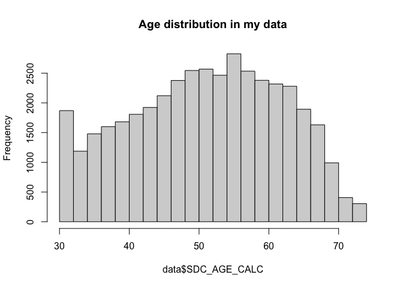

## Objective of assignment 2 
To perform simple analysis for selection bias and information bias using the categorical variables you have already created (physical activity)  

We have 9 short questions (Question 1a-d and Question 2a-e) in the `Bias Assignment File`.

## A few important notes 
  * R is case sensitive, so variables like, `my_Variable` and `my_variable` are different. So if you type the former and later type the latter, there will me an error message: `Error: object 'my_variable' not found`   
  
  * This file is located in [https://github.com/walkabilly/chep801_usask/blob/main/Assignments/Bias/Bias-Assignment.md](https://github.com/walkabilly/chep801_usask/blob/main/Assignments/Bias/Bias-Assignment.md). IN Rstudio, create a new markdown file by selecting _file_ -> _new markdown_ (with Html output). Copy and paste R codes and run line by line to follow the steps. Alternatively, paste entire rmd, except the header (the beginning of .RMD file starting and ending with `---`. You should retain your own header as the title of your file) [https://github.com/walkabilly/chep801_usask/blob/main/Assignments/Bias/Bias%20Assignment.Rmd](https://github.com/walkabilly/chep801_usask/blob/main/Assignments/Bias/Bias%20Assignment.Rmd).     

  
  * Before running these codes, install "episensr" and "htmlTable". Copy and paste `install.packages(c("htmlTable", "episensr"))`  If a popup window shows up to restart R, click `yes`. Once these packages are installed, remove this line to prevent re-installation. 

  * Make sure that your CanPath data.csv file contains the diabetes and physical exercise variable used below.   
  

  * Also, a quick note for formatting - header specification to make prettier headers and sub headers   
      When specifying header, we use `#` (large header) or `#####` (small header) and somewhere between, depening on the number of `#`s. Space is needed between `#` and header description. Without the space, `#` is treated literal, rathe than the special controlling the size of header.  
    
#### Header with 4`#`s, with space, with correct header formatting    
####Header with 4`#`s, without space, interpreted literally as charateror "#", rather than the indicator of header 

You will notice the header line turns into blue fonts when interpreted as header in the markdown file.  Also, it is good to give a space after the header statement just to indicate the end of the header and to create a new line.  
  
  * A side note, you have some control in what to display in R codes within chunk` ```{r}`  
    *   FOr example, ` ```{r, include = FALSE}`  will suppress displaying all messages and R codes within the chunk, so that you can decide not to display annoying and unnecessary messages when you load R libraries 
    *   ` ```{r, echo = FALSE}` will remove codes but not the result of analysis generated by the codes.    
    * More information if you are interested in hiding unnecessary messages: https://rmarkdown.rstudio.com/lesson-3.html  


## Now, lets begin example codes to prepare the assignment data and show example of bias analysis 
The example codes also contain how to re-order categorical varaibles as pointed in Assignment 1.  

```r
knitr::opts_chunk$set(echo = TRUE)
# load the episenr package after installation. This needs to be done every time you analyse
library("episensr") #you can quote or unquote, but need quote when using install.package, but not when using library, don't ask me why
library(htmlTable)

# packaged used in the data work lab and assignment 1, needed to run some functions in this assignment
library(tidyverse)
library("knitr")
library("epitools")
```


First, lets load the data. Make sure to specify your own path to the data. 

```r
data <- read_csv("Data.csv")
```

```
## Rows: 41187 Columns: 440
## ── Column specification ────────────────────────────────────────────────────────
## Delimiter: ","
## chr   (5): ID, MSD11_PR, MSD11_REG, MSD11_ZONE, MSD11_CMA
## dbl (425): ADM_STUDY_ID, SDC_GENDER, SDC_AGE_CALC, SDC_MARITAL_STATUS, SDC_E...
## lgl  (10): DIS_MH_BIPOLAR_EVER, DIS_GEN_DS_EVER, DIS_GEN_SCA_EVER, DIS_GEN_T...
## 
## ℹ Use `spec()` to retrieve the full column specification for this data.
## ℹ Specify the column types or set `show_col_types = FALSE` to quiet this message.
```


### Exclusion of some cases
Lets suppose this is a study of aging, so we limit the sample to participants with a bit older age of > 45 in this study. One way to do so is to run following lines:

```r
# quick descriptive analysis, count and proportion of each age (from age 30 - 74) in the original sample
prop.table(table(data$SDC_AGE_CALC))
```

```
## 
##          30          31          32          33          34          35 
## 0.014689101 0.015490325 0.015223250 0.013912157 0.014907616 0.016048753 
##          36          37          38          39          40          41 
## 0.019860636 0.020224828 0.018622381 0.019496443 0.021317406 0.022021512 
##          42          43          44          45          46          47 
## 0.021875835 0.024862214 0.021827276 0.024279506 0.027217326 0.029888071 
##          48          49          50          51          52          53 
## 0.027824313 0.029451040 0.032340302 0.031029208 0.031320562 0.029839512 
##          54          55          56          57          58          59 
## 0.030009469 0.035229563 0.033384320 0.033627115 0.027897152 0.030155146 
##          60          61          62          63          64          65 
## 0.027630077 0.028479860 0.027800034 0.028042829 0.027314444 0.024692257 
##          66          67          68          69          70          71 
## 0.021268847 0.020758977 0.018816617 0.015636002 0.008424988 0.005195814 
##          72          73          74 
## 0.004685945 0.003763323 0.003617646
```

```r
table(data$SDC_AGE_CALC)
```

```
## 
##   30   31   32   33   34   35   36   37   38   39   40   41   42   43   44   45 
##  605  638  627  573  614  661  818  833  767  803  878  907  901 1024  899 1000 
##   46   47   48   49   50   51   52   53   54   55   56   57   58   59   60   61 
## 1121 1231 1146 1213 1332 1278 1290 1229 1236 1451 1375 1385 1149 1242 1138 1173 
##   62   63   64   65   66   67   68   69   70   71   72   73   74 
## 1145 1155 1125 1017  876  855  775  644  347  214  193  155  149
```

```r
# we also show the distribution of age in histrogram 
hist(data$SDC_AGE_CALC, main = "Age distribution in my data")
```

<!-- -->

```r
# now, we create a new data called "d", which consists of those with age > 45
d <- data %>% filter(SDC_AGE_CALC > 45)

# lets check how many people are in the original and our subset data using a command to count number of rows
nrow(data)
```

```
## [1] 41187
```

```r
nrow(d)
```

```
## [1] 28639
```

```r
# a lot less people now...
```
We now remove the "data" table and use only subset "d" from now on

```r
rm(data)
```


### Exposure variable 
Here, I copied and pasted the scripts to create a categorical variable for physical activity from the last class and assignment. However, this time, the PA (Physical Activity) variable is dichotomous, rather than 3 levels, named as `pa_dic`. We will dichotomize into 1/0 numeric value, then convert to categorical using `factor` as in the previous class (without using factor, the variable will be treated as number rather than category). 


```r
d <- d %>%
    mutate(pa_dic = case_when(
      PA_TOTAL_SHORT < 600  ~ 1,
      PA_TOTAL_SHORT >= 600 ~ 0
    )
  )

# Make variable to dichotomous from integer variable of 1/0
d$pa_dic <- as.factor(d$pa_dic)

# Give label to the variable, 0: moderate/high and 1: low physical activity 
levels(d$pa_dic) <- c( "Moderate/high PA", "low PA")

#lets check mean activity levels across two categories of PA we just created 
d %>% group_by(pa_dic) %>% summarize(mean = mean(PA_TOTAL_SHORT))
```

```
## # A tibble: 3 × 2
##   pa_dic            mean
##   <fct>            <dbl>
## 1 Moderate/high PA 3467.
## 2 low PA            192.
## 3 <NA>               NA
```


### OUtcome variable
Lets create the outcome variable type 2 diabetes mellitus. 
Presumably this variable is self-reported by participants, so they are not as accurate as actual diagnostic report, but people normally do not lie for these chronic disease status so acceptable accuracy, I hope. 


*Definitions of diabetes variables in the data dictionary is as follows (double check with the Excel data dictionary file)*
  -   value 1  -	Diabetes mellitus type 1,  not our interest
  -   value 2  - 	Diabetes mellitus type 2,  our outcome if interest
  -   value 3	 - Gestational diabetes only,  not our interest
  -   value 4  -  -7	Not Applicable       , people without any diabetes


First, check the diabetes variable

```r
# check frequency of 4 types of diabates types 
table(d$DIS_DIAB_TYPE)
```

```
## 
##    -7     1     2     3 
## 25296   206  1855   300
```

```r
# there is also another value type - missing value coded as NA, see the first 10 people, 4th person did not report anything
head(d$DIS_DIAB_TYPE, n = 10) # showing first 10 entries 
```

```
##  [1] -7 -7 -7 NA -7 -7 -7 -7 -7 -7
```

```r
summary(d$DIS_DIAB_TYPE) # See exact number of whose did not report (NA's)
```

```
##    Min. 1st Qu.  Median    Mean 3rd Qu.    Max.    NA's 
##  -7.000  -7.000  -7.000  -6.228  -7.000   3.000     982
```

```r
# For simplicity, we will remove people who did not respond (in real research, if the proportion of people with missing data seems important , like 10% of all people, you need to perform imputation)

d %>% filter(is.na(DIS_DIAB_TYPE)) %>% nrow() # First, count # of people with missing diabetes record
```

```
## [1] 982
```

```r
d <- d %>% filter(!is.na(DIS_DIAB_TYPE)) # then, remove these people 

# I will also remove people with type 1 diabetes, as they occur very early age and patient usually have very different lifestyle and risk of chronic illness 
d <- d %>% filter(DIS_DIAB_TYPE != 1) 
```

Now lets create diabetes binary category variable. 
We create binary variable for type 2 diabetes, grouping gestational diabetes into the no diabetes category, and type 2 diabetes as the diabetes category. 

```r
table(d$DIS_DIAB_TYPE)
```

```
## 
##    -7     2     3 
## 25296  1855   300
```

```r
d <- d %>%
  mutate(diabetes_dic = case_when(
    DIS_DIAB_TYPE == -7 | DIS_DIAB_TYPE == -7 ~ 0,
    DIS_DIAB_TYPE ==  2 ~ 1
  ))

# we coded the new variable as numeric of 1 and 0. I will make it into categorical (called factor) with 2 levels. 
d$diabetes_dic <- as.factor(d$diabetes_dic)
levels(d$diabetes_dic) = c("noDiabetes", "diabetes") # THis means 0 and 1 category gets descriptive lables
table(d$diabetes_dic)
```

```
## 
## noDiabetes   diabetes 
##      25296       1855
```

```r
# compare the old (3 categories in number) and new variable (binary factor - categorical- variable with lebel) 
table(d$DIS_DIAB_TYPE, d$diabetes_dic)
```

```
##     
##      noDiabetes diabetes
##   -7      25296        0
##   2           0     1855
##   3           0        0
```

### A quick demo for re-ordering categorical variable using `levels` 

```r
d$new_diabetes_reorder <- d$diabetes_dic

# check the current ordering using the commend level and table
levels(d$new_diabetes_reorder)
```

```
## [1] "noDiabetes" "diabetes"
```

```r
table(d$new_diabetes_reorder)
```

```
## 
## noDiabetes   diabetes 
##      25296       1855
```

```r
# change order , enter the list of variable level names in the order you like into c()
levels(d$new_diabetes_reorder) <- c("diabetes", "noDiabetes")

#check the order is reversed 
levels(d$new_diabetes_reorder)
```

```
## [1] "diabetes"   "noDiabetes"
```

```r
levels(d$diabetes_dic)
```

```
## [1] "noDiabetes" "diabetes"
```


### 2x2 table for risk ratio
We will now display relative risk of diabetes among people with varying level of physical activity using the `epitable` function as in the data lab last week. 
First , just show count using the `epitable` function (the option `rev="both"` just changes the order of categories. You can remove this option if you like and see what will happen to the table)

```r
# Make table
table_pa_dia <- epitable(d$pa_dic, d$diabetes_dic, rev = "both") 
# No need to know the command below, it just gives label called "exposure" to the table
names(attr(table_pa_dia, "dimnames"))[1] <- "Exposure"

# Now display table 
table_pa_dia
```

```
##                   Outcome
## Exposure           diabetes noDiabetes
##   low PA                434       4937
##   Moderate/high PA     1094      16263
```

```r
# Bit fancy way
library(htmlTable)
# bit more fancy way
htmlTable(table_pa_dia)
```

<table class='gmisc_table' style='border-collapse: collapse; margin-top: 1em; margin-bottom: 1em;' >
<thead>
<tr>
<th style='border-top: 2px solid grey;'></th>
<th colspan='2' style='font-weight: 900; border-bottom: 1px solid grey; border-top: 2px solid grey; text-align: center;'>Outcome</th>
</tr>
<tr><th style='border-bottom: 1px solid grey;'></th>
<th style='font-weight: 900; border-bottom: 1px solid grey; text-align: center;'>diabetes</th>
<th style='font-weight: 900; border-bottom: 1px solid grey; text-align: center;'>noDiabetes</th>
</tr>
</thead>
<tbody> 
<tr><td colspan='3' style='font-weight: 900;'>Exposure</td></tr>
<tr>
<td style='text-align: left;'>&nbsp;&nbsp;low PA</td>
<td style='text-align: center;'>434</td>
<td style='text-align: center;'>4937</td>
</tr>
<tr>
<td style='border-bottom: 2px solid grey; text-align: left;'>&nbsp;&nbsp;Moderate/high PA</td>
<td style='border-bottom: 2px solid grey; text-align: center;'>1094</td>
<td style='border-bottom: 2px solid grey; text-align: center;'>16263</td>
</tr>
</tbody>
</table>
### Risk ratio (ralative risk)
In this table , incidence risk among exposed is      
 _*434/(434+4937)=0.081*_   
 
Incidence risk among unexposed is     
 _*1094/(1094+16263)=0.063*_   
 
Therefore, risk ratio (RR) is      
 _*0.081/0.063*_   

Now, calculate RR using `epitab` from the data lab week 2. 
Here, the exposure of interest is **Low PA** and the outcome is **Diabetes**. 

```r
#Create table and save 
table_rr_pa_dia <- epitab(table_pa_dia, method = "riskratio", rev = "both")
```

Exploring the table. 
Note that column `upper` and `lower` are upper and lower bound of confidence interval for the risk ratio. 
Unfortunately, the order of the column/row are _reversed_ because of some issues in this function (location of table cells, a b, c, d is flipped horizontally and vertically), so be careful when calculating associations manually from this table.
It is important to round numeric variables to appropriate number of digits. We will round to 2. 

```r
# Show table only, no other extra cluttering information 
table_rr_pa_dia$tab
```

```
##                   Outcome
## Exposure           noDiabetes        p0 diabetes         p1 riskratio    lower
##   Moderate/high PA      16263 0.9369707     1094 0.06302933  1.000000       NA
##   low PA                 4937 0.9191957      434 0.08080432  1.282011 1.152043
##                   Outcome
## Exposure              upper      p.value
##   Moderate/high PA       NA           NA
##   low PA           1.426642 8.094247e-06
```

```r
round(table_rr_pa_dia$tab, 2)
```

```
##                   Outcome
## Exposure           noDiabetes   p0 diabetes   p1 riskratio lower upper p.value
##   Moderate/high PA      16263 0.94     1094 0.06      1.00    NA    NA      NA
##   low PA                 4937 0.92      434 0.08      1.28  1.15  1.43       0
```

We can also display only specific set of columns , which are specified by index specification accessed by `[]` from this table, like `table[row, column]`. In the example below, I am showing column 1 to 7 and and all row as `[, 1:7]`. Empty value in row indicates displaying all columns. `1:7` indicates pick all columns between 1 to 7, inclusive.


```r
round(table_rr_pa_dia$tab[, 1:7], 2)
```

```
##                   Outcome
## Exposure           noDiabetes   p0 diabetes   p1 riskratio lower upper
##   Moderate/high PA      16263 0.94     1094 0.06      1.00    NA    NA
##   low PA                 4937 0.92      434 0.08      1.28  1.15  1.43
```

```r
# Slightly more fancy display by function called htmlTable, with added gray bars alternating columns
round(table_rr_pa_dia$tab[, 1:7], 2) %>% 
  addHtmlTableStyle(col.columns = c("none", "grey90")) %>% 
  htmlTable()
```

<table class='gmisc_table' style='border-collapse: collapse; margin-top: 1em; margin-bottom: 1em;' >
<thead>
<tr>
<th style='border-top: 2px solid grey;'></th>
<th colspan='7' style='font-weight: 900; border-bottom: 1px solid grey; border-top: 2px solid grey; text-align: center;'>Outcome</th>
</tr>
<tr><th style='border-bottom: 1px solid grey;'></th>
<th style='font-weight: 900; border-bottom: 1px solid grey; text-align: center;'>noDiabetes</th>
<th style='font-weight: 900; border-bottom: 1px solid grey; background-color: #e5e5e5; text-align: center;'>p0</th>
<th style='font-weight: 900; border-bottom: 1px solid grey; text-align: center;'>diabetes</th>
<th style='font-weight: 900; border-bottom: 1px solid grey; background-color: #e5e5e5; text-align: center;'>p1</th>
<th style='font-weight: 900; border-bottom: 1px solid grey; text-align: center;'>riskratio</th>
<th style='font-weight: 900; border-bottom: 1px solid grey; background-color: #e5e5e5; text-align: center;'>lower</th>
<th style='font-weight: 900; border-bottom: 1px solid grey; text-align: center;'>upper</th>
</tr>
</thead>
<tbody> 
<tr><td colspan='8' style='font-weight: 900;'>Exposure</td></tr>
<tr>
<td style='text-align: left;'>&nbsp;&nbsp;Moderate/high PA</td>
<td style='text-align: center;'>16263</td>
<td style='background-color: #e5e5e5; text-align: center;'>0.94</td>
<td style='text-align: center;'>1094</td>
<td style='background-color: #e5e5e5; text-align: center;'>0.06</td>
<td style='text-align: center;'>1</td>
<td style='background-color: #e5e5e5; text-align: center;'></td>
<td style='text-align: center;'></td>
</tr>
<tr>
<td style='border-bottom: 2px solid grey; text-align: left;'>&nbsp;&nbsp;low PA</td>
<td style='border-bottom: 2px solid grey; text-align: center;'>4937</td>
<td style='border-bottom: 2px solid grey; background-color: #e5e5e5; text-align: center;'>0.92</td>
<td style='border-bottom: 2px solid grey; text-align: center;'>434</td>
<td style='border-bottom: 2px solid grey; background-color: #e5e5e5; text-align: center;'>0.08</td>
<td style='border-bottom: 2px solid grey; text-align: center;'>1.28</td>
<td style='border-bottom: 2px solid grey; background-color: #e5e5e5; text-align: center;'>1.15</td>
<td style='border-bottom: 2px solid grey; text-align: center;'>1.43</td>
</tr>
</tbody>
</table>
If you like to subset table to simplify, just specify the index (location) of columns or rows, for example to select the outcome count (not incidences i.e., Ps) that is displyed in column 1 and 3, specify column location by `c(1,3)`. We do not use `:` as we do not specify range. 

```r
round(table_rr_pa_dia$tab[, c(1,3)], 2)
```

```
##                   Outcome
## Exposure           noDiabetes diabetes
##   Moderate/high PA      16263     1094
##   low PA                 4937      434
```
or to get incidence proportions, type 

```r
round(table_rr_pa_dia$tab[, c(2,4)], 2)
```

```
##                   Outcome
## Exposure             p0   p1
##   Moderate/high PA 0.94 0.06
##   low PA           0.92 0.08
```
We can also get correct ordering of column and row by reversing index

```r
round(table_rr_pa_dia$tab[c(2,1), c(3,1)], 2)
```

```
##                   Outcome
## Exposure           diabetes noDiabetes
##   low PA                434       4937
##   Moderate/high PA     1094      16263
```

### We will now perform bias analysis, starting from selection bias. 
#### Suppose that our hypothetical cohort data (the data are acually survey) are provided by those who agreed to participate and remained in the study until the end, without withdrawal. Therefore, the RR estimates we get might suffer from bias, if selection probabilities of participation into the study and withdrawal are associated with our exposure and outcome status.
IF there is no bias (participation is 100% and no withdrawal) selection probabilities of participating to the study is found to be as follows:    
  - Exposed and Outcome, P_a in the table below= 1  
  - exposed and no Outcome, P_b = 1  
  - Unexposed and Outcome, P_c = 1  
  - unexposed and no Outcome, P_d= 1    


```r
# Lines below just creates example tables 
contingencyTable <- data.frame(Outcome_Yes = c("a", "c"), Outcome_No = c("b", "d"))
rownames(contingencyTable) <- c("Exposure_yes", "Exposure_No")
probTable <- data.frame(Outcome_Yes = c("P_a", "P_c"), Outcome_No = c("P_b", "P_d"))
rownames(probTable) <- c("Exposure_yes", "Exposure_No")

contingencyTable %>% 
  addHtmlTableStyle(css.cell = c("width: 140;","width: 140;")) %>% 
  htmlTable(caption = "Table cell labels") 
```

<table class='gmisc_table' style='border-collapse: collapse; margin-top: 1em; margin-bottom: 1em;' >
<thead>
<tr><td colspan='3' style='text-align: left;'>
Table cell labels</td></tr>
<tr><th style='border-bottom: 1px solid grey; border-top: 2px solid grey;'></th>
<th style='font-weight: 900; border-bottom: 1px solid grey; border-top: 2px solid grey; text-align: center;'>Outcome_Yes</th>
<th style='font-weight: 900; border-bottom: 1px solid grey; border-top: 2px solid grey; text-align: center;'>Outcome_No</th>
</tr>
</thead>
<tbody>
<tr>
<td style='text-align: left;'>Exposure_yes</td>
<td style='width: 140; text-align: center;'>a</td>
<td style='width: 140; text-align: center;'>b</td>
</tr>
<tr>
<td style='border-bottom: 2px solid grey; text-align: left;'>Exposure_No</td>
<td style='width: 140; border-bottom: 2px solid grey; text-align: center;'>c</td>
<td style='width: 140; border-bottom: 2px solid grey; text-align: center;'>d</td>
</tr>
</tbody>
</table>

```r
probTable %>% 
  addHtmlTableStyle(css.cell = c("width: 140;","width: 140;")) %>% 
  htmlTable(caption = "table of selection probabilities") 
```

<table class='gmisc_table' style='border-collapse: collapse; margin-top: 1em; margin-bottom: 1em;' >
<thead>
<tr><td colspan='3' style='text-align: left;'>
table of selection probabilities</td></tr>
<tr><th style='border-bottom: 1px solid grey; border-top: 2px solid grey;'></th>
<th style='font-weight: 900; border-bottom: 1px solid grey; border-top: 2px solid grey; text-align: center;'>Outcome_Yes</th>
<th style='font-weight: 900; border-bottom: 1px solid grey; border-top: 2px solid grey; text-align: center;'>Outcome_No</th>
</tr>
</thead>
<tbody>
<tr>
<td style='text-align: left;'>Exposure_yes</td>
<td style='width: 140; text-align: center;'>P_a</td>
<td style='width: 140; text-align: center;'>P_b</td>
</tr>
<tr>
<td style='border-bottom: 2px solid grey; text-align: left;'>Exposure_No</td>
<td style='width: 140; border-bottom: 2px solid grey; text-align: center;'>P_c</td>
<td style='width: 140; border-bottom: 2px solid grey; text-align: center;'>P_d</td>
</tr>
</tbody>
</table>


Here is an example usage of `episensr`'s `selection` bias function.If all selection probabilities are 1.0 (no selection bias), we enter the `bias_params` (selection bias probability parameter) line in the command below as all 1.0,  and  the output look as follows. Note  that `observed` and `selection bias corrected` RR and OR are identical in the output, indicating no bias. The values in the `bias_params` argument should be between 0 and 1. 
**The order of the selection probabilities in the `bias_params` is c(P_a, P_c, P_b, P_d). Also, the output table below has the outcome and exposure swapped (rows and columns transposed, showing the order of `a, c, b, d`)**
For details, try entering `?selection` for help menu. 

```r
selection(matrix(c(434, 1094, 4937, 16263), 
                 dimnames = list(c("Diabetes", "No Diabetes"), 
                                 c("Low PA", "moderate/high PA"))
                 , nrow = 2, byrow = TRUE),
          bias_parms  = c(1, 1, 1, 1))
```

```
## --Observed data-- 
##          Outcome: Diabetes 
##        Comparing: Low PA vs. moderate/high PA 
## 
##             Low PA moderate/high PA
## Diabetes       434             1094
## No Diabetes   4937            16263
## 
##                                      2.5%    97.5%
## Observed Relative Risk: 1.282011 1.152043 1.426642
##    Observed Odds Ratio: 1.306802 1.164072 1.467033
## ---
##                                                 
## Selection Bias Corrected Relative Risk: 1.282011
##    Selection Bias Corrected Odds Ratio: 1.306802
```
#### You need to experiment a couple different values of the selection probabilites in `bias_parms` before working on the questions below, values between 0 and 1.  

