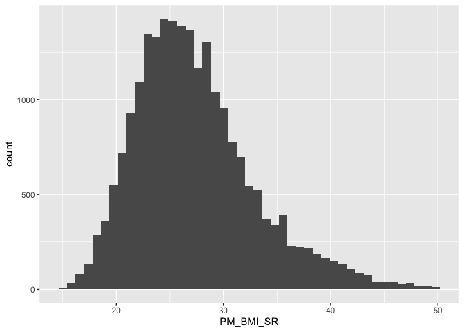
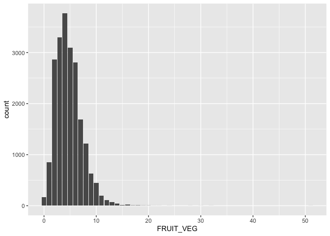
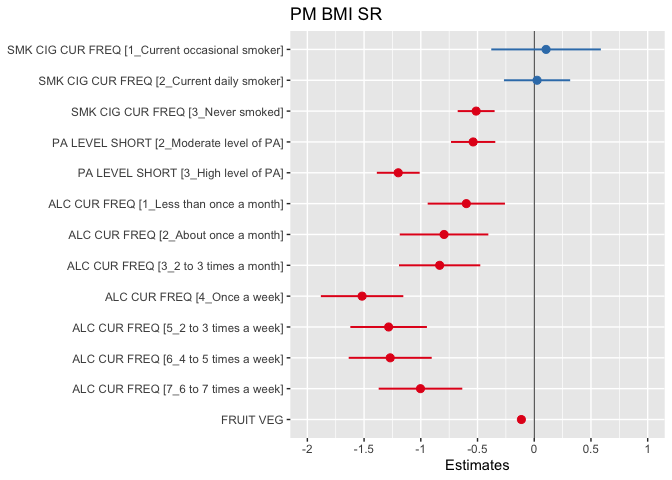
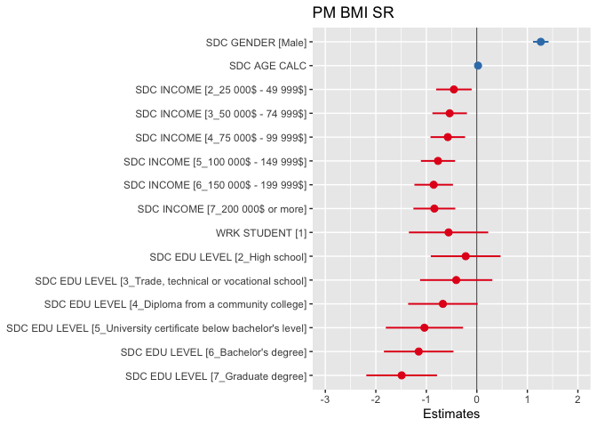
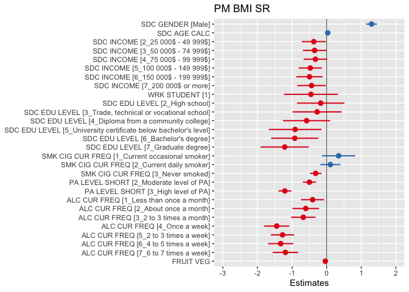

# Epi Communication Assignment 1


# Assignment 

The following analysis uses the Can-Path Dataset available in Canvas.  

One of your biostatistician staff has conducted an analysis examining the association between different social and behavioural factors on Body Mass Index using the Can-Path dataset. Your goal as a epidemiologist is to use the analysis provided and develop a one page communication report/document to communicate the beginning of health promotion strategy for your region. You can write text, develop an infographic, and use outside knowledge to support the development of your report. 

It is crucial when discussing obesity and weight status that we avoid adding to stigma as researchers and epidemiologists. There are a number of health consequences to weight stigma that we must attempt to avoid. At the same time, we need to work with people to try and improve health. Some resources here: 

1. Puhl, R M., Wharton, C M. Weight Bias: A Primer for the Fitness Industry. Health & Fitness Journal. 2007; 11(3), p 7-11. [https://doi.org/10.1249/01.FIT.0000269060.03465.ab](https://doi.org/10.1249/01.FIT.0000269060.03465.ab)
2. Phelan SM, Burgess DJ, Yeazel MW, Hellerstedt WL, Griffin JM, van Ryn M. Impact of weight bias and stigma on quality of care and outcomes for patients with obesity. Obes Rev. 2015;16(4):319-326. [https://doi.org/10.1111/obr.12266](https://doi.org/10.1111/obr.12266).
3. Puhl RM, Himmelstein MS, Pearl RL. Weight stigma as a psychosocial contributor to obesity. Am Psychol. 2020;75(2):274-289. [https://doi.org/10.1037/amp0000538](https://doi.org/10.1037/amp0000538)

### Outcome

The outcome is BMI. The histogram and summary statistics of the BMI variable is below. 


<!-- -->

```
##    Min. 1st Qu.  Median    Mean 3rd Qu.    Max. 
##   15.16   23.34   26.52   27.35   30.27   49.94
```

### Behavioural Factors

The behavioural factors included in the analysis are smoking, physical activity, alcohol consumption, and fruit and vegetable consumption. The descriptive statistics for the 

#### SMK_CIG_CUR_FREQ  

Variable outlining the smoking status of participants. 

(0) Does not smoke currently  
(1) Current occasional smoker  
(2) Current daily smoker  
(3) Never smoked  


```
##             SMK_CIG_CUR_FREQ     n percent
##   0_Does not smoke currently  7552   33.8%
##  1_Current occasional smoker   554    2.5%
##       2_Current daily smoker  1782    8.0%
##               3_Never smoked 12488   55.8%
```

#### PA_LEVEL_SHORT   

Variable outlining the physical activity level of participants. 

(1) Low level of physical activity  
(2) Moderate level of physical activity  
(3) High level of physical activity  


```
##          PA_LEVEL_SHORT    n percent
##       1_Low level of PA 6067   27.1%
##  2_Moderate level of PA 7297   32.6%
##      3_High level of PA 9012   40.3%
```

#### ALC_CUR_FREQ   

Variable outlining the number (units are a bit all over the place) of alcoholic beverages consumed. 

(0) Never  
(1) Less than once a month  
(2) About once a month  
(3) 2 to 3 times a month  
(4) Once a week  
(5) 2 to 3 times a week  
(6) 4 to 5 times a week  
(7) 6 to 7 times a week  


```
##              ALC_CUR_FREQ    n percent
##                   0_Never 1394    6.5%
##  1_Less than once a month 3848   18.1%
##      2_About once a month 1766    8.3%
##    3_2 to 3 times a month 2758   12.9%
##             4_Once a week 2536   11.9%
##     5_2 to 3 times a week 4173   19.6%
##     6_4 to 5 times a week 2465   11.6%
##     7_6 to 7 times a week 2373   11.1%
```

#### FRUIT_VEG   

Count of the number of fruit and vegetables consumed per week. 


<!-- -->

```
##    Min. 1st Qu.  Median    Mean 3rd Qu.    Max. 
##   0.000   3.000   4.000   4.768   6.000  51.000
```

### Social and Demographic Factors

The social and demographic factors included in the analysis are age, income category, student status, and education level. The descriptive statistics for these variables is below: 

#### SDC_GENDER

Variable representing the gender of participants. 

(1)	Male
(2)	Female


```
##  SDC_GENDER     n percent
##      Female 12058   56.6%
##        Male  9255   43.4%
```

#### SDC_AGE_CALC 

Age of the participant at the time of completing the survey. 


```
##    Min. 1st Qu.  Median    Mean 3rd Qu.    Max. 
##   30.00   43.00   52.00   51.33   60.00   74.00
```

#### SDC_INCOME   

Variable representing the income of participants. 

(1)	Less than 10 000 $
(2)	10 000 $ - 24 999 $
(3)	25 000 $ - 49 999 $
(4)	50 000 $ - 74 999 $
(5)	75 000 $ - 99 999 $
(6)	100 000 $ - 149 999 $
(7)	150 000 $ - 199 999 $
(8)	200 000 $ or more


```
##             SDC_INCOME    n percent
##    1_Less than 24 999$ 1371    6.4%
##    2_25 000$ - 49 999$ 3207   15.0%
##    3_50 000$ - 74 999$ 4051   19.0%
##    4_75 000$ - 99 999$ 4162   19.5%
##  5_100 000$ - 149 999$ 4771   22.4%
##  6_150 000$ - 199 999$ 2204   10.3%
##     7_200 000$ or more 1547    7.3%
```

#### WRK_STUDENT  

Variable representing if a participant is a student or not. 

(0)	Participant is not a student
(1)	Participant is a student


```
##  WRK_STUDENT     n percent
##            0 21118   99.1%
##            1   195    0.9%
```

#### SDC_EDU_LEVEL   

Variable representing the education level of participants. 

(0)	None
(1)	Elementary school
(2)	High school
(3)	Trade, technical or vocational school, apprenticeship training or technical CEGEP
(4)	Diploma from a community college, pre-university CEGEP or non-university certificate
(5)	University certificate below bachelor's level
(6)	Bachelor's degree
(7)	Graduate degree (MSc, MBA, MD, PhD, etc.)


```
##                                    SDC_EDU_LEVEL    n percent
##                      1_Elementary school or less  267    1.3%
##                                    2_High school 3803   17.8%
##          3_Trade, technical or vocational school 1775    8.3%
##               4_Diploma from a community college 5186   24.3%
##  5_University certificate below bachelor's level  878    4.1%
##                              6_Bachelor's degree 5996   28.1%
##                                7_Graduate degree 3408   16.0%
```

# Linear Regression

## Behavioural Variables


     Dependent: PM_BMI_SR                                                     unit        value        Coefficient (univariable)         Coefficient (multivariable)     
---  ---------------------  ------------------------------------------------  ----------  -----------  --------------------------------  --------------------------------
28   SMK_CIG_CUR_FREQ       0_Does not smoke currently                        Mean (sd)   27.6 (5.6)   -                                 -                               
29                          1_Current occasional smoker                       Mean (sd)   27.7 (5.8)   0.06 (-0.42 to 0.55, p=0.795)     0.30 (-0.18 to 0.79, p=0.218)   
30                          2_Current daily smoker                            Mean (sd)   27.8 (6.1)   0.17 (-0.13 to 0.46, p=0.269)     0.04 (-0.25 to 0.33, p=0.795)   
31                          3_Never smoked                                    Mean (sd)   27.1 (5.5)   -0.50 (-0.66 to -0.33, p<0.001)   -0.28 (-0.45 to -0.11, p=0.001) 
10   PA_LEVEL_SHORT         1_Low level of PA                                 Mean (sd)   28.1 (6.1)   -                                 -                               
11                          2_Moderate level of PA                            Mean (sd)   27.5 (5.6)   -0.63 (-0.83 to -0.44, p<0.001)   -0.50 (-0.70 to -0.31, p<0.001) 
12                          3_High level of PA                                Mean (sd)   26.7 (5.3)   -1.38 (-1.56 to -1.19, p<0.001)   -1.19 (-1.38 to -1.00, p<0.001) 
1    ALC_CUR_FREQ           0_Never                                           Mean (sd)   28.4 (6.1)   -                                 -                               
2                           1_Less than once a month                          Mean (sd)   27.8 (6.0)   -0.59 (-0.94 to -0.25, p=0.001)   -0.47 (-0.81 to -0.14, p=0.006) 
3                           2_About once a month                              Mean (sd)   27.5 (5.7)   -0.87 (-1.26 to -0.47, p<0.001)   -0.64 (-1.03 to -0.25, p=0.001) 
4                           3_2 to 3 times a month                            Mean (sd)   27.5 (5.7)   -0.92 (-1.28 to -0.56, p<0.001)   -0.69 (-1.05 to -0.33, p<0.001) 
5                           4_Once a week                                     Mean (sd)   26.8 (5.2)   -1.58 (-1.95 to -1.22, p<0.001)   -1.39 (-1.76 to -1.03, p<0.001) 
6                           5_2 to 3 times a week                             Mean (sd)   27.0 (5.3)   -1.39 (-1.73 to -1.05, p<0.001)   -1.18 (-1.52 to -0.84, p<0.001) 
7                           6_4 to 5 times a week                             Mean (sd)   27.0 (5.4)   -1.35 (-1.72 to -0.98, p<0.001)   -1.24 (-1.61 to -0.88, p<0.001) 
8                           7_6 to 7 times a week                             Mean (sd)   27.3 (5.4)   -1.07 (-1.44 to -0.70, p<0.001)   -1.05 (-1.42 to -0.68, p<0.001) 
9    FRUIT_VEG              [0.0,51.0]                                        Mean (sd)   27.3 (5.6)   -0.15 (-0.18 to -0.12, p<0.001)   -0.10 (-0.13 to -0.07, p<0.001) 
13   SDC_AGE_CALC           [30.0,74.0]                                       Mean (sd)   27.3 (5.6)   0.04 (0.03 to 0.04, p<0.001)      0.04 (0.03 to 0.04, p<0.001)    
21   SDC_INCOME             1_Less than 24 999$                               Mean (sd)   28.0 (6.4)   -                                 -                               
22                          2_25 000$ - 49 999$                               Mean (sd)   27.7 (5.8)   -0.38 (-0.73 to -0.02, p=0.037)   -0.36 (-0.71 to -0.01, p=0.045) 
23                          3_50 000$ - 74 999$                               Mean (sd)   27.5 (5.6)   -0.51 (-0.86 to -0.17, p=0.003)   -0.26 (-0.61 to 0.08, p=0.130)  
24                          4_75 000$ - 99 999$                               Mean (sd)   27.4 (5.4)   -0.67 (-1.01 to -0.33, p<0.001)   -0.21 (-0.56 to 0.13, p=0.223)  
25                          5_100 000$ - 149 999$                             Mean (sd)   27.1 (5.5)   -0.92 (-1.26 to -0.59, p<0.001)   -0.34 (-0.68 to 0.00, p=0.051)  
26                          6_150 000$ - 199 999$                             Mean (sd)   26.9 (5.6)   -1.12 (-1.50 to -0.74, p<0.001)   -0.35 (-0.74 to 0.03, p=0.069)  
27                          7_200 000$ or more                                Mean (sd)   26.9 (5.2)   -1.12 (-1.53 to -0.71, p<0.001)   -0.28 (-0.70 to 0.14, p=0.188)  
32   WRK_STUDENT            0                                                 Mean (sd)   27.4 (5.6)   -                                 -                               
33                          1                                                 Mean (sd)   26.3 (5.8)   -1.04 (-1.83 to -0.25, p=0.010)   -0.62 (-1.41 to 0.16, p=0.118)  
14   SDC_EDU_LEVEL          1_Elementary school or less                       Mean (sd)   28.7 (5.5)   -                                 -                               
15                          2_High school                                     Mean (sd)   28.1 (5.7)   -0.67 (-1.36 to 0.02, p=0.058)    -0.42 (-1.11 to 0.27, p=0.234)  
16                          3_Trade, technical or vocational school           Mean (sd)   28.1 (5.6)   -0.65 (-1.37 to 0.07, p=0.078)    -0.32 (-1.04 to 0.39, p=0.374)  
17                          4_Diploma from a community college                Mean (sd)   27.4 (5.7)   -1.35 (-2.04 to -0.66, p<0.001)   -0.91 (-1.59 to -0.22, p=0.010) 
18                          5_University certificate below bachelor's level   Mean (sd)   27.2 (5.8)   -1.57 (-2.34 to -0.81, p<0.001)   -1.16 (-1.92 to -0.40, p=0.003) 
19                          6_Bachelor's degree                               Mean (sd)   27.0 (5.5)   -1.78 (-2.46 to -1.09, p<0.001)   -1.13 (-1.82 to -0.44, p=0.001) 
20                          7_Graduate degree                                 Mean (sd)   26.7 (5.4)   -2.02 (-2.72 to -1.33, p<0.001)   -1.34 (-2.04 to -0.64, p<0.001) 

Below is the same model output but includes the model descriptive statistics


```{=html}
<div id="lloeekcikv" style="padding-left:0px;padding-right:0px;padding-top:10px;padding-bottom:10px;overflow-x:auto;overflow-y:auto;width:auto;height:auto;">
<style>html {
  font-family: -apple-system, BlinkMacSystemFont, 'Segoe UI', Roboto, Oxygen, Ubuntu, Cantarell, 'Helvetica Neue', 'Fira Sans', 'Droid Sans', Arial, sans-serif;
}

#lloeekcikv .gt_table {
  display: table;
  border-collapse: collapse;
  margin-left: auto;
  margin-right: auto;
  color: #333333;
  font-size: 16px;
  font-weight: normal;
  font-style: normal;
  background-color: #FFFFFF;
  width: auto;
  border-top-style: solid;
  border-top-width: 2px;
  border-top-color: #A8A8A8;
  border-right-style: none;
  border-right-width: 2px;
  border-right-color: #D3D3D3;
  border-bottom-style: solid;
  border-bottom-width: 2px;
  border-bottom-color: #A8A8A8;
  border-left-style: none;
  border-left-width: 2px;
  border-left-color: #D3D3D3;
}

#lloeekcikv .gt_heading {
  background-color: #FFFFFF;
  text-align: center;
  border-bottom-color: #FFFFFF;
  border-left-style: none;
  border-left-width: 1px;
  border-left-color: #D3D3D3;
  border-right-style: none;
  border-right-width: 1px;
  border-right-color: #D3D3D3;
}

#lloeekcikv .gt_caption {
  padding-top: 4px;
  padding-bottom: 4px;
}

#lloeekcikv .gt_title {
  color: #333333;
  font-size: 125%;
  font-weight: initial;
  padding-top: 4px;
  padding-bottom: 4px;
  padding-left: 5px;
  padding-right: 5px;
  border-bottom-color: #FFFFFF;
  border-bottom-width: 0;
}

#lloeekcikv .gt_subtitle {
  color: #333333;
  font-size: 85%;
  font-weight: initial;
  padding-top: 0;
  padding-bottom: 6px;
  padding-left: 5px;
  padding-right: 5px;
  border-top-color: #FFFFFF;
  border-top-width: 0;
}

#lloeekcikv .gt_bottom_border {
  border-bottom-style: solid;
  border-bottom-width: 2px;
  border-bottom-color: #D3D3D3;
}

#lloeekcikv .gt_col_headings {
  border-top-style: solid;
  border-top-width: 2px;
  border-top-color: #D3D3D3;
  border-bottom-style: solid;
  border-bottom-width: 2px;
  border-bottom-color: #D3D3D3;
  border-left-style: none;
  border-left-width: 1px;
  border-left-color: #D3D3D3;
  border-right-style: none;
  border-right-width: 1px;
  border-right-color: #D3D3D3;
}

#lloeekcikv .gt_col_heading {
  color: #333333;
  background-color: #FFFFFF;
  font-size: 100%;
  font-weight: normal;
  text-transform: inherit;
  border-left-style: none;
  border-left-width: 1px;
  border-left-color: #D3D3D3;
  border-right-style: none;
  border-right-width: 1px;
  border-right-color: #D3D3D3;
  vertical-align: bottom;
  padding-top: 5px;
  padding-bottom: 6px;
  padding-left: 5px;
  padding-right: 5px;
  overflow-x: hidden;
}

#lloeekcikv .gt_column_spanner_outer {
  color: #333333;
  background-color: #FFFFFF;
  font-size: 100%;
  font-weight: normal;
  text-transform: inherit;
  padding-top: 0;
  padding-bottom: 0;
  padding-left: 4px;
  padding-right: 4px;
}

#lloeekcikv .gt_column_spanner_outer:first-child {
  padding-left: 0;
}

#lloeekcikv .gt_column_spanner_outer:last-child {
  padding-right: 0;
}

#lloeekcikv .gt_column_spanner {
  border-bottom-style: solid;
  border-bottom-width: 2px;
  border-bottom-color: #D3D3D3;
  vertical-align: bottom;
  padding-top: 5px;
  padding-bottom: 5px;
  overflow-x: hidden;
  display: inline-block;
  width: 100%;
}

#lloeekcikv .gt_group_heading {
  padding-top: 8px;
  padding-bottom: 8px;
  padding-left: 5px;
  padding-right: 5px;
  color: #333333;
  background-color: #FFFFFF;
  font-size: 100%;
  font-weight: initial;
  text-transform: inherit;
  border-top-style: solid;
  border-top-width: 2px;
  border-top-color: #D3D3D3;
  border-bottom-style: solid;
  border-bottom-width: 2px;
  border-bottom-color: #D3D3D3;
  border-left-style: none;
  border-left-width: 1px;
  border-left-color: #D3D3D3;
  border-right-style: none;
  border-right-width: 1px;
  border-right-color: #D3D3D3;
  vertical-align: middle;
  text-align: left;
}

#lloeekcikv .gt_empty_group_heading {
  padding: 0.5px;
  color: #333333;
  background-color: #FFFFFF;
  font-size: 100%;
  font-weight: initial;
  border-top-style: solid;
  border-top-width: 2px;
  border-top-color: #D3D3D3;
  border-bottom-style: solid;
  border-bottom-width: 2px;
  border-bottom-color: #D3D3D3;
  vertical-align: middle;
}

#lloeekcikv .gt_from_md > :first-child {
  margin-top: 0;
}

#lloeekcikv .gt_from_md > :last-child {
  margin-bottom: 0;
}

#lloeekcikv .gt_row {
  padding-top: 8px;
  padding-bottom: 8px;
  padding-left: 5px;
  padding-right: 5px;
  margin: 10px;
  border-top-style: solid;
  border-top-width: 1px;
  border-top-color: #D3D3D3;
  border-left-style: none;
  border-left-width: 1px;
  border-left-color: #D3D3D3;
  border-right-style: none;
  border-right-width: 1px;
  border-right-color: #D3D3D3;
  vertical-align: middle;
  overflow-x: hidden;
}

#lloeekcikv .gt_stub {
  color: #333333;
  background-color: #FFFFFF;
  font-size: 100%;
  font-weight: initial;
  text-transform: inherit;
  border-right-style: solid;
  border-right-width: 2px;
  border-right-color: #D3D3D3;
  padding-left: 5px;
  padding-right: 5px;
}

#lloeekcikv .gt_stub_row_group {
  color: #333333;
  background-color: #FFFFFF;
  font-size: 100%;
  font-weight: initial;
  text-transform: inherit;
  border-right-style: solid;
  border-right-width: 2px;
  border-right-color: #D3D3D3;
  padding-left: 5px;
  padding-right: 5px;
  vertical-align: top;
}

#lloeekcikv .gt_row_group_first td {
  border-top-width: 2px;
}

#lloeekcikv .gt_summary_row {
  color: #333333;
  background-color: #FFFFFF;
  text-transform: inherit;
  padding-top: 8px;
  padding-bottom: 8px;
  padding-left: 5px;
  padding-right: 5px;
}

#lloeekcikv .gt_first_summary_row {
  border-top-style: solid;
  border-top-color: #D3D3D3;
}

#lloeekcikv .gt_first_summary_row.thick {
  border-top-width: 2px;
}

#lloeekcikv .gt_last_summary_row {
  padding-top: 8px;
  padding-bottom: 8px;
  padding-left: 5px;
  padding-right: 5px;
  border-bottom-style: solid;
  border-bottom-width: 2px;
  border-bottom-color: #D3D3D3;
}

#lloeekcikv .gt_grand_summary_row {
  color: #333333;
  background-color: #FFFFFF;
  text-transform: inherit;
  padding-top: 8px;
  padding-bottom: 8px;
  padding-left: 5px;
  padding-right: 5px;
}

#lloeekcikv .gt_first_grand_summary_row {
  padding-top: 8px;
  padding-bottom: 8px;
  padding-left: 5px;
  padding-right: 5px;
  border-top-style: double;
  border-top-width: 6px;
  border-top-color: #D3D3D3;
}

#lloeekcikv .gt_striped {
  background-color: rgba(128, 128, 128, 0.05);
}

#lloeekcikv .gt_table_body {
  border-top-style: solid;
  border-top-width: 2px;
  border-top-color: #D3D3D3;
  border-bottom-style: solid;
  border-bottom-width: 2px;
  border-bottom-color: #D3D3D3;
}

#lloeekcikv .gt_footnotes {
  color: #333333;
  background-color: #FFFFFF;
  border-bottom-style: none;
  border-bottom-width: 2px;
  border-bottom-color: #D3D3D3;
  border-left-style: none;
  border-left-width: 2px;
  border-left-color: #D3D3D3;
  border-right-style: none;
  border-right-width: 2px;
  border-right-color: #D3D3D3;
}

#lloeekcikv .gt_footnote {
  margin: 0px;
  font-size: 90%;
  padding-left: 4px;
  padding-right: 4px;
  padding-left: 5px;
  padding-right: 5px;
}

#lloeekcikv .gt_sourcenotes {
  color: #333333;
  background-color: #FFFFFF;
  border-bottom-style: none;
  border-bottom-width: 2px;
  border-bottom-color: #D3D3D3;
  border-left-style: none;
  border-left-width: 2px;
  border-left-color: #D3D3D3;
  border-right-style: none;
  border-right-width: 2px;
  border-right-color: #D3D3D3;
}

#lloeekcikv .gt_sourcenote {
  font-size: 90%;
  padding-top: 4px;
  padding-bottom: 4px;
  padding-left: 5px;
  padding-right: 5px;
}

#lloeekcikv .gt_left {
  text-align: left;
}

#lloeekcikv .gt_center {
  text-align: center;
}

#lloeekcikv .gt_right {
  text-align: right;
  font-variant-numeric: tabular-nums;
}

#lloeekcikv .gt_font_normal {
  font-weight: normal;
}

#lloeekcikv .gt_font_bold {
  font-weight: bold;
}

#lloeekcikv .gt_font_italic {
  font-style: italic;
}

#lloeekcikv .gt_super {
  font-size: 65%;
}

#lloeekcikv .gt_footnote_marks {
  font-style: italic;
  font-weight: normal;
  font-size: 75%;
  vertical-align: 0.4em;
}

#lloeekcikv .gt_asterisk {
  font-size: 100%;
  vertical-align: 0;
}

#lloeekcikv .gt_indent_1 {
  text-indent: 5px;
}

#lloeekcikv .gt_indent_2 {
  text-indent: 10px;
}

#lloeekcikv .gt_indent_3 {
  text-indent: 15px;
}

#lloeekcikv .gt_indent_4 {
  text-indent: 20px;
}

#lloeekcikv .gt_indent_5 {
  text-indent: 25px;
}
</style>
<table class="gt_table">
  
  <thead class="gt_col_headings">
    <tr>
      <th class="gt_col_heading gt_columns_bottom_border gt_left" rowspan="1" colspan="1" scope="col" id="&lt;strong&gt;Characteristic&lt;/strong&gt;"><strong>Characteristic</strong></th>
      <th class="gt_col_heading gt_columns_bottom_border gt_center" rowspan="1" colspan="1" scope="col" id="&lt;strong&gt;Beta&lt;/strong&gt;"><strong>Beta</strong></th>
      <th class="gt_col_heading gt_columns_bottom_border gt_center" rowspan="1" colspan="1" scope="col" id="&lt;strong&gt;95% CI&lt;/strong&gt;&lt;sup class=&quot;gt_footnote_marks&quot;&gt;1&lt;/sup&gt;"><strong>95% CI</strong><sup class="gt_footnote_marks">1</sup></th>
      <th class="gt_col_heading gt_columns_bottom_border gt_center" rowspan="1" colspan="1" scope="col" id="&lt;strong&gt;p-value&lt;/strong&gt;"><strong>p-value</strong></th>
    </tr>
  </thead>
  <tbody class="gt_table_body">
    <tr><td headers="label" class="gt_row gt_left">SMK_CIG_CUR_FREQ</td>
<td headers="estimate" class="gt_row gt_center"></td>
<td headers="ci" class="gt_row gt_center"></td>
<td headers="p.value" class="gt_row gt_center"></td></tr>
    <tr><td headers="label" class="gt_row gt_left">    0_Does not smoke currently</td>
<td headers="estimate" class="gt_row gt_center">—</td>
<td headers="ci" class="gt_row gt_center">—</td>
<td headers="p.value" class="gt_row gt_center"></td></tr>
    <tr><td headers="label" class="gt_row gt_left">    1_Current occasional smoker</td>
<td headers="estimate" class="gt_row gt_center">0.10</td>
<td headers="ci" class="gt_row gt_center">-0.38, 0.59</td>
<td headers="p.value" class="gt_row gt_center">0.7</td></tr>
    <tr><td headers="label" class="gt_row gt_left">    2_Current daily smoker</td>
<td headers="estimate" class="gt_row gt_center">0.02</td>
<td headers="ci" class="gt_row gt_center">-0.27, 0.32</td>
<td headers="p.value" class="gt_row gt_center">0.9</td></tr>
    <tr><td headers="label" class="gt_row gt_left">    3_Never smoked</td>
<td headers="estimate" class="gt_row gt_center">-0.51</td>
<td headers="ci" class="gt_row gt_center">-0.67, -0.35</td>
<td headers="p.value" class="gt_row gt_center"><0.001</td></tr>
    <tr><td headers="label" class="gt_row gt_left">PA_LEVEL_SHORT</td>
<td headers="estimate" class="gt_row gt_center"></td>
<td headers="ci" class="gt_row gt_center"></td>
<td headers="p.value" class="gt_row gt_center"></td></tr>
    <tr><td headers="label" class="gt_row gt_left">    1_Low level of PA</td>
<td headers="estimate" class="gt_row gt_center">—</td>
<td headers="ci" class="gt_row gt_center">—</td>
<td headers="p.value" class="gt_row gt_center"></td></tr>
    <tr><td headers="label" class="gt_row gt_left">    2_Moderate level of PA</td>
<td headers="estimate" class="gt_row gt_center">-0.54</td>
<td headers="ci" class="gt_row gt_center">-0.73, -0.34</td>
<td headers="p.value" class="gt_row gt_center"><0.001</td></tr>
    <tr><td headers="label" class="gt_row gt_left">    3_High level of PA</td>
<td headers="estimate" class="gt_row gt_center">-1.2</td>
<td headers="ci" class="gt_row gt_center">-1.4, -1.0</td>
<td headers="p.value" class="gt_row gt_center"><0.001</td></tr>
    <tr><td headers="label" class="gt_row gt_left">ALC_CUR_FREQ</td>
<td headers="estimate" class="gt_row gt_center"></td>
<td headers="ci" class="gt_row gt_center"></td>
<td headers="p.value" class="gt_row gt_center"></td></tr>
    <tr><td headers="label" class="gt_row gt_left">    0_Never</td>
<td headers="estimate" class="gt_row gt_center">—</td>
<td headers="ci" class="gt_row gt_center">—</td>
<td headers="p.value" class="gt_row gt_center"></td></tr>
    <tr><td headers="label" class="gt_row gt_left">    1_Less than once a month</td>
<td headers="estimate" class="gt_row gt_center">-0.60</td>
<td headers="ci" class="gt_row gt_center">-0.94, -0.26</td>
<td headers="p.value" class="gt_row gt_center"><0.001</td></tr>
    <tr><td headers="label" class="gt_row gt_left">    2_About once a month</td>
<td headers="estimate" class="gt_row gt_center">-0.80</td>
<td headers="ci" class="gt_row gt_center">-1.2, -0.40</td>
<td headers="p.value" class="gt_row gt_center"><0.001</td></tr>
    <tr><td headers="label" class="gt_row gt_left">    3_2 to 3 times a month</td>
<td headers="estimate" class="gt_row gt_center">-0.83</td>
<td headers="ci" class="gt_row gt_center">-1.2, -0.48</td>
<td headers="p.value" class="gt_row gt_center"><0.001</td></tr>
    <tr><td headers="label" class="gt_row gt_left">    4_Once a week</td>
<td headers="estimate" class="gt_row gt_center">-1.5</td>
<td headers="ci" class="gt_row gt_center">-1.9, -1.2</td>
<td headers="p.value" class="gt_row gt_center"><0.001</td></tr>
    <tr><td headers="label" class="gt_row gt_left">    5_2 to 3 times a week</td>
<td headers="estimate" class="gt_row gt_center">-1.3</td>
<td headers="ci" class="gt_row gt_center">-1.6, -0.95</td>
<td headers="p.value" class="gt_row gt_center"><0.001</td></tr>
    <tr><td headers="label" class="gt_row gt_left">    6_4 to 5 times a week</td>
<td headers="estimate" class="gt_row gt_center">-1.3</td>
<td headers="ci" class="gt_row gt_center">-1.6, -0.90</td>
<td headers="p.value" class="gt_row gt_center"><0.001</td></tr>
    <tr><td headers="label" class="gt_row gt_left">    7_6 to 7 times a week</td>
<td headers="estimate" class="gt_row gt_center">-1.0</td>
<td headers="ci" class="gt_row gt_center">-1.4, -0.63</td>
<td headers="p.value" class="gt_row gt_center"><0.001</td></tr>
    <tr><td headers="label" class="gt_row gt_left">FRUIT_VEG</td>
<td headers="estimate" class="gt_row gt_center">-0.11</td>
<td headers="ci" class="gt_row gt_center">-0.14, -0.08</td>
<td headers="p.value" class="gt_row gt_center"><0.001</td></tr>
  </tbody>
  
  <tfoot class="gt_footnotes">
    <tr>
      <td class="gt_footnote" colspan="4"><sup class="gt_footnote_marks">1</sup> CI = Confidence Interval</td>
    </tr>
  </tfoot>
</table>
</div>
```
<!-- -->

## Social and Demographic Variables


```{=html}
<div id="yvpepbnqda" style="padding-left:0px;padding-right:0px;padding-top:10px;padding-bottom:10px;overflow-x:auto;overflow-y:auto;width:auto;height:auto;">
<style>html {
  font-family: -apple-system, BlinkMacSystemFont, 'Segoe UI', Roboto, Oxygen, Ubuntu, Cantarell, 'Helvetica Neue', 'Fira Sans', 'Droid Sans', Arial, sans-serif;
}

#yvpepbnqda .gt_table {
  display: table;
  border-collapse: collapse;
  margin-left: auto;
  margin-right: auto;
  color: #333333;
  font-size: 16px;
  font-weight: normal;
  font-style: normal;
  background-color: #FFFFFF;
  width: auto;
  border-top-style: solid;
  border-top-width: 2px;
  border-top-color: #A8A8A8;
  border-right-style: none;
  border-right-width: 2px;
  border-right-color: #D3D3D3;
  border-bottom-style: solid;
  border-bottom-width: 2px;
  border-bottom-color: #A8A8A8;
  border-left-style: none;
  border-left-width: 2px;
  border-left-color: #D3D3D3;
}

#yvpepbnqda .gt_heading {
  background-color: #FFFFFF;
  text-align: center;
  border-bottom-color: #FFFFFF;
  border-left-style: none;
  border-left-width: 1px;
  border-left-color: #D3D3D3;
  border-right-style: none;
  border-right-width: 1px;
  border-right-color: #D3D3D3;
}

#yvpepbnqda .gt_caption {
  padding-top: 4px;
  padding-bottom: 4px;
}

#yvpepbnqda .gt_title {
  color: #333333;
  font-size: 125%;
  font-weight: initial;
  padding-top: 4px;
  padding-bottom: 4px;
  padding-left: 5px;
  padding-right: 5px;
  border-bottom-color: #FFFFFF;
  border-bottom-width: 0;
}

#yvpepbnqda .gt_subtitle {
  color: #333333;
  font-size: 85%;
  font-weight: initial;
  padding-top: 0;
  padding-bottom: 6px;
  padding-left: 5px;
  padding-right: 5px;
  border-top-color: #FFFFFF;
  border-top-width: 0;
}

#yvpepbnqda .gt_bottom_border {
  border-bottom-style: solid;
  border-bottom-width: 2px;
  border-bottom-color: #D3D3D3;
}

#yvpepbnqda .gt_col_headings {
  border-top-style: solid;
  border-top-width: 2px;
  border-top-color: #D3D3D3;
  border-bottom-style: solid;
  border-bottom-width: 2px;
  border-bottom-color: #D3D3D3;
  border-left-style: none;
  border-left-width: 1px;
  border-left-color: #D3D3D3;
  border-right-style: none;
  border-right-width: 1px;
  border-right-color: #D3D3D3;
}

#yvpepbnqda .gt_col_heading {
  color: #333333;
  background-color: #FFFFFF;
  font-size: 100%;
  font-weight: normal;
  text-transform: inherit;
  border-left-style: none;
  border-left-width: 1px;
  border-left-color: #D3D3D3;
  border-right-style: none;
  border-right-width: 1px;
  border-right-color: #D3D3D3;
  vertical-align: bottom;
  padding-top: 5px;
  padding-bottom: 6px;
  padding-left: 5px;
  padding-right: 5px;
  overflow-x: hidden;
}

#yvpepbnqda .gt_column_spanner_outer {
  color: #333333;
  background-color: #FFFFFF;
  font-size: 100%;
  font-weight: normal;
  text-transform: inherit;
  padding-top: 0;
  padding-bottom: 0;
  padding-left: 4px;
  padding-right: 4px;
}

#yvpepbnqda .gt_column_spanner_outer:first-child {
  padding-left: 0;
}

#yvpepbnqda .gt_column_spanner_outer:last-child {
  padding-right: 0;
}

#yvpepbnqda .gt_column_spanner {
  border-bottom-style: solid;
  border-bottom-width: 2px;
  border-bottom-color: #D3D3D3;
  vertical-align: bottom;
  padding-top: 5px;
  padding-bottom: 5px;
  overflow-x: hidden;
  display: inline-block;
  width: 100%;
}

#yvpepbnqda .gt_group_heading {
  padding-top: 8px;
  padding-bottom: 8px;
  padding-left: 5px;
  padding-right: 5px;
  color: #333333;
  background-color: #FFFFFF;
  font-size: 100%;
  font-weight: initial;
  text-transform: inherit;
  border-top-style: solid;
  border-top-width: 2px;
  border-top-color: #D3D3D3;
  border-bottom-style: solid;
  border-bottom-width: 2px;
  border-bottom-color: #D3D3D3;
  border-left-style: none;
  border-left-width: 1px;
  border-left-color: #D3D3D3;
  border-right-style: none;
  border-right-width: 1px;
  border-right-color: #D3D3D3;
  vertical-align: middle;
  text-align: left;
}

#yvpepbnqda .gt_empty_group_heading {
  padding: 0.5px;
  color: #333333;
  background-color: #FFFFFF;
  font-size: 100%;
  font-weight: initial;
  border-top-style: solid;
  border-top-width: 2px;
  border-top-color: #D3D3D3;
  border-bottom-style: solid;
  border-bottom-width: 2px;
  border-bottom-color: #D3D3D3;
  vertical-align: middle;
}

#yvpepbnqda .gt_from_md > :first-child {
  margin-top: 0;
}

#yvpepbnqda .gt_from_md > :last-child {
  margin-bottom: 0;
}

#yvpepbnqda .gt_row {
  padding-top: 8px;
  padding-bottom: 8px;
  padding-left: 5px;
  padding-right: 5px;
  margin: 10px;
  border-top-style: solid;
  border-top-width: 1px;
  border-top-color: #D3D3D3;
  border-left-style: none;
  border-left-width: 1px;
  border-left-color: #D3D3D3;
  border-right-style: none;
  border-right-width: 1px;
  border-right-color: #D3D3D3;
  vertical-align: middle;
  overflow-x: hidden;
}

#yvpepbnqda .gt_stub {
  color: #333333;
  background-color: #FFFFFF;
  font-size: 100%;
  font-weight: initial;
  text-transform: inherit;
  border-right-style: solid;
  border-right-width: 2px;
  border-right-color: #D3D3D3;
  padding-left: 5px;
  padding-right: 5px;
}

#yvpepbnqda .gt_stub_row_group {
  color: #333333;
  background-color: #FFFFFF;
  font-size: 100%;
  font-weight: initial;
  text-transform: inherit;
  border-right-style: solid;
  border-right-width: 2px;
  border-right-color: #D3D3D3;
  padding-left: 5px;
  padding-right: 5px;
  vertical-align: top;
}

#yvpepbnqda .gt_row_group_first td {
  border-top-width: 2px;
}

#yvpepbnqda .gt_summary_row {
  color: #333333;
  background-color: #FFFFFF;
  text-transform: inherit;
  padding-top: 8px;
  padding-bottom: 8px;
  padding-left: 5px;
  padding-right: 5px;
}

#yvpepbnqda .gt_first_summary_row {
  border-top-style: solid;
  border-top-color: #D3D3D3;
}

#yvpepbnqda .gt_first_summary_row.thick {
  border-top-width: 2px;
}

#yvpepbnqda .gt_last_summary_row {
  padding-top: 8px;
  padding-bottom: 8px;
  padding-left: 5px;
  padding-right: 5px;
  border-bottom-style: solid;
  border-bottom-width: 2px;
  border-bottom-color: #D3D3D3;
}

#yvpepbnqda .gt_grand_summary_row {
  color: #333333;
  background-color: #FFFFFF;
  text-transform: inherit;
  padding-top: 8px;
  padding-bottom: 8px;
  padding-left: 5px;
  padding-right: 5px;
}

#yvpepbnqda .gt_first_grand_summary_row {
  padding-top: 8px;
  padding-bottom: 8px;
  padding-left: 5px;
  padding-right: 5px;
  border-top-style: double;
  border-top-width: 6px;
  border-top-color: #D3D3D3;
}

#yvpepbnqda .gt_striped {
  background-color: rgba(128, 128, 128, 0.05);
}

#yvpepbnqda .gt_table_body {
  border-top-style: solid;
  border-top-width: 2px;
  border-top-color: #D3D3D3;
  border-bottom-style: solid;
  border-bottom-width: 2px;
  border-bottom-color: #D3D3D3;
}

#yvpepbnqda .gt_footnotes {
  color: #333333;
  background-color: #FFFFFF;
  border-bottom-style: none;
  border-bottom-width: 2px;
  border-bottom-color: #D3D3D3;
  border-left-style: none;
  border-left-width: 2px;
  border-left-color: #D3D3D3;
  border-right-style: none;
  border-right-width: 2px;
  border-right-color: #D3D3D3;
}

#yvpepbnqda .gt_footnote {
  margin: 0px;
  font-size: 90%;
  padding-left: 4px;
  padding-right: 4px;
  padding-left: 5px;
  padding-right: 5px;
}

#yvpepbnqda .gt_sourcenotes {
  color: #333333;
  background-color: #FFFFFF;
  border-bottom-style: none;
  border-bottom-width: 2px;
  border-bottom-color: #D3D3D3;
  border-left-style: none;
  border-left-width: 2px;
  border-left-color: #D3D3D3;
  border-right-style: none;
  border-right-width: 2px;
  border-right-color: #D3D3D3;
}

#yvpepbnqda .gt_sourcenote {
  font-size: 90%;
  padding-top: 4px;
  padding-bottom: 4px;
  padding-left: 5px;
  padding-right: 5px;
}

#yvpepbnqda .gt_left {
  text-align: left;
}

#yvpepbnqda .gt_center {
  text-align: center;
}

#yvpepbnqda .gt_right {
  text-align: right;
  font-variant-numeric: tabular-nums;
}

#yvpepbnqda .gt_font_normal {
  font-weight: normal;
}

#yvpepbnqda .gt_font_bold {
  font-weight: bold;
}

#yvpepbnqda .gt_font_italic {
  font-style: italic;
}

#yvpepbnqda .gt_super {
  font-size: 65%;
}

#yvpepbnqda .gt_footnote_marks {
  font-style: italic;
  font-weight: normal;
  font-size: 75%;
  vertical-align: 0.4em;
}

#yvpepbnqda .gt_asterisk {
  font-size: 100%;
  vertical-align: 0;
}

#yvpepbnqda .gt_indent_1 {
  text-indent: 5px;
}

#yvpepbnqda .gt_indent_2 {
  text-indent: 10px;
}

#yvpepbnqda .gt_indent_3 {
  text-indent: 15px;
}

#yvpepbnqda .gt_indent_4 {
  text-indent: 20px;
}

#yvpepbnqda .gt_indent_5 {
  text-indent: 25px;
}
</style>
<table class="gt_table">
  
  <thead class="gt_col_headings">
    <tr>
      <th class="gt_col_heading gt_columns_bottom_border gt_left" rowspan="1" colspan="1" scope="col" id="&lt;strong&gt;Characteristic&lt;/strong&gt;"><strong>Characteristic</strong></th>
      <th class="gt_col_heading gt_columns_bottom_border gt_center" rowspan="1" colspan="1" scope="col" id="&lt;strong&gt;Beta&lt;/strong&gt;"><strong>Beta</strong></th>
      <th class="gt_col_heading gt_columns_bottom_border gt_center" rowspan="1" colspan="1" scope="col" id="&lt;strong&gt;95% CI&lt;/strong&gt;&lt;sup class=&quot;gt_footnote_marks&quot;&gt;1&lt;/sup&gt;"><strong>95% CI</strong><sup class="gt_footnote_marks">1</sup></th>
      <th class="gt_col_heading gt_columns_bottom_border gt_center" rowspan="1" colspan="1" scope="col" id="&lt;strong&gt;p-value&lt;/strong&gt;"><strong>p-value</strong></th>
    </tr>
  </thead>
  <tbody class="gt_table_body">
    <tr><td headers="label" class="gt_row gt_left">SDC_GENDER</td>
<td headers="estimate" class="gt_row gt_center"></td>
<td headers="ci" class="gt_row gt_center"></td>
<td headers="p.value" class="gt_row gt_center"></td></tr>
    <tr><td headers="label" class="gt_row gt_left">    Female</td>
<td headers="estimate" class="gt_row gt_center">—</td>
<td headers="ci" class="gt_row gt_center">—</td>
<td headers="p.value" class="gt_row gt_center"></td></tr>
    <tr><td headers="label" class="gt_row gt_left">    Male</td>
<td headers="estimate" class="gt_row gt_center">1.3</td>
<td headers="ci" class="gt_row gt_center">1.1, 1.4</td>
<td headers="p.value" class="gt_row gt_center"><0.001</td></tr>
    <tr><td headers="label" class="gt_row gt_left">SDC_AGE_CALC</td>
<td headers="estimate" class="gt_row gt_center">0.02</td>
<td headers="ci" class="gt_row gt_center">0.02, 0.03</td>
<td headers="p.value" class="gt_row gt_center"><0.001</td></tr>
    <tr><td headers="label" class="gt_row gt_left">SDC_INCOME</td>
<td headers="estimate" class="gt_row gt_center"></td>
<td headers="ci" class="gt_row gt_center"></td>
<td headers="p.value" class="gt_row gt_center"></td></tr>
    <tr><td headers="label" class="gt_row gt_left">    1_Less than 24 999$</td>
<td headers="estimate" class="gt_row gt_center">—</td>
<td headers="ci" class="gt_row gt_center">—</td>
<td headers="p.value" class="gt_row gt_center"></td></tr>
    <tr><td headers="label" class="gt_row gt_left">    2_25 000$ - 49 999$</td>
<td headers="estimate" class="gt_row gt_center">-0.45</td>
<td headers="ci" class="gt_row gt_center">-0.81, -0.10</td>
<td headers="p.value" class="gt_row gt_center">0.011</td></tr>
    <tr><td headers="label" class="gt_row gt_left">    3_50 000$ - 74 999$</td>
<td headers="estimate" class="gt_row gt_center">-0.54</td>
<td headers="ci" class="gt_row gt_center">-0.88, -0.20</td>
<td headers="p.value" class="gt_row gt_center">0.002</td></tr>
    <tr><td headers="label" class="gt_row gt_left">    4_75 000$ - 99 999$</td>
<td headers="estimate" class="gt_row gt_center">-0.58</td>
<td headers="ci" class="gt_row gt_center">-0.92, -0.23</td>
<td headers="p.value" class="gt_row gt_center"><0.001</td></tr>
    <tr><td headers="label" class="gt_row gt_left">    5_100 000$ - 149 999$</td>
<td headers="estimate" class="gt_row gt_center">-0.77</td>
<td headers="ci" class="gt_row gt_center">-1.1, -0.43</td>
<td headers="p.value" class="gt_row gt_center"><0.001</td></tr>
    <tr><td headers="label" class="gt_row gt_left">    6_150 000$ - 199 999$</td>
<td headers="estimate" class="gt_row gt_center">-0.85</td>
<td headers="ci" class="gt_row gt_center">-1.2, -0.47</td>
<td headers="p.value" class="gt_row gt_center"><0.001</td></tr>
    <tr><td headers="label" class="gt_row gt_left">    7_200 000$ or more</td>
<td headers="estimate" class="gt_row gt_center">-0.84</td>
<td headers="ci" class="gt_row gt_center">-1.3, -0.43</td>
<td headers="p.value" class="gt_row gt_center"><0.001</td></tr>
    <tr><td headers="label" class="gt_row gt_left">WRK_STUDENT</td>
<td headers="estimate" class="gt_row gt_center"></td>
<td headers="ci" class="gt_row gt_center"></td>
<td headers="p.value" class="gt_row gt_center"></td></tr>
    <tr><td headers="label" class="gt_row gt_left">    0</td>
<td headers="estimate" class="gt_row gt_center">—</td>
<td headers="ci" class="gt_row gt_center">—</td>
<td headers="p.value" class="gt_row gt_center"></td></tr>
    <tr><td headers="label" class="gt_row gt_left">    1</td>
<td headers="estimate" class="gt_row gt_center">-0.56</td>
<td headers="ci" class="gt_row gt_center">-1.3, 0.23</td>
<td headers="p.value" class="gt_row gt_center">0.2</td></tr>
    <tr><td headers="label" class="gt_row gt_left">SDC_EDU_LEVEL</td>
<td headers="estimate" class="gt_row gt_center"></td>
<td headers="ci" class="gt_row gt_center"></td>
<td headers="p.value" class="gt_row gt_center"></td></tr>
    <tr><td headers="label" class="gt_row gt_left">    1_Elementary school or less</td>
<td headers="estimate" class="gt_row gt_center">—</td>
<td headers="ci" class="gt_row gt_center">—</td>
<td headers="p.value" class="gt_row gt_center"></td></tr>
    <tr><td headers="label" class="gt_row gt_left">    2_High school</td>
<td headers="estimate" class="gt_row gt_center">-0.22</td>
<td headers="ci" class="gt_row gt_center">-0.91, 0.47</td>
<td headers="p.value" class="gt_row gt_center">0.5</td></tr>
    <tr><td headers="label" class="gt_row gt_left">    3_Trade, technical or vocational school</td>
<td headers="estimate" class="gt_row gt_center">-0.41</td>
<td headers="ci" class="gt_row gt_center">-1.1, 0.31</td>
<td headers="p.value" class="gt_row gt_center">0.3</td></tr>
    <tr><td headers="label" class="gt_row gt_left">    4_Diploma from a community college</td>
<td headers="estimate" class="gt_row gt_center">-0.67</td>
<td headers="ci" class="gt_row gt_center">-1.4, 0.02</td>
<td headers="p.value" class="gt_row gt_center">0.055</td></tr>
    <tr><td headers="label" class="gt_row gt_left">    5_University certificate below bachelor's level</td>
<td headers="estimate" class="gt_row gt_center">-1.0</td>
<td headers="ci" class="gt_row gt_center">-1.8, -0.27</td>
<td headers="p.value" class="gt_row gt_center">0.008</td></tr>
    <tr><td headers="label" class="gt_row gt_left">    6_Bachelor's degree</td>
<td headers="estimate" class="gt_row gt_center">-1.2</td>
<td headers="ci" class="gt_row gt_center">-1.8, -0.46</td>
<td headers="p.value" class="gt_row gt_center">0.001</td></tr>
    <tr><td headers="label" class="gt_row gt_left">    7_Graduate degree</td>
<td headers="estimate" class="gt_row gt_center">-1.5</td>
<td headers="ci" class="gt_row gt_center">-2.2, -0.79</td>
<td headers="p.value" class="gt_row gt_center"><0.001</td></tr>
  </tbody>
  
  <tfoot class="gt_footnotes">
    <tr>
      <td class="gt_footnote" colspan="4"><sup class="gt_footnote_marks">1</sup> CI = Confidence Interval</td>
    </tr>
  </tfoot>
</table>
</div>
```
<!-- -->

## Full model 


```{=html}
<div id="zzykhvveja" style="padding-left:0px;padding-right:0px;padding-top:10px;padding-bottom:10px;overflow-x:auto;overflow-y:auto;width:auto;height:auto;">
<style>html {
  font-family: -apple-system, BlinkMacSystemFont, 'Segoe UI', Roboto, Oxygen, Ubuntu, Cantarell, 'Helvetica Neue', 'Fira Sans', 'Droid Sans', Arial, sans-serif;
}

#zzykhvveja .gt_table {
  display: table;
  border-collapse: collapse;
  margin-left: auto;
  margin-right: auto;
  color: #333333;
  font-size: 16px;
  font-weight: normal;
  font-style: normal;
  background-color: #FFFFFF;
  width: auto;
  border-top-style: solid;
  border-top-width: 2px;
  border-top-color: #A8A8A8;
  border-right-style: none;
  border-right-width: 2px;
  border-right-color: #D3D3D3;
  border-bottom-style: solid;
  border-bottom-width: 2px;
  border-bottom-color: #A8A8A8;
  border-left-style: none;
  border-left-width: 2px;
  border-left-color: #D3D3D3;
}

#zzykhvveja .gt_heading {
  background-color: #FFFFFF;
  text-align: center;
  border-bottom-color: #FFFFFF;
  border-left-style: none;
  border-left-width: 1px;
  border-left-color: #D3D3D3;
  border-right-style: none;
  border-right-width: 1px;
  border-right-color: #D3D3D3;
}

#zzykhvveja .gt_caption {
  padding-top: 4px;
  padding-bottom: 4px;
}

#zzykhvveja .gt_title {
  color: #333333;
  font-size: 125%;
  font-weight: initial;
  padding-top: 4px;
  padding-bottom: 4px;
  padding-left: 5px;
  padding-right: 5px;
  border-bottom-color: #FFFFFF;
  border-bottom-width: 0;
}

#zzykhvveja .gt_subtitle {
  color: #333333;
  font-size: 85%;
  font-weight: initial;
  padding-top: 0;
  padding-bottom: 6px;
  padding-left: 5px;
  padding-right: 5px;
  border-top-color: #FFFFFF;
  border-top-width: 0;
}

#zzykhvveja .gt_bottom_border {
  border-bottom-style: solid;
  border-bottom-width: 2px;
  border-bottom-color: #D3D3D3;
}

#zzykhvveja .gt_col_headings {
  border-top-style: solid;
  border-top-width: 2px;
  border-top-color: #D3D3D3;
  border-bottom-style: solid;
  border-bottom-width: 2px;
  border-bottom-color: #D3D3D3;
  border-left-style: none;
  border-left-width: 1px;
  border-left-color: #D3D3D3;
  border-right-style: none;
  border-right-width: 1px;
  border-right-color: #D3D3D3;
}

#zzykhvveja .gt_col_heading {
  color: #333333;
  background-color: #FFFFFF;
  font-size: 100%;
  font-weight: normal;
  text-transform: inherit;
  border-left-style: none;
  border-left-width: 1px;
  border-left-color: #D3D3D3;
  border-right-style: none;
  border-right-width: 1px;
  border-right-color: #D3D3D3;
  vertical-align: bottom;
  padding-top: 5px;
  padding-bottom: 6px;
  padding-left: 5px;
  padding-right: 5px;
  overflow-x: hidden;
}

#zzykhvveja .gt_column_spanner_outer {
  color: #333333;
  background-color: #FFFFFF;
  font-size: 100%;
  font-weight: normal;
  text-transform: inherit;
  padding-top: 0;
  padding-bottom: 0;
  padding-left: 4px;
  padding-right: 4px;
}

#zzykhvveja .gt_column_spanner_outer:first-child {
  padding-left: 0;
}

#zzykhvveja .gt_column_spanner_outer:last-child {
  padding-right: 0;
}

#zzykhvveja .gt_column_spanner {
  border-bottom-style: solid;
  border-bottom-width: 2px;
  border-bottom-color: #D3D3D3;
  vertical-align: bottom;
  padding-top: 5px;
  padding-bottom: 5px;
  overflow-x: hidden;
  display: inline-block;
  width: 100%;
}

#zzykhvveja .gt_group_heading {
  padding-top: 8px;
  padding-bottom: 8px;
  padding-left: 5px;
  padding-right: 5px;
  color: #333333;
  background-color: #FFFFFF;
  font-size: 100%;
  font-weight: initial;
  text-transform: inherit;
  border-top-style: solid;
  border-top-width: 2px;
  border-top-color: #D3D3D3;
  border-bottom-style: solid;
  border-bottom-width: 2px;
  border-bottom-color: #D3D3D3;
  border-left-style: none;
  border-left-width: 1px;
  border-left-color: #D3D3D3;
  border-right-style: none;
  border-right-width: 1px;
  border-right-color: #D3D3D3;
  vertical-align: middle;
  text-align: left;
}

#zzykhvveja .gt_empty_group_heading {
  padding: 0.5px;
  color: #333333;
  background-color: #FFFFFF;
  font-size: 100%;
  font-weight: initial;
  border-top-style: solid;
  border-top-width: 2px;
  border-top-color: #D3D3D3;
  border-bottom-style: solid;
  border-bottom-width: 2px;
  border-bottom-color: #D3D3D3;
  vertical-align: middle;
}

#zzykhvveja .gt_from_md > :first-child {
  margin-top: 0;
}

#zzykhvveja .gt_from_md > :last-child {
  margin-bottom: 0;
}

#zzykhvveja .gt_row {
  padding-top: 8px;
  padding-bottom: 8px;
  padding-left: 5px;
  padding-right: 5px;
  margin: 10px;
  border-top-style: solid;
  border-top-width: 1px;
  border-top-color: #D3D3D3;
  border-left-style: none;
  border-left-width: 1px;
  border-left-color: #D3D3D3;
  border-right-style: none;
  border-right-width: 1px;
  border-right-color: #D3D3D3;
  vertical-align: middle;
  overflow-x: hidden;
}

#zzykhvveja .gt_stub {
  color: #333333;
  background-color: #FFFFFF;
  font-size: 100%;
  font-weight: initial;
  text-transform: inherit;
  border-right-style: solid;
  border-right-width: 2px;
  border-right-color: #D3D3D3;
  padding-left: 5px;
  padding-right: 5px;
}

#zzykhvveja .gt_stub_row_group {
  color: #333333;
  background-color: #FFFFFF;
  font-size: 100%;
  font-weight: initial;
  text-transform: inherit;
  border-right-style: solid;
  border-right-width: 2px;
  border-right-color: #D3D3D3;
  padding-left: 5px;
  padding-right: 5px;
  vertical-align: top;
}

#zzykhvveja .gt_row_group_first td {
  border-top-width: 2px;
}

#zzykhvveja .gt_summary_row {
  color: #333333;
  background-color: #FFFFFF;
  text-transform: inherit;
  padding-top: 8px;
  padding-bottom: 8px;
  padding-left: 5px;
  padding-right: 5px;
}

#zzykhvveja .gt_first_summary_row {
  border-top-style: solid;
  border-top-color: #D3D3D3;
}

#zzykhvveja .gt_first_summary_row.thick {
  border-top-width: 2px;
}

#zzykhvveja .gt_last_summary_row {
  padding-top: 8px;
  padding-bottom: 8px;
  padding-left: 5px;
  padding-right: 5px;
  border-bottom-style: solid;
  border-bottom-width: 2px;
  border-bottom-color: #D3D3D3;
}

#zzykhvveja .gt_grand_summary_row {
  color: #333333;
  background-color: #FFFFFF;
  text-transform: inherit;
  padding-top: 8px;
  padding-bottom: 8px;
  padding-left: 5px;
  padding-right: 5px;
}

#zzykhvveja .gt_first_grand_summary_row {
  padding-top: 8px;
  padding-bottom: 8px;
  padding-left: 5px;
  padding-right: 5px;
  border-top-style: double;
  border-top-width: 6px;
  border-top-color: #D3D3D3;
}

#zzykhvveja .gt_striped {
  background-color: rgba(128, 128, 128, 0.05);
}

#zzykhvveja .gt_table_body {
  border-top-style: solid;
  border-top-width: 2px;
  border-top-color: #D3D3D3;
  border-bottom-style: solid;
  border-bottom-width: 2px;
  border-bottom-color: #D3D3D3;
}

#zzykhvveja .gt_footnotes {
  color: #333333;
  background-color: #FFFFFF;
  border-bottom-style: none;
  border-bottom-width: 2px;
  border-bottom-color: #D3D3D3;
  border-left-style: none;
  border-left-width: 2px;
  border-left-color: #D3D3D3;
  border-right-style: none;
  border-right-width: 2px;
  border-right-color: #D3D3D3;
}

#zzykhvveja .gt_footnote {
  margin: 0px;
  font-size: 90%;
  padding-left: 4px;
  padding-right: 4px;
  padding-left: 5px;
  padding-right: 5px;
}

#zzykhvveja .gt_sourcenotes {
  color: #333333;
  background-color: #FFFFFF;
  border-bottom-style: none;
  border-bottom-width: 2px;
  border-bottom-color: #D3D3D3;
  border-left-style: none;
  border-left-width: 2px;
  border-left-color: #D3D3D3;
  border-right-style: none;
  border-right-width: 2px;
  border-right-color: #D3D3D3;
}

#zzykhvveja .gt_sourcenote {
  font-size: 90%;
  padding-top: 4px;
  padding-bottom: 4px;
  padding-left: 5px;
  padding-right: 5px;
}

#zzykhvveja .gt_left {
  text-align: left;
}

#zzykhvveja .gt_center {
  text-align: center;
}

#zzykhvveja .gt_right {
  text-align: right;
  font-variant-numeric: tabular-nums;
}

#zzykhvveja .gt_font_normal {
  font-weight: normal;
}

#zzykhvveja .gt_font_bold {
  font-weight: bold;
}

#zzykhvveja .gt_font_italic {
  font-style: italic;
}

#zzykhvveja .gt_super {
  font-size: 65%;
}

#zzykhvveja .gt_footnote_marks {
  font-style: italic;
  font-weight: normal;
  font-size: 75%;
  vertical-align: 0.4em;
}

#zzykhvveja .gt_asterisk {
  font-size: 100%;
  vertical-align: 0;
}

#zzykhvveja .gt_indent_1 {
  text-indent: 5px;
}

#zzykhvveja .gt_indent_2 {
  text-indent: 10px;
}

#zzykhvveja .gt_indent_3 {
  text-indent: 15px;
}

#zzykhvveja .gt_indent_4 {
  text-indent: 20px;
}

#zzykhvveja .gt_indent_5 {
  text-indent: 25px;
}
</style>
<table class="gt_table">
  
  <thead class="gt_col_headings">
    <tr>
      <th class="gt_col_heading gt_columns_bottom_border gt_left" rowspan="1" colspan="1" scope="col" id="&lt;strong&gt;Characteristic&lt;/strong&gt;"><strong>Characteristic</strong></th>
      <th class="gt_col_heading gt_columns_bottom_border gt_center" rowspan="1" colspan="1" scope="col" id="&lt;strong&gt;Beta&lt;/strong&gt;"><strong>Beta</strong></th>
      <th class="gt_col_heading gt_columns_bottom_border gt_center" rowspan="1" colspan="1" scope="col" id="&lt;strong&gt;95% CI&lt;/strong&gt;&lt;sup class=&quot;gt_footnote_marks&quot;&gt;1&lt;/sup&gt;"><strong>95% CI</strong><sup class="gt_footnote_marks">1</sup></th>
      <th class="gt_col_heading gt_columns_bottom_border gt_center" rowspan="1" colspan="1" scope="col" id="&lt;strong&gt;p-value&lt;/strong&gt;"><strong>p-value</strong></th>
    </tr>
  </thead>
  <tbody class="gt_table_body">
    <tr><td headers="label" class="gt_row gt_left">SDC_GENDER</td>
<td headers="estimate" class="gt_row gt_center"></td>
<td headers="ci" class="gt_row gt_center"></td>
<td headers="p.value" class="gt_row gt_center"></td></tr>
    <tr><td headers="label" class="gt_row gt_left">    Female</td>
<td headers="estimate" class="gt_row gt_center">—</td>
<td headers="ci" class="gt_row gt_center">—</td>
<td headers="p.value" class="gt_row gt_center"></td></tr>
    <tr><td headers="label" class="gt_row gt_left">    Male</td>
<td headers="estimate" class="gt_row gt_center">1.3</td>
<td headers="ci" class="gt_row gt_center">1.1, 1.5</td>
<td headers="p.value" class="gt_row gt_center"><0.001</td></tr>
    <tr><td headers="label" class="gt_row gt_left">SDC_AGE_CALC</td>
<td headers="estimate" class="gt_row gt_center">0.03</td>
<td headers="ci" class="gt_row gt_center">0.02, 0.04</td>
<td headers="p.value" class="gt_row gt_center"><0.001</td></tr>
    <tr><td headers="label" class="gt_row gt_left">SDC_INCOME</td>
<td headers="estimate" class="gt_row gt_center"></td>
<td headers="ci" class="gt_row gt_center"></td>
<td headers="p.value" class="gt_row gt_center"></td></tr>
    <tr><td headers="label" class="gt_row gt_left">    1_Less than 24 999$</td>
<td headers="estimate" class="gt_row gt_center">—</td>
<td headers="ci" class="gt_row gt_center">—</td>
<td headers="p.value" class="gt_row gt_center"></td></tr>
    <tr><td headers="label" class="gt_row gt_left">    2_25 000$ - 49 999$</td>
<td headers="estimate" class="gt_row gt_center">-0.37</td>
<td headers="ci" class="gt_row gt_center">-0.72, -0.02</td>
<td headers="p.value" class="gt_row gt_center">0.037</td></tr>
    <tr><td headers="label" class="gt_row gt_left">    3_50 000$ - 74 999$</td>
<td headers="estimate" class="gt_row gt_center">-0.35</td>
<td headers="ci" class="gt_row gt_center">-0.69, -0.01</td>
<td headers="p.value" class="gt_row gt_center">0.045</td></tr>
    <tr><td headers="label" class="gt_row gt_left">    4_75 000$ - 99 999$</td>
<td headers="estimate" class="gt_row gt_center">-0.33</td>
<td headers="ci" class="gt_row gt_center">-0.67, 0.02</td>
<td headers="p.value" class="gt_row gt_center">0.061</td></tr>
    <tr><td headers="label" class="gt_row gt_left">    5_100 000$ - 149 999$</td>
<td headers="estimate" class="gt_row gt_center">-0.48</td>
<td headers="ci" class="gt_row gt_center">-0.81, -0.14</td>
<td headers="p.value" class="gt_row gt_center">0.006</td></tr>
    <tr><td headers="label" class="gt_row gt_left">    6_150 000$ - 199 999$</td>
<td headers="estimate" class="gt_row gt_center">-0.50</td>
<td headers="ci" class="gt_row gt_center">-0.88, -0.12</td>
<td headers="p.value" class="gt_row gt_center">0.011</td></tr>
    <tr><td headers="label" class="gt_row gt_left">    7_200 000$ or more</td>
<td headers="estimate" class="gt_row gt_center">-0.44</td>
<td headers="ci" class="gt_row gt_center">-0.85, -0.02</td>
<td headers="p.value" class="gt_row gt_center">0.039</td></tr>
    <tr><td headers="label" class="gt_row gt_left">WRK_STUDENT</td>
<td headers="estimate" class="gt_row gt_center"></td>
<td headers="ci" class="gt_row gt_center"></td>
<td headers="p.value" class="gt_row gt_center"></td></tr>
    <tr><td headers="label" class="gt_row gt_left">    0</td>
<td headers="estimate" class="gt_row gt_center">—</td>
<td headers="ci" class="gt_row gt_center">—</td>
<td headers="p.value" class="gt_row gt_center"></td></tr>
    <tr><td headers="label" class="gt_row gt_left">    1</td>
<td headers="estimate" class="gt_row gt_center">-0.45</td>
<td headers="ci" class="gt_row gt_center">-1.2, 0.32</td>
<td headers="p.value" class="gt_row gt_center">0.3</td></tr>
    <tr><td headers="label" class="gt_row gt_left">SDC_EDU_LEVEL</td>
<td headers="estimate" class="gt_row gt_center"></td>
<td headers="ci" class="gt_row gt_center"></td>
<td headers="p.value" class="gt_row gt_center"></td></tr>
    <tr><td headers="label" class="gt_row gt_left">    1_Elementary school or less</td>
<td headers="estimate" class="gt_row gt_center">—</td>
<td headers="ci" class="gt_row gt_center">—</td>
<td headers="p.value" class="gt_row gt_center"></td></tr>
    <tr><td headers="label" class="gt_row gt_left">    2_High school</td>
<td headers="estimate" class="gt_row gt_center">-0.17</td>
<td headers="ci" class="gt_row gt_center">-0.86, 0.51</td>
<td headers="p.value" class="gt_row gt_center">0.6</td></tr>
    <tr><td headers="label" class="gt_row gt_left">    3_Trade, technical or vocational school</td>
<td headers="estimate" class="gt_row gt_center">-0.28</td>
<td headers="ci" class="gt_row gt_center">-0.99, 0.44</td>
<td headers="p.value" class="gt_row gt_center">0.4</td></tr>
    <tr><td headers="label" class="gt_row gt_left">    4_Diploma from a community college</td>
<td headers="estimate" class="gt_row gt_center">-0.58</td>
<td headers="ci" class="gt_row gt_center">-1.3, 0.10</td>
<td headers="p.value" class="gt_row gt_center">0.10</td></tr>
    <tr><td headers="label" class="gt_row gt_left">    5_University certificate below bachelor's level</td>
<td headers="estimate" class="gt_row gt_center">-0.91</td>
<td headers="ci" class="gt_row gt_center">-1.7, -0.15</td>
<td headers="p.value" class="gt_row gt_center">0.019</td></tr>
    <tr><td headers="label" class="gt_row gt_left">    6_Bachelor's degree</td>
<td headers="estimate" class="gt_row gt_center">-0.92</td>
<td headers="ci" class="gt_row gt_center">-1.6, -0.24</td>
<td headers="p.value" class="gt_row gt_center">0.008</td></tr>
    <tr><td headers="label" class="gt_row gt_left">    7_Graduate degree</td>
<td headers="estimate" class="gt_row gt_center">-1.2</td>
<td headers="ci" class="gt_row gt_center">-1.9, -0.52</td>
<td headers="p.value" class="gt_row gt_center"><0.001</td></tr>
    <tr><td headers="label" class="gt_row gt_left">SMK_CIG_CUR_FREQ</td>
<td headers="estimate" class="gt_row gt_center"></td>
<td headers="ci" class="gt_row gt_center"></td>
<td headers="p.value" class="gt_row gt_center"></td></tr>
    <tr><td headers="label" class="gt_row gt_left">    0_Does not smoke currently</td>
<td headers="estimate" class="gt_row gt_center">—</td>
<td headers="ci" class="gt_row gt_center">—</td>
<td headers="p.value" class="gt_row gt_center"></td></tr>
    <tr><td headers="label" class="gt_row gt_left">    1_Current occasional smoker</td>
<td headers="estimate" class="gt_row gt_center">0.34</td>
<td headers="ci" class="gt_row gt_center">-0.14, 0.82</td>
<td headers="p.value" class="gt_row gt_center">0.2</td></tr>
    <tr><td headers="label" class="gt_row gt_left">    2_Current daily smoker</td>
<td headers="estimate" class="gt_row gt_center">0.11</td>
<td headers="ci" class="gt_row gt_center">-0.18, 0.40</td>
<td headers="p.value" class="gt_row gt_center">0.5</td></tr>
    <tr><td headers="label" class="gt_row gt_left">    3_Never smoked</td>
<td headers="estimate" class="gt_row gt_center">-0.32</td>
<td headers="ci" class="gt_row gt_center">-0.48, -0.15</td>
<td headers="p.value" class="gt_row gt_center"><0.001</td></tr>
    <tr><td headers="label" class="gt_row gt_left">PA_LEVEL_SHORT</td>
<td headers="estimate" class="gt_row gt_center"></td>
<td headers="ci" class="gt_row gt_center"></td>
<td headers="p.value" class="gt_row gt_center"></td></tr>
    <tr><td headers="label" class="gt_row gt_left">    1_Low level of PA</td>
<td headers="estimate" class="gt_row gt_center">—</td>
<td headers="ci" class="gt_row gt_center">—</td>
<td headers="p.value" class="gt_row gt_center"></td></tr>
    <tr><td headers="label" class="gt_row gt_left">    2_Moderate level of PA</td>
<td headers="estimate" class="gt_row gt_center">-0.50</td>
<td headers="ci" class="gt_row gt_center">-0.69, -0.30</td>
<td headers="p.value" class="gt_row gt_center"><0.001</td></tr>
    <tr><td headers="label" class="gt_row gt_left">    3_High level of PA</td>
<td headers="estimate" class="gt_row gt_center">-1.2</td>
<td headers="ci" class="gt_row gt_center">-1.4, -1.0</td>
<td headers="p.value" class="gt_row gt_center"><0.001</td></tr>
    <tr><td headers="label" class="gt_row gt_left">ALC_CUR_FREQ</td>
<td headers="estimate" class="gt_row gt_center"></td>
<td headers="ci" class="gt_row gt_center"></td>
<td headers="p.value" class="gt_row gt_center"></td></tr>
    <tr><td headers="label" class="gt_row gt_left">    0_Never</td>
<td headers="estimate" class="gt_row gt_center">—</td>
<td headers="ci" class="gt_row gt_center">—</td>
<td headers="p.value" class="gt_row gt_center"></td></tr>
    <tr><td headers="label" class="gt_row gt_left">    1_Less than once a month</td>
<td headers="estimate" class="gt_row gt_center">-0.41</td>
<td headers="ci" class="gt_row gt_center">-0.74, -0.07</td>
<td headers="p.value" class="gt_row gt_center">0.018</td></tr>
    <tr><td headers="label" class="gt_row gt_left">    2_About once a month</td>
<td headers="estimate" class="gt_row gt_center">-0.61</td>
<td headers="ci" class="gt_row gt_center">-0.99, -0.22</td>
<td headers="p.value" class="gt_row gt_center">0.002</td></tr>
    <tr><td headers="label" class="gt_row gt_left">    3_2 to 3 times a month</td>
<td headers="estimate" class="gt_row gt_center">-0.68</td>
<td headers="ci" class="gt_row gt_center">-1.0, -0.32</td>
<td headers="p.value" class="gt_row gt_center"><0.001</td></tr>
    <tr><td headers="label" class="gt_row gt_left">    4_Once a week</td>
<td headers="estimate" class="gt_row gt_center">-1.4</td>
<td headers="ci" class="gt_row gt_center">-1.8, -1.1</td>
<td headers="p.value" class="gt_row gt_center"><0.001</td></tr>
    <tr><td headers="label" class="gt_row gt_left">    5_2 to 3 times a week</td>
<td headers="estimate" class="gt_row gt_center">-1.3</td>
<td headers="ci" class="gt_row gt_center">-1.6, -0.94</td>
<td headers="p.value" class="gt_row gt_center"><0.001</td></tr>
    <tr><td headers="label" class="gt_row gt_left">    6_4 to 5 times a week</td>
<td headers="estimate" class="gt_row gt_center">-1.3</td>
<td headers="ci" class="gt_row gt_center">-1.7, -0.96</td>
<td headers="p.value" class="gt_row gt_center"><0.001</td></tr>
    <tr><td headers="label" class="gt_row gt_left">    7_6 to 7 times a week</td>
<td headers="estimate" class="gt_row gt_center">-1.2</td>
<td headers="ci" class="gt_row gt_center">-1.6, -0.83</td>
<td headers="p.value" class="gt_row gt_center"><0.001</td></tr>
    <tr><td headers="label" class="gt_row gt_left">FRUIT_VEG</td>
<td headers="estimate" class="gt_row gt_center">-0.04</td>
<td headers="ci" class="gt_row gt_center">-0.07, -0.01</td>
<td headers="p.value" class="gt_row gt_center">0.013</td></tr>
  </tbody>
  
  <tfoot class="gt_footnotes">
    <tr>
      <td class="gt_footnote" colspan="4"><sup class="gt_footnote_marks">1</sup> CI = Confidence Interval</td>
    </tr>
  </tfoot>
</table>
</div>
```
<!-- -->
