## Data Viz

### 1. ggplot2 General

ggplot2 is an open-source data visualization package for the statistical programming language R. Created by Hadley Wickham in 2005, ggplot2 is an implementation of Leland Wilkinson's Grammar of Graphics—a general scheme for data visualization which breaks up graphs into semantic components such as scales and layers.[Wikipedia](https://en.wikipedia.org/wiki/Ggplot2) The basic idea is to build plots layer by layer. With ggplot2 you can control absolutely everything about a plot. 

Data viz is a big place where R and Stata diverge a lot. With R giving much more flexibility (and sometimes annoyance) in terms of visualizing data. We are going to cover basics but recommend the BBC Code Book [https://bbc.github.io/rcookbook/](https://bbc.github.io/rcookbook/) and Keiran Healey's book _Data Visualization_ [https://kieranhealy.org/publications/dataviz/](https://kieranhealy.org/publications/dataviz/) which is part of the the `socviz` package [https://kjhealy.github.io/socviz/](https://kjhealy.github.io/socviz/. )

### 2. Histograms and single variable box plots

ggplot2 is built on things called *geoms* which represent different types of plots. There are *geoms* for histograms, scatterplots, beeswarm, and many other plots. Here we are focusing two basic plots and the defaults of everything else. 

#### Histograms


```r
pa_histo <- ggplot(data, aes(PA_TOTAL_SHORT)) + 
              geom_histogram()
plot(pa_histo)
```

```
## `stat_bin()` using `bins = 30`. Pick better value with `binwidth`.
```

```
## Warning: Removed 6763 rows containing non-finite values (`stat_bin()`).
```

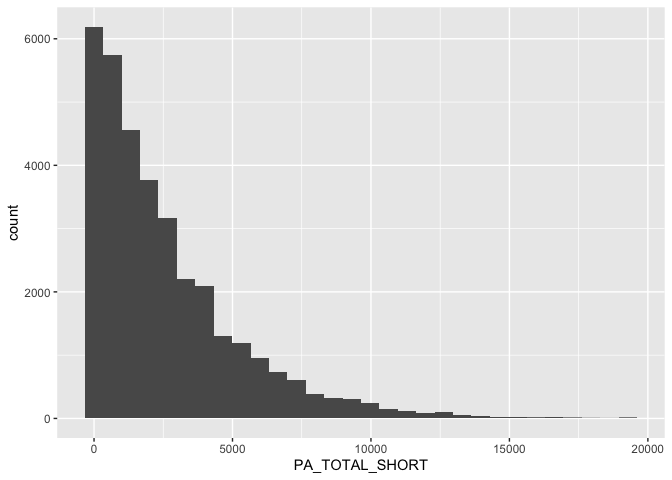<!-- -->

Here *ggplot2* is gives us a warning because the binwidth might not be appropriate. We can pick another binwidth. 


```r
pa_histo_bin_100 <- ggplot(data, aes(PA_TOTAL_SHORT)) + 
              geom_histogram(binwidth = 100)
plot(pa_histo_bin_100)
```

```
## Warning: Removed 6763 rows containing non-finite values (`stat_bin()`).
```

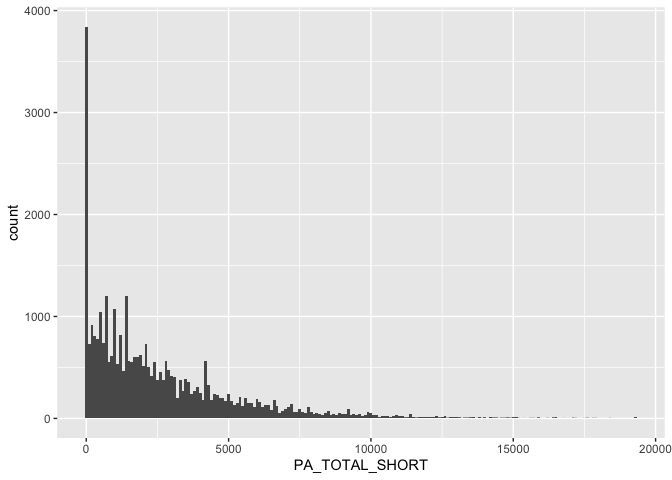<!-- -->

#### Single bar graphs

People get stuck in R making bar graphs because they are used to Excel and only have the mean value of a given column then making the bar graph from that mean column. It's always questionnable whether you should be making a bar graph, but if you really need to here is how you can do it in R. 


```r
# Recoding income here so we can see the levels more easily

data <- data %>%
	mutate(income_recode = case_when(
		SDC_INCOME == 1 ~ "1_Less than 10 000 $",
    SDC_INCOME == 2 ~ "2_10 000 $ - 24 999 $",
		SDC_INCOME == 3 ~ "3_25 000 $ - 49 999 $",
		SDC_INCOME == 4 ~ "4_50 000 $ - 74 999 $",
    SDC_INCOME == 5 ~ "5_75 000 $ - 99 999 $",
		SDC_INCOME == 6 ~ "6_100 000 $ - 149 999 $",
    SDC_INCOME == 7 ~ "7_150 000 $ - 199 999 $",
    SDC_INCOME == 8 ~	"8_200 000 $ or more"
	))

table(data$SDC_INCOME, data$income_recode)
```

```
##    
##     1_Less than 10 000 $ 2_10 000 $ - 24 999 $ 3_25 000 $ - 49 999 $
##   1                  472                     0                     0
##   2                    0                  1985                     0
##   3                    0                     0                  5745
##   4                    0                     0                     0
##   5                    0                     0                     0
##   6                    0                     0                     0
##   7                    0                     0                     0
##   8                    0                     0                     0
##    
##     4_50 000 $ - 74 999 $ 5_75 000 $ - 99 999 $ 6_100 000 $ - 149 999 $
##   1                     0                     0                       0
##   2                     0                     0                       0
##   3                     0                     0                       0
##   4                  6831                     0                       0
##   5                     0                  6602                       0
##   6                     0                     0                    7600
##   7                     0                     0                       0
##   8                     0                     0                       0
##    
##     7_150 000 $ - 199 999 $ 8_200 000 $ or more
##   1                       0                   0
##   2                       0                   0
##   3                       0                   0
##   4                       0                   0
##   5                       0                   0
##   6                       0                   0
##   7                    3463                   0
##   8                       0                2555
```


```r
bar_income <- ggplot(data, aes(income_recode)) + 
                geom_bar() + 
                labs(x = "Income Categories") + 
                theme(axis.text.x = element_text(angle = 90))       
plot(bar_income)
```

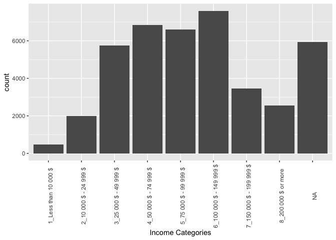<!-- -->

#### Single variable boxplots


```r
boxplot <- ggplot(data, aes(PA_TOTAL_SHORT)) + 
              geom_boxplot() + 
              coord_flip()  # Here we add coord_flip function to make the boxplot more as we would expect
plot(boxplot)
```

```
## Warning: Removed 6763 rows containing non-finite values (`stat_boxplot()`).
```

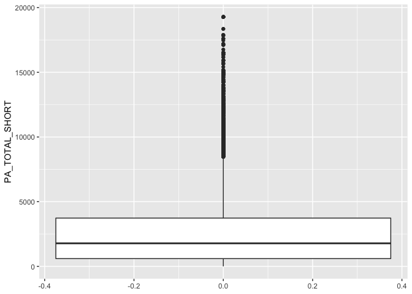<!-- -->

### 3. Scatter plots

Scatterplots plot the relationship between two variables. There are lots of things we can do and we will build a plot sequentially. We are going to plot the relationship between age and physical activity (two continuous variables). 


```r
scatter_plot <- ggplot(data, aes(x = SDC_AGE_CALC, y = PA_TOTAL_SHORT)) + 
                  geom_point()
plot(scatter_plot)
```

```
## Warning: Removed 6763 rows containing missing values (`geom_point()`).
```

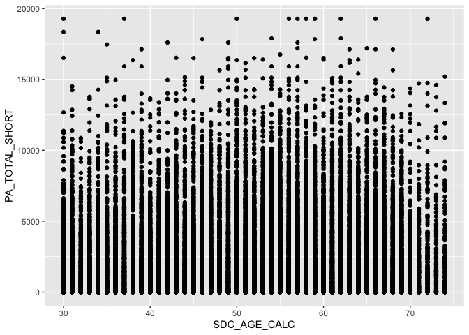<!-- -->

Common things you will see with a scatter plot including the following

#### Adding a regression line

Here we add another *geom* on top of the *geom_point* to start building our plot. We will use *geom_smooth* to add a line. The default in R is a lowess smoother. You can also add a linear regression line. I'm also changing the colour so we can see the difference between the two lines. It's best to use hexcodes for colours but we can also just use words. 


```r
scatter_plot_line <- ggplot(data, aes(x = SDC_AGE_CALC, y = PA_TOTAL_SHORT)) + 
                  geom_point() + 
                  geom_smooth(colour = "red") + 
                  geom_smooth(method = "lm", colour = "#088da5")
plot(scatter_plot_line)
```

```
## `geom_smooth()` using method = 'gam' and formula = 'y ~ s(x, bs = "cs")'
```

```
## Warning: Removed 6763 rows containing non-finite values (`stat_smooth()`).
```

```
## `geom_smooth()` using formula = 'y ~ x'
```

```
## Warning: Removed 6763 rows containing non-finite values (`stat_smooth()`).
```

```
## Warning: Removed 6763 rows containing missing values (`geom_point()`).
```

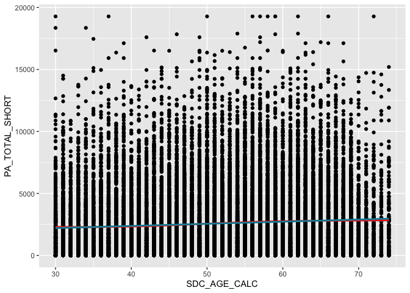<!-- -->

#### Changing the variable names


```r
scatter_plot_variables <- ggplot(data, aes(x = SDC_AGE_CALC, y = PA_TOTAL_SHORT)) + 
                  geom_point() + 
                  geom_smooth(colour = "red") + 
                  geom_smooth(method = "lm", colour = "#088da5") +
                  labs(x = "Age", y = "Physical Activity")
plot(scatter_plot_variables)
```

```
## `geom_smooth()` using method = 'gam' and formula = 'y ~ s(x, bs = "cs")'
```

```
## Warning: Removed 6763 rows containing non-finite values (`stat_smooth()`).
```

```
## `geom_smooth()` using formula = 'y ~ x'
```

```
## Warning: Removed 6763 rows containing non-finite values (`stat_smooth()`).
```

```
## Warning: Removed 6763 rows containing missing values (`geom_point()`).
```

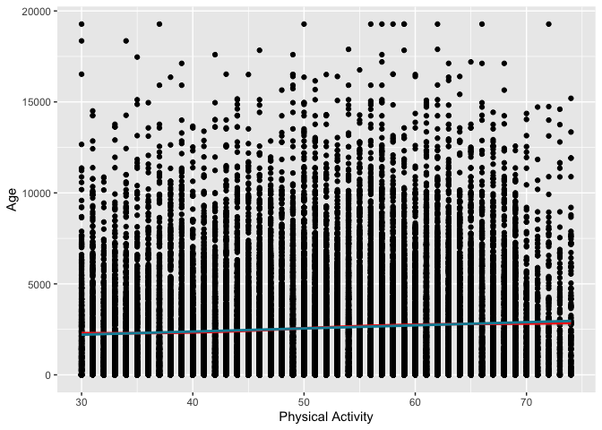<!-- -->

#### Changing the shading of the points

We can use *alpha* to change the shading of the points. This lets use quickly avoid overplotting with lots of overlapping points. We need to play with this a bit. A good place to start is 0.5 and go from there. I ended up at 0.2 which I think shows the mass of data points and avoids too much emphasis on the outlier points. 


```r
scatter_plot_alpha <- ggplot(data, aes(x = SDC_AGE_CALC, y = PA_TOTAL_SHORT)) + 
                  geom_point(alpha = 0.2) + 
                  geom_smooth(colour = "red") + 
                  geom_smooth(method = "lm", colour = "#088da5") +
                  labs(x = "Age", y = "Physical Activity")
plot(scatter_plot_alpha)
```

```
## `geom_smooth()` using method = 'gam' and formula = 'y ~ s(x, bs = "cs")'
```

```
## Warning: Removed 6763 rows containing non-finite values (`stat_smooth()`).
```

```
## `geom_smooth()` using formula = 'y ~ x'
```

```
## Warning: Removed 6763 rows containing non-finite values (`stat_smooth()`).
```

```
## Warning: Removed 6763 rows containing missing values (`geom_point()`).
```

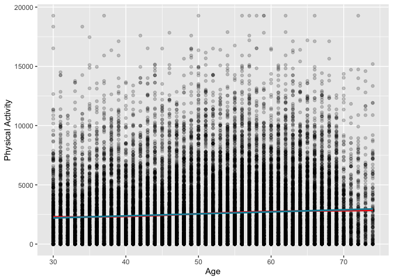<!-- -->

### 4. Grouping with ggplot2

One of the best things about ggplot2 is the ability to easily *group_by* like we would do with data wrangling. We do this by adding groupings (colouring by a variable) or facets (creating separate plots). Here we want to group by gender to see if there are visual differences between genders in the age-PA association. 


```r
# Recoding gender here so we can see the man/women in the plot instead of 1 and 2

data <- data %>%
	mutate(gender_recode = case_when(
		SDC_GENDER == 1 ~ "Man",
    SDC_GENDER == 2 ~ "Woman"
	))
```

Colouring by gender

```r
scatter_plot_gender <- ggplot(data, aes(x = SDC_AGE_CALC, y = PA_TOTAL_SHORT, colour = gender_recode)) + 
                  geom_point(alpha = 0.2) + 
                  labs(x = "Age", y = "Physical Activity", fill = "Gender") 
plot(scatter_plot_gender)
```

```
## Warning: Removed 6763 rows containing missing values (`geom_point()`).
```

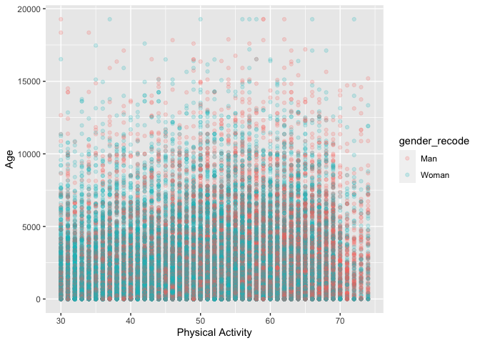<!-- -->

Faceting by gender

```r
scatter_plot_gender <- ggplot(data, aes(x = SDC_AGE_CALC, y = PA_TOTAL_SHORT)) + 
                  geom_point(alpha = 0.2) + 
                  labs(x = "Age", y = "Physical Activity") +
                  facet_wrap(~ gender_recode)
plot(scatter_plot_gender)
```

```
## Warning: Removed 6763 rows containing missing values (`geom_point()`).
```

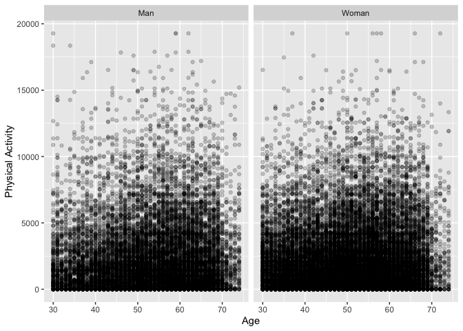<!-- -->


### 5. Colours and themes

Finally, there are many default colours and themes we can use to make the plots look good very quickly. A few things I use regularly. 

#### Themes

There are two themes I use regularly; *classic* and *bw*. Classic provides a clean looking plot with no/limited background. *bw* provides a black and white figure, which is great for publications that need no colour. 

**Black and White Theme**


```r
scatter_plot_bw <- ggplot(data, aes(x = SDC_AGE_CALC, y = PA_TOTAL_SHORT, colour = gender_recode)) + 
                  geom_point(alpha = 0.2) + 
                  labs(x = "Age", y = "Physical Activity", colour = "Gender") +
                  theme_bw()
plot(scatter_plot_bw)
```

```
## Warning: Removed 6763 rows containing missing values (`geom_point()`).
```

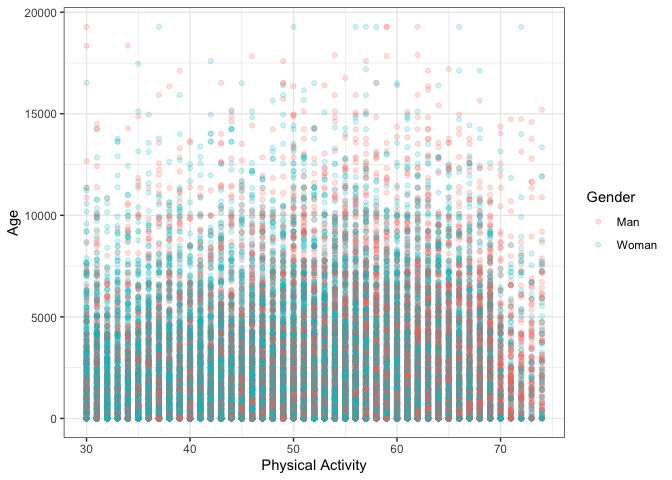<!-- -->

**Classic Theme**


```r
scatter_plot_classic <- ggplot(data, aes(x = SDC_AGE_CALC, y = PA_TOTAL_SHORT, colour = gender_recode)) + 
                  geom_point(alpha = 0.2) + 
                  labs(x = "Age", y = "Physical Activity", colour = "Gender") +
                  theme_classic()
plot(scatter_plot_classic)
```

```
## Warning: Removed 6763 rows containing missing values (`geom_point()`).
```

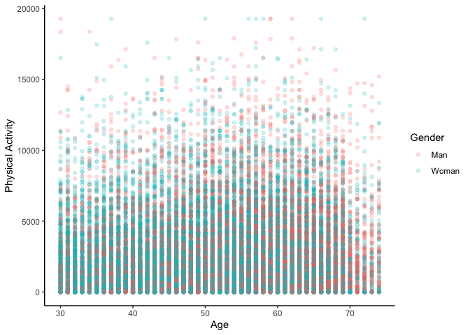<!-- -->

#### Colours

There are lots of default colours in R. The basic functions are *scale_colour* and *scale_fill*. We didn't talk about this much but colour and fill are different based what you are filling. If we go back to the gender colouring we can use different functions to change the colours. The colour brewer colours [https://colorbrewer2.org/](https://colorbrewer2.org/) using *scale_colour_brewer* or *scale_fill_brewer* for sensible default colours. 


```r
scatter_plot_gender_brewer <- ggplot(data, aes(x = SDC_AGE_CALC, y = PA_TOTAL_SHORT, colour = gender_recode)) + 
                  geom_point(alpha = 0.2) + 
                  scale_colour_manual(values = c("#E69F00", "#56B4E9")) +
                  labs(x = "Age", y = "Physical Activity", colour = "Gender") 
plot(scatter_plot_gender_brewer)
```

```
## Warning: Removed 6763 rows containing missing values (`geom_point()`).
```

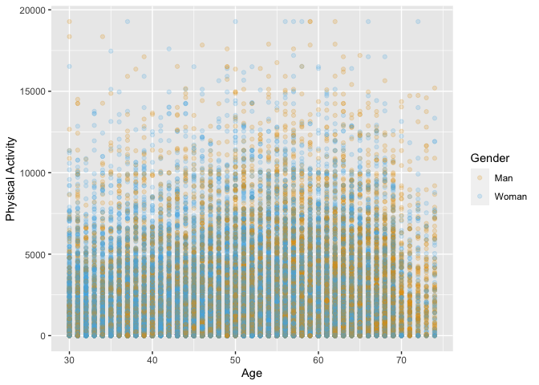<!-- -->
