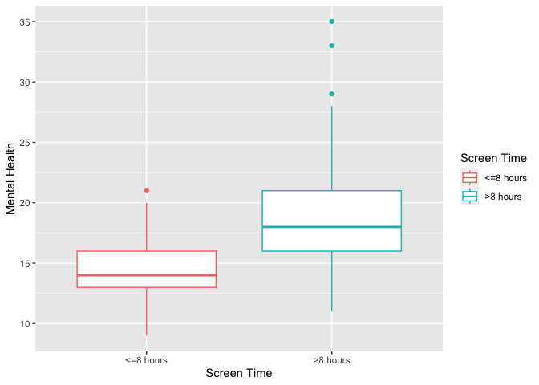
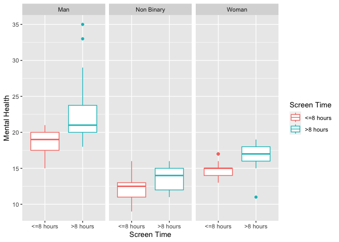
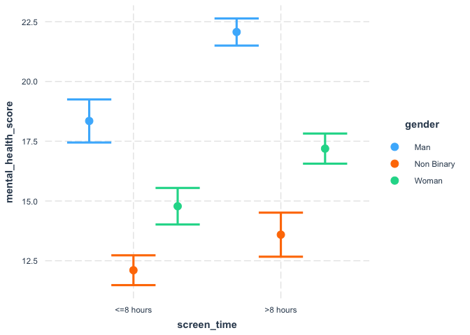
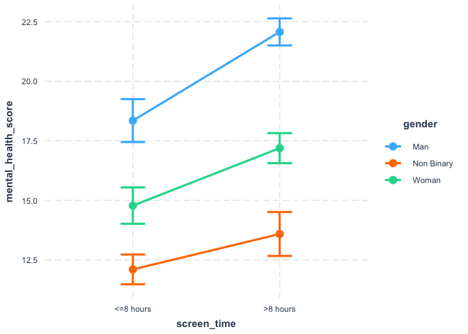
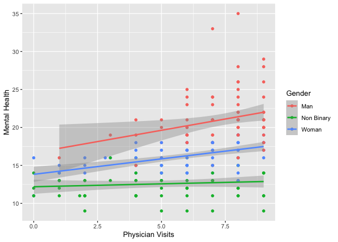
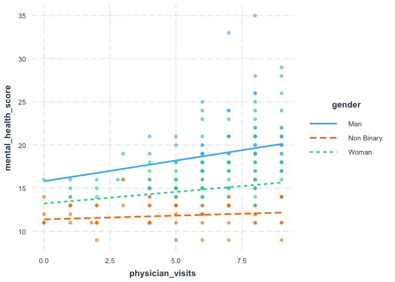
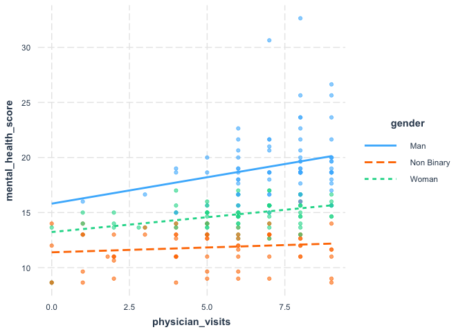

## Interaction/Effect Measure Modification

We will show different methods to estimate interaction in regression models in different scenarios depending on types of variables. We will present both regression based and visual methods to examine interaction. Interaction is complex and we will use new data instead of the usual data for this course in order to simplify the interpretation. 

### 1. Interaction in linear regression with a categorical exposure of interest (A) and a categorical effect modifier (Z)


```r
data <- read_csv("interaction_data1.csv")
```

```
## Rows: 230 Columns: 5
## ── Column specification ────────────────────────────────────────────────────────
## Delimiter: ","
## chr (2): gender, screen_time
## dbl (3): mental_health_score, id, physician_visits
## 
## ℹ Use `spec()` to retrieve the full column specification for this data.
## ℹ Specify the column types or set `show_col_types = FALSE` to quiet this message.
```

We have 3 variables of interest in these data. 

1. Mental Health Score. A survey measure ranging from 10 to 25 with higher scores representing better mental health on average
2. Screen Time. A self-report measure of screen time that has been categorized into 8 hours or more. 
3. Gender. A three category gender variable. 

We suspect that gender is an effect modifier of the association between screen time and mental health score. We want to examine this. 

#### Visual inspection

##### 1.1 Visualize the boxplot between screen time and mental health


```r
boxplot_screen <- ggplot(data, aes(x = screen_time, y = mental_health_score, colour = screen_time)) + 
                  geom_boxplot() + 
                  labs(x = "Screen Time", y = "Mental Health", colour = "Screen Time") 
plot(boxplot_screen)
```

<!-- -->

We can see that there is probably a strong association between screen time and mental health. 

##### 1.2 Visualize the boxplot between screen time and mental health stratified by gender


```r
boxplot_screen_gender <- ggplot(data, aes(x = screen_time, y = mental_health_score, colour = screen_time)) + 
                  geom_boxplot() + 
                  labs(x = "Screen Time", y = "Mental Health", colour = "Screen Time") +
                  facet_wrap(~ gender)
plot(boxplot_screen_gender)
```

<!-- -->

We can also see here differences between mental and screen time by gender. It looks like men in general have greater mental health and women and non-binary people but the effect of screen time is still there for each group. 

##### 1.3 Run the regression

Here we will run the regression including all three variables of interest `and` the interaction term between screen_time and gender. This is multiplicative interaction. There are a few ways to do this in R that will give you the same result. We also include both the main effect and interaction term in the models. 


```r
regression_m1 <- lm(mental_health_score ~ screen_time + gender + screen_time*gender, data=data) ## Method 1
summary(regression_m1)
```

```
## 
## Call:
## lm(formula = mental_health_score ~ screen_time + gender + screen_time * 
##     gender, data = data)
## 
## Residuals:
##     Min      1Q  Median      3Q     Max 
## -6.1915 -1.1042 -0.1042  0.8958 12.9310 
## 
## Coefficients:
##                                      Estimate Std. Error t value Pr(>|t|)    
## (Intercept)                           18.3478     0.4573  40.121  < 2e-16 ***
## screen_time>8 hours                    3.7211     0.5404   6.885 5.73e-11 ***
## genderNon Binary                      -6.2437     0.5562 -11.226  < 2e-16 ***
## genderWoman                           -3.5666     0.5995  -5.949 1.03e-08 ***
## screen_time>8 hours:genderNon Binary  -2.2344     0.7816  -2.859  0.00466 ** 
## screen_time>8 hours:genderWoman       -1.3109     0.7381  -1.776  0.07707 .  
## ---
## Signif. codes:  0 '***' 0.001 '**' 0.01 '*' 0.05 '.' 0.1 ' ' 1
## 
## Residual standard error: 2.193 on 224 degrees of freedom
## Multiple R-squared:  0.7413,	Adjusted R-squared:  0.7356 
## F-statistic: 128.4 on 5 and 224 DF,  p-value: < 2.2e-16
```

```r
regression_m2 <- lm(mental_health_score ~ screen_time*gender, data=data) ## Method 2
summary(regression_m2)
```

```
## 
## Call:
## lm(formula = mental_health_score ~ screen_time * gender, data = data)
## 
## Residuals:
##     Min      1Q  Median      3Q     Max 
## -6.1915 -1.1042 -0.1042  0.8958 12.9310 
## 
## Coefficients:
##                                      Estimate Std. Error t value Pr(>|t|)    
## (Intercept)                           18.3478     0.4573  40.121  < 2e-16 ***
## screen_time>8 hours                    3.7211     0.5404   6.885 5.73e-11 ***
## genderNon Binary                      -6.2437     0.5562 -11.226  < 2e-16 ***
## genderWoman                           -3.5666     0.5995  -5.949 1.03e-08 ***
## screen_time>8 hours:genderNon Binary  -2.2344     0.7816  -2.859  0.00466 ** 
## screen_time>8 hours:genderWoman       -1.3109     0.7381  -1.776  0.07707 .  
## ---
## Signif. codes:  0 '***' 0.001 '**' 0.01 '*' 0.05 '.' 0.1 ' ' 1
## 
## Residual standard error: 2.193 on 224 degrees of freedom
## Multiple R-squared:  0.7413,	Adjusted R-squared:  0.7356 
## F-statistic: 128.4 on 5 and 224 DF,  p-value: < 2.2e-16
```

Nicer output


```r
interaction_model <- tbl_regression(regression_m2) 

interaction_model %>% as_kable()
```


|**Characteristic**    | **Beta** | **95% CI**  | **p-value** |
|:---------------------|:--------:|:-----------:|:-----------:|
|screen_time           |          |             |             |
|<=8 hours             |    —     |      —      |             |
|>8 hours              |   3.7    |  2.7, 4.8   |   <0.001    |
|gender                |          |             |             |
|Man                   |    —     |      —      |             |
|Non Binary            |   -6.2   | -7.3, -5.1  |   <0.001    |
|Woman                 |   -3.6   | -4.7, -2.4  |   <0.001    |
|screen_time * gender  |          |             |             |
|>8 hours * Non Binary |   -2.2   | -3.8, -0.69 |    0.005    |
|>8 hours * Woman      |   -1.3   | -2.8, 0.14  |    0.077    |

We can see the interaction here in the regression results. We can interpret the interaction effect as follows using our notation form the lecture, where our modifiable exposure is screen time (A), our outcome is mental health score (Y), and our effect modifier is gender (Z). 

Here we need to interpret both the main effects and the interaction. 

Main effect of A (screen time)

* __Men__ who who have more than 8 hours of screen time have a 3.7 point (95% CI = 2.7 to 4.8) greater mental health score compared to men with less than or equal to 8 hours of screen time. This effect is for men because we have the interaction term in the model. Without the interaction term the effect would be regardless of gender. 

Main effect of Z (gender)

* Compared to those who identify as men with <=8 hours of screen time, women have -3.6 point lower (95% CI =	-4.7 to -2.4) mental health score. Those who identify as non-binary had a -6.2 point lower (95% CI = -7.3 to -5.1) mental health score. 

Interaction

* Compared to men who had more than 8 hours of screen time non-binary people with less then 8 hours of screen time had a 2.2 lower mental health score (95% CI = -3.8 to -0.69). Women with less then 8 hours of screen time had a 1.3 point lower mental health score (95% CI = -2.8 to 0.14) compared to men how watched 8 hours of screen time. What we are saying is that the effect of screen time stronger for men compared to the other genders. 

In simple terms

* __The effect of screen time on mental health risk is modified by gender in that it is weaker in women and non binary people than it is in those who identify as men.__

##### 1.4 Visualize the regression results

Here we will use the `interactions` package to visualize the results of the regression. We can use `cat_plot` to visualize the results of interactions in regression when we have a categorical exposure of interest (A) and a categorical effect modifier (Z). This is different from the first visualization because we are using the regression results. 


```r
cat_plot(regression_m2, pred = screen_time, modx = gender)
```

<!-- -->

Sometimes it helps to show the lines between the plots to visualize the interaction. 


```r
cat_plot(regression_m2, pred = screen_time, modx = gender, geom = "line")
```

<!-- -->

We can see that the slopes are slightly different between the groups with a steeper slope for the men, compared to women and non-binary identifying people. Screen time effects men's mental health more than the other groups. 

### 2. Interaction in linear regression with a continous exposure of interest (A) and a categorical effect modifier (Z)

We have 3 variables of interest in these data. 

1. Mental Health Score. A survey measure ranging from 10 to 25 with higher scores representing better mental health on average
2. Physician Visits. The average number of physician visits in the past 2 years.
3. Gender. A three category gender variable. 

We suspect that gender is an effect modifier of the association between screen time and mental health score. We want to examine this. 

##### 2.1 Visualize the boxplot between screen time and mental health


```r
scatter_screen_gender <- ggplot(data, aes(x = physician_visits, y = mental_health_score, colour = gender)) + 
                  geom_point() + 
                  geom_smooth(method = "lm") +
                  labs(x = "Physician Visits", y = "Mental Health", colour = "Gender") 
plot(scatter_screen_gender)
```

```
## `geom_smooth()` using formula = 'y ~ x'
```

<!-- -->

##### 2.2 Run the regression

Here we will run the regression including all three variables of interest `and` the interaction term between physician visits and gender. This is multiplicative interaction. There are a few ways to do this in R that will give you the same result. We also include both the main effect and interaction term in the models. 


```r
regression1 <- lm(mental_health_score ~ physician_visits + gender + physician_visits*gender, data=data) ## Method 1
summary(regression1)
```

```
## 
## Call:
## lm(formula = mental_health_score ~ physician_visits + gender + 
##     physician_visits * gender, data = data)
## 
## Residuals:
##     Min      1Q  Median      3Q     Max 
## -5.8143 -1.4424 -0.0818  1.2421 13.5915 
## 
## Coefficients:
##                                   Estimate Std. Error t value Pr(>|t|)    
## (Intercept)                        16.6543     1.2910  12.900  < 2e-16 ***
## physician_visits                    0.5943     0.1722   3.452 0.000666 ***
## genderNon Binary                   -4.4663     1.4344  -3.114 0.002088 ** 
## genderWoman                        -2.8287     1.5106  -1.873 0.062436 .  
## physician_visits:genderNon Binary  -0.5178     0.2046  -2.530 0.012078 *  
## physician_visits:genderWoman       -0.1873     0.2129  -0.879 0.380132    
## ---
## Signif. codes:  0 '***' 0.001 '**' 0.01 '*' 0.05 '.' 0.1 ' ' 1
## 
## Residual standard error: 2.423 on 224 degrees of freedom
## Multiple R-squared:  0.6844,	Adjusted R-squared:  0.6773 
## F-statistic: 97.13 on 5 and 224 DF,  p-value: < 2.2e-16
```

Nicer output


```r
interaction_model <- tbl_regression(regression1) 

interaction_model %>% as_kable()
```


|**Characteristic**            | **Beta** |  **95% CI**  | **p-value** |
|:-----------------------------|:--------:|:------------:|:-----------:|
|physician_visits              |   0.59   |  0.25, 0.93  |   <0.001    |
|gender                        |          |              |             |
|Man                           |    —     |      —       |             |
|Non Binary                    |   -4.5   |  -7.3, -1.6  |    0.002    |
|Woman                         |   -2.8   |  -5.8, 0.15  |    0.062    |
|physician_visits * gender     |          |              |             |
|physician_visits * Non Binary |  -0.52   | -0.92, -0.11 |    0.012    |
|physician_visits * Woman      |  -0.19   | -0.61, 0.23  |     0.4     |

Here have a continuous exposure of interest physician visits (A) and on categorical potential effect modifier (Z). Again, we need to look at the main effects and interaction. 

Main effect of A (physician visits)

* For a 0.6 unit increase in physician visits there is a 1 unit increase in the mental health score overall (95% CI = 0.25 to 0.92) for men. This is the slope of the regression line for men. 

Main effect of Z (gender)

* Compared to those who identify as men, women have -2.8 point lower (95% CI =	-5.8 to 0.15) mental health score. Those who identify as non-binary had a -4.5 point lower (95% CI = -7.3 to -1.6) mental health score. This a comparison of the intercept between the three groups. 

Interaction

* Compared to the association between men's physician visits and mental health, the association between physician visits and mental health score for women and non-binary people is negative -0.19 (95% CI = -0.61 to 0.23) and -0.52 (95% CI = -0.92 to -0.11), respectively. This is a comparison of the difference in slopes between men's slope and the other two slopes. Notice that in the figures all slopes are positive but the slopes for the interaction are negative. This is because we are comparing the different in slopes, so the men's slope is steeper than the women's and non-binary. 

##### 1.4 Visualize the regression results

Here we will use the `interactions` package to visualize the results of the regression. We can use `cat_plot` to visualize the results of interactions in regression when we have a categorical exposure of interest (A) and a categorical effect modifier (Z). This is different from the first visualization because we are using the regression results. 


```r
interact_plot(regression1, pred = physician_visits, modx = gender, plot.points = TRUE)
```

<!-- -->

##### 1.5 More complex regression and partial residuals

Sometimes we might have a more complex regression with multiple predictor variables that we still want to visualize the interaction for. See the model below. 


```r
regression_full <- lm(mental_health_score ~ physician_visits + gender + screen_time + physician_visits*gender, data=data) ## Method 1
summary(regression_full)
```

```
## 
## Call:
## lm(formula = mental_health_score ~ physician_visits + gender + 
##     screen_time + physician_visits * gender, data = data)
## 
## Residuals:
##     Min      1Q  Median      3Q     Max 
## -4.5901 -1.0038 -0.1228  0.9954 12.9988 
## 
## Coefficients:
##                                   Estimate Std. Error t value Pr(>|t|)    
## (Intercept)                        15.8102     1.1579  13.654  < 2e-16 ***
## physician_visits                    0.4792     0.1545   3.102  0.00217 ** 
## genderNon Binary                   -4.4186     1.2807  -3.450  0.00067 ***
## genderWoman                        -2.5778     1.3491  -1.911  0.05733 .  
## screen_time>8 hours                 2.3576     0.3095   7.616 7.35e-13 ***
## physician_visits:genderNon Binary  -0.3916     0.1834  -2.135  0.03386 *  
## physician_visits:genderWoman       -0.2100     0.1901  -1.105  0.27050    
## ---
## Signif. codes:  0 '***' 0.001 '**' 0.01 '*' 0.05 '.' 0.1 ' ' 1
## 
## Residual standard error: 2.163 on 223 degrees of freedom
## Multiple R-squared:  0.7495,	Adjusted R-squared:  0.7428 
## F-statistic: 111.2 on 6 and 223 DF,  p-value: < 2.2e-16
```

Here is we visual we can see a slight different between the lines because this model is more complex. 


```r
interact_plot(regression_full, pred = physician_visits, modx = gender, plot.points = TRUE)
```

<!-- -->

We can show only the prediction lines for the interaction using the particla residuals command. This lets us see only the interaction of interest. 


```r
interact_plot(regression_full, pred = physician_visits, modx = gender, plot.points = TRUE, partial.residuals = TRUE)
```

<!-- -->

Last we can add 95 % confidence intervals. 


```r
interact_plot(regression_full, pred = physician_visits, modx = gender, plot.points = TRUE, partial.residuals = TRUE, interval = TRUE,
              int.width = 0.95)
```

<!-- -->


