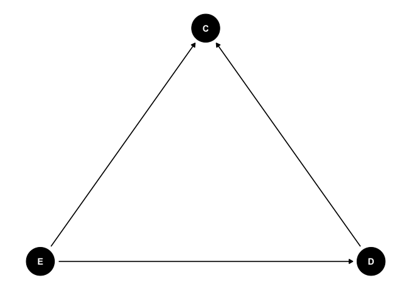

### Required libraries


```r
knitr::opts_chunk$set(echo = TRUE)
library(ggdag)
library(dagitty)
library(episensr) 
library(quartets)
library(reportRmd)
library(tidyverse)
library(gtsummary)
library(knitr)
library(epitools)
```

This data work class is based on the paper below and the [`quartets`](https://r-causal.github.io/quartets/#causal-quartet) R package. We will be working through some examples from the quartets package, specifically Anscombe's Quartet and the Causal Quartet. The examples are precisely the one's provided in the paper and in the package but I will add some explanation and discussion to the data work. 

  *  Lucy D’Agostino McGowan, Travis Gerke & Malcolm Barrett (2023) Causal Inference Is Not Just a Statistics Problem, Journal of Statistics and Data Science Education, DOI: 10.1080/26939169.2023.2276446. 
  
## Anscombe's Quartet

From the `quartets` package and [wiki](https://en.wikipedia.org/wiki/Anscombe%27s_quartet)

> The goal of the anscombe_quartet data set is to help drive home the point that visualizing your data is important. Francis Anscombe generated these four datasets to demonstrate that statistical summary measures alone cannot capture the full relationship between two variables (here, x and y). Anscombe emphasized the importance of visualizing data prior to calculating summary statistics.

* Dataset 1 has a linear relationship between x and y
* Dataset 2 has shows a nonlinear relationship between x and y
* Dataset 3 has a linear relationship between x and y with a single outlier
* Dataset 4 has shows no relationship between x and y with a single outlier that serves as a high-leverage point

### Load the data


```r
anscombe <- anscombe_quartet
```

### Summary statistics

Let's generate summary statistics for the data. Remember that this dataset was generated by a person to show why we should visualize our data. 


```r
anscombe_summary <- anscombe_quartet %>%
                      group_by(dataset) %>%
                      summarise(mean_x = mean(x),
                                var_x = var(x),
                                mean_y = mean(y),
                                var_y = var(y),
                                cor = cor(x, y)) 

kable(anscombe_summary, digits = 2)
```


|dataset       | mean_x| var_x| mean_y| var_y|  cor|
|:-------------|------:|-----:|------:|-----:|----:|
|(1) Linear    |      9|    11|    7.5|  4.13| 0.82|
|(2) Nonlinear |      9|    11|    7.5|  4.13| 0.82|
|(3) Outlier   |      9|    11|    7.5|  4.12| 0.82|
|(4) Leverage  |      9|    11|    7.5|  4.12| 0.82|

Ok wow. If we look at the summary statistics they are all exactly the same. For each for the 4 datasets the mean and variance of x and y are the same, and the correlation between x and y is the same. This extends basically to all summary statistics, regression coefficients, whatever you want to calculate. 

### Visualize the data

Here we are doing a scatter plot between x and y grouped by dataset. 


```r
ggplot(anscombe_quartet, aes(x = x, y = y)) +
  geom_point() + 
  geom_smooth(method = "lm", formula = "y ~ x") +
  facet_wrap(~dataset) + 
  theme_classic()
```

<!-- -->

The data visualization shows that the datasets are very different in terms of the actual relationship between x and y. Anscombe's Quartet has been modernized into the [`DataSaurus Dozen`](https://cran.r-project.org/web/packages/datasauRus/index.html)... because why not. 

### Visualize the DataSaurus Dozen data


```r
ggplot(datasaurus_dozen, aes(x = x, y = y)) +
  geom_point() + 
  geom_smooth(method = "lm", formula = "y ~ x") +
  facet_wrap(~dataset) +
  theme_classic()
```

<!-- -->

That was fun! 

```{}
If you want you can calculate the summary statistics and correlations as a practice.
```

## Causal Quartet

Now will work on the causal quartet data. From the R package repo

> The goal of the causal_quartet data set is to help drive home the point that when presented with an exposure, outcome, and some measured factors, statistics alone, whether summary statistics or data visualizations, are not sufficient to determine the appropriate causal estimate. Additional information about the data generating mechanism is needed in order to draw the correct conclusions. 

Instead of 4 different relationships, as in the Anscombe's quartet data, we have 4 different types of potential mechanisms that might bias our results

1. Collider
2. Confounder
3. Mediator
4. M-Bias 

The causal quartet contains 100 simulated data points from each of the four mechanisms. This set of figures demonstrates that despite the very different data-generating mechanisms, there is no clear way to determine the “appropriate” way to model the effect of the exposure X and the outcome Y without additional information. The information below is combined from tables 1 and 2 from the paper.

| Technical term | Explanation | Correct causal model / analysis | True Association | 
| ----- | ----- | ----- | ----- |
| Collider | The exposure, X, causes a factor, Z, and the outcome, Y, causes a factor, Z. Adjusting for Z when estimating the effect of X on Y would yield a biased result. | Y ~ X | 1 | 
| Confounder | A factor, Z, causes both the exposure, X, and the outcome, Y. Failing to adjust for Z when estimating the effect of X on Y would yield a biased result. | Y ~ X ; Z | 0.5 | 
| Mediator | An exposure, X, causes a factor, Z, which causes the outcome, Y. Adjusting for Z when estimating the effect of X on Y would yield the direct effect, not adjusting for Z would yield the total effect of X on Y. The direct effect represents the relationship between X and Y independent of any mediator, while the total effect includes both the direct effect and any indirect effects mediated by the potential mediator. | Direct Effect: Y ~ X ; Z - Total Effect: Y ~ X | Direct effect: 0 - Total effect: 1 | 
|  M-Bias | here are two additional factors, U1 and U2. Both cause Z, U1 causes the exposure, X, and U2 causes the outcome, Y. Adjusting for Z when estimating the effect of X on Y will yield a biased result. | Y ~ X | 1 | 

### Visualize causal quartet

Let's visualize the data just to see what we are looking at. Remember that each dataset has a different data generating mechanism. I did not show that but it's in the paper. The the x,y association is different based on the presence of another variable. 


```r
ggplot(causal_quartet, aes(x = exposure, y = outcome)) +
  geom_point() + 
  geom_smooth(method = "lm", formula = "y ~ x") +
  facet_wrap(~dataset) + 
  theme_classic()
```

<!-- -->

Now let's look at the DAG for each of the 4 different data generating mechanism. I'm going to use the `daggity` package for this. 

## Collider

### Collider DAG


```r
collider_dag <- dagitty("dag{D -> C
                             E -> C
                             E -> D}")
tidy_dagitty(collider_dag)
```

```
## # A DAG with 3 nodes and 3 edges
## #
## # A tibble: 4 × 8
##   name       x     y direction to      xend   yend circular
##   <chr>  <dbl> <dbl> <fct>     <chr>  <dbl>  <dbl> <lgl>   
## 1 C     -0.179 0.240 <NA>      <NA>  NA     NA     FALSE   
## 2 D      0.815 0.313 ->        C     -0.179  0.240 FALSE   
## 3 E      0.254 1.14  ->        C     -0.179  0.240 FALSE   
## 4 E      0.254 1.14  ->        D      0.815  0.313 FALSE
```

```r
ggdag(collider_dag, layout = "circle") + theme_dag() + coord_flip()
```

<!-- -->

So based on what we know about the colliders so far should adjust or not adjust in this case? __NO__

Let's compare what happens when we do and do not adjust for the collider. 

##### Collider Regression

Get the data


```r
collider_data <- filter(causal_quartet, dataset == "(1) Collider")
```

Adjusted model


```r
collider_adjust <- lm(outcome ~ exposure + covariate, data = collider_data)
collider_adjust <- tbl_regression(collider_adjust)
collider_adjust %>% as_kable()
```


|**Characteristic** | **Beta** | **95% CI** | **p-value** |
|:------------------|:--------:|:----------:|:-----------:|
|exposure           |   0.55   | 0.36, 0.75 |   <0.001    |
|covariate          |   0.39   | 0.27, 0.50 |   <0.001    |

Unadjusted model 


```r
collider_unadjust <- lm(outcome ~ exposure, data = collider_data)
collider_unadjust <- tbl_regression(collider_unadjust) 
collider_unadjust %>% as_kable()
```


|**Characteristic** | **Beta** | **95% CI** | **p-value** |
|:------------------|:--------:|:----------:|:-----------:|
|exposure           |   1.0    | 0.83, 1.2  |   <0.001    |

Both tables together


```r
collider_tble <- tbl_merge(list(collider_adjust, collider_unadjust))
collider_tble %>% as_kable()
```


|**Characteristic** | **Beta** | **95% CI** | **p-value** | **Beta** | **95% CI** | **p-value** |
|:------------------|:--------:|:----------:|:-----------:|:--------:|:----------:|:-----------:|
|exposure           |   0.55   | 0.36, 0.75 |   <0.001    |   1.0    | 0.83, 1.2  |   <0.001    |
|covariate          |   0.39   | 0.27, 0.50 |   <0.001    |          |            |             |

So. When we adjust for the collider we get a biased estimate because the collider opens a path between the exposure and outcome through the collider. 


## Confounder

### Confounder DAG


```r
confounder_dag <- dagitty("dag{C -> D
                             C -> E
                             E -> D}")
tidy_dagitty(confounder_dag)
```

```
## # A DAG with 3 nodes and 3 edges
## #
## # A tibble: 4 × 8
##   name        x      y direction to       xend   yend circular
##   <chr>   <dbl>  <dbl> <fct>     <chr>   <dbl>  <dbl> <lgl>   
## 1 C      0.242   0.705 ->        D     -0.0699 -0.245 FALSE   
## 2 C      0.242   0.705 ->        E     -0.736   0.501 FALSE   
## 3 D     -0.0699 -0.245 <NA>      <NA>  NA      NA     FALSE   
## 4 E     -0.736   0.501 ->        D     -0.0699 -0.245 FALSE
```

```r
ggdag(confounder_dag, layout = "circle") + theme_dag() + coord_flip()
```

<!-- -->

So based on what we know about confounders so far should adjust or not adjust in this case? __YES__

Let's compare what happens when we do and do not adjust for the confounder 

##### Confounder Regression

Get the data


```r
confounder_data <- filter(causal_quartet, dataset == "(2) Confounder")
```

Adjusted model


```r
confounder_adjust <- lm(outcome ~ exposure + covariate, data = confounder_data)
confounder_adjust <- tbl_regression(confounder_adjust)
confounder_adjust %>% as_kable()
```


|**Characteristic** | **Beta** | **95% CI** | **p-value** |
|:------------------|:--------:|:----------:|:-----------:|
|exposure           |   0.50   | 0.29, 0.72 |   <0.001    |
|covariate          |   0.97   | 0.68, 1.3  |   <0.001    |

Unadjusted model 


```r
confounder_unadjust <- lm(outcome ~ exposure, data = confounder_data)
confounder_unadjust <- tbl_regression(confounder_unadjust) 
confounder_unadjust %>% as_kable()
```


|**Characteristic** | **Beta** | **95% CI** | **p-value** |
|:------------------|:--------:|:----------:|:-----------:|
|exposure           |   1.0    | 0.81, 1.2  |   <0.001    |

Both tables together


```r
confounder_tble <- tbl_merge(list(confounder_adjust, confounder_unadjust))
confounder_tble %>% as_kable()
```


|**Characteristic** | **Beta** | **95% CI** | **p-value** | **Beta** | **95% CI** | **p-value** |
|:------------------|:--------:|:----------:|:-----------:|:--------:|:----------:|:-----------:|
|exposure           |   0.50   | 0.29, 0.72 |   <0.001    |   1.0    | 0.81, 1.2  |   <0.001    |
|covariate          |   0.97   | 0.68, 1.3  |   <0.001    |          |            |             |

So. When we adjust for the confounder we get the correct estimate because we block the path that exists between the confounder and the exposure and outcome. 

## Mediator

### Mediator DAG


```r
mediator_dag <- dagitty("dag{C -> D
                             E -> C
                             E -> D}")
tidy_dagitty(mediator_dag)
```

```
## # A DAG with 3 nodes and 3 edges
## #
## # A tibble: 4 × 8
##   name        x     y direction to       xend   yend circular
##   <chr>   <dbl> <dbl> <fct>     <chr>   <dbl>  <dbl> <lgl>   
## 1 C     -0.0238 1.14  ->        D      0.651   0.400 FALSE   
## 2 D      0.651  0.400 <NA>      <NA>  NA      NA     FALSE   
## 3 E      0.955  1.35  ->        C     -0.0238  1.14  FALSE   
## 4 E      0.955  1.35  ->        D      0.651   0.400 FALSE
```

```r
ggdag(mediator_dag, layout = "circle") + theme_dag() + coord_flip()
```

<!-- -->

So based on what we know about mediators so far should adjust or not adjust in this case? __NO__

Let's compare what happens when we do and do not adjust for the mediator. 

##### Mediator Regression

Get the data


```r
mediator_data <- filter(causal_quartet, dataset == "(3) Mediator")
```

Adjusted model


```r
mediator_adjust <- lm(outcome ~ exposure + covariate, data = mediator_data)
mediator_adjust <- tbl_regression(mediator_adjust)
mediator_adjust %>% as_kable()
```


|**Characteristic** | **Beta** | **95% CI**  | **p-value** |
|:------------------|:--------:|:-----------:|:-----------:|
|exposure           |   0.00   | -0.24, 0.25 |    >0.9     |
|covariate          |   1.1    |  0.88, 1.3  |   <0.001    |

Unadjusted model 


```r
mediator_unadjust <- lm(outcome ~ exposure, data = mediator_data)
mediator_unadjust <- tbl_regression(mediator_unadjust) 
mediator_unadjust %>% as_kable()
```


|**Characteristic** | **Beta** | **95% CI** | **p-value** |
|:------------------|:--------:|:----------:|:-----------:|
|exposure           |   1.0    | 0.73, 1.3  |   <0.001    |

Both tables together


```r
mediator_tbl <- tbl_merge(list(mediator_adjust, mediator_unadjust))
mediator_tbl %>% as_kable()
```


|**Characteristic** | **Beta** | **95% CI**  | **p-value** | **Beta** | **95% CI** | **p-value** |
|:------------------|:--------:|:-----------:|:-----------:|:--------:|:----------:|:-----------:|
|exposure           |   0.00   | -0.24, 0.25 |    >0.9     |   1.0    | 0.73, 1.3  |   <0.001    |
|covariate          |   1.1    |  0.88, 1.3  |   <0.001    |          |            |             |

With a mediator we want to understand both the direct effect and the total effect. The direct effect is the direct association between the exposure and outcome independent of the mediator which we know is 1. The total effect is the effect of the exposure through the covariate to the outcome, which we know is 0. In this case to get the direct effect we __should__ adjust for the mediator, and to get the total effect we __should not__ adjust for the mediator. 

All this said, mediation is a complex topic on it's own and we will cover some of the more advanced analyses methods later in the course. The key point here is that you need to have a causal model based on the literature that a variable is a mediator. 

## M-Bias

### M-Bias DAG


```r
m_bias_dag <- m_bias(
  x = "Education",
  y = "Diabetes",
  a = "Income during Childhood",
  b = "Genetic Risk \nfor Diabetes",
  m = "Mother's Diabetes"
) 

ggdag(m_bias_dag) + theme_dag_blank()
```

<!-- -->

```r
ggdag(m_bias_dag, use_labels = "label") + theme_dag_blank()
```

<!-- -->

From the `ggdag` package

> From a classical confounding perspective, it seems like the mother’s diabetes status might be a confounder: it’s associated with both the exposure and outcome, and it’s not a descendant of either. However, the association with the outcome and exposure is not direct for either; it’s due to confounding by genetic risk and childhood income, respectively. Drawing it as a DAG makes it clear that the mother’s diabetes status is a collider, and adjusting for it will induce an association between genetic risk and childhood income, thus opening a back-door path from education to diabetes status. [link](https://r-causal.github.io/ggdag/articles/bias-structures.html).

So based on what we know about m-bias so far should adjust or not adjust in this case? __NO__

Let's compare what happens when we do and do not adjust for the m-bias 

##### M-Bias Regression

Get the data


```r
m_bias_data <- filter(causal_quartet, dataset == "(4) M-Bias")
```

Adjusted model


```r
m_bias_adjust <- lm(outcome ~ exposure + covariate, data = m_bias_data)
m_bias_adjust <- tbl_regression(m_bias_adjust)
m_bias_adjust %>% as_kable()
```


|**Characteristic** | **Beta** | **95% CI**  | **p-value** |
|:------------------|:--------:|:-----------:|:-----------:|
|exposure           |   0.88   |  0.61, 1.1  |   <0.001    |
|covariate          |   0.04   | -0.02, 0.09 |     0.2     |

Unadjusted model 


```r
m_bias_unadjust <- lm(outcome ~ exposure, data = m_bias_data)
m_bias_unadjust <- tbl_regression(m_bias_unadjust) 
m_bias_unadjust %>% as_kable()
```


|**Characteristic** | **Beta** | **95% CI** | **p-value** |
|:------------------|:--------:|:----------:|:-----------:|
|exposure           |   1.0    | 0.81, 1.2  |   <0.001    |

Both tables together


```r
m_bias_tbl <- tbl_merge(list(m_bias_adjust, m_bias_unadjust))
m_bias_tbl %>% as_kable()
```


|**Characteristic** | **Beta** | **95% CI**  | **p-value** | **Beta** | **95% CI** | **p-value** |
|:------------------|:--------:|:-----------:|:-----------:|:--------:|:----------:|:-----------:|
|exposure           |   0.88   |  0.61, 1.1  |   <0.001    |   1.0    | 0.81, 1.2  |   <0.001    |
|covariate          |   0.04   | -0.02, 0.09 |     0.2     |          |            |             |

## Causal Quartet Conclusions

| Data generating mechanism | ATE not adjusting for pre-exposure | ATE adjusting for pre-exposure | Correct average causal effect |
| ---- | ---- | ---- | ---- | 
| (1) Collider | 1 | 1 | 1 |
| (2) Confounder | 1 | 0.5 | 0.5 |
| (3) Mediator | 1 | 1 | 1 |
| (4) M-Bias| 1 | 0.88 | 1 |

From the paper

> Here we have demonstrated that when presented with an exposure, outcome, and some measured factors, statistics alone, whether summary statistics or data visualizations, are insufficient to determine the appropriate causal estimate. Analysts need additional information about the data generating mechanism to draw the correct conclusions. While knowledge of the data generating process is necessary to estimate the correct causal effect in each of the cases presented, an analyst can take steps to make mistakes such as those shown here less likely. [link](https://www.tandfonline.com/doi/full/10.1080/26939169.2023.2276446).

Remember at the beginning of class we talked about adjustment and how in general we should favour less statistical adjustment rather than more. The causal quartet is a toy example but you can see how if you have many many covariates the chance that you are create more bias than you remove is real, especially as your DAG gets more complex. 
