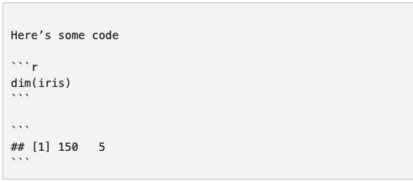

```{r setup, include=FALSE}
knitr::opts_chunk$set(echo = TRUE)
library(tidyverse)
```

> [Remember that there is no geek gene](http://journals.plos.org/ploscompbiol/article?id=10.1371/journal.pcbi.1006023)

The purpose of this document is to orient and provide guidance to working with modern analytic workflows. This is just the beginning and the space is constantly evolving. One step at a time. 

We are mostly using [https://www.tidyverse.org/](Tidyverse) flavoured R in this course. There are different philosophies about using Base R or Tidyverse. Don't go down the rabbit hole. 

#### Thanks!

Much of this work was stolen from

- [Jenny Bryan](https://twitter.com/JennyBryan)
- [Amelia McNamara](https://twitter.com/AmeliaMN)
- [Chester Ismay and Patrick C. Kennedy](https://ismayc.github.io/rbasics-book/index.html)

# Section 1 - General R Stuff

Coding style is important. Follow the [Hadley](http://adv-r.had.co.nz/Style.html) or [Goolge](https://google.github.io/styleguide/Rguide.xml) style guide. We also use `snake_case` in INTERACT projects. All variables and data should be all lower case with an underscore between each word. All new variables you create or data you export should follow the same convention. 

##### Cheat Sheets

RStudio (recently rebranded as Posit) have a bunch of super handy cheat sheets for many of their packages. These are a go to resource for anyone working in R. You can see them here

[https://posit.co/blog/cheat-sheet-updates/](https://posit.co/blog/cheat-sheet-updates)

##### Packages

R can do many statistical and data analyses. They are organized in so-called packages or libraries. With the standard installation, most common packages are installed. There are lots of packages. It’s probable that if you have thought about the analysis, there is a package that is able to do it already. There are two basic steps to using a package:

**Installing the package**
`install.packages("ggplot2")`
**Loading the package**
`library(ggplot2)`

##### Common Errors in R ([from Chester Ismay and Patrick C. Kennedy](https://ismayc.github.io/rbasics-book/index.html))

**1. Error: `could not find function`**

This error usually occurs when a package has not been loaded into R via library, so R does not know where to find the specified function. It’s a good habit to use the library functions on all of the packages you will be using in the top R chunk in your R Markdown file, which is usually given the chunk name setup.  

**2. Error: `object not found`**

This error usually occurs when your R Markdown document refers to an object that has not been defined in an R chunk at or before that chunk. You’ll frequently see this when you’ve forgotten to copy code from your R Console sandbox back into a chunk in R Markdown.  

**3. Misspellings**

One of the most frustrating errors you can encounter in R is when you misspell the name of an object or function. R is not forgiving on this, and it won’t try to automatically figure out what you are referring to. You’ll usually be able to quite easily figure out that you made a typo because you’ll receive an object not found error.

Remember that R is also case-sensitive, so if you called an object Name and then try to call it name later on without name being defined, you’ll receive an error.

**4. Unmatched parenthesis**

Another common error is forgetting or neglecting to finish a call to a function with a closing ). An example of this follows:

`mean(x = c(1, 5, 10, 52)`  

```
Error in parse(text = x, srcfile = src) :
 <text>:2:0: unexpected end of input
1: mean(x = c(1, 5, 10, 52)
  ^
Calls: <Anonymous> ... evaluate -> parse_all -> parse_all.character -> parse
Execution halted

Exited with status 1.
```

In this case, there needs to be one more parenthesis added at the end of your call to mean:

`mean(x = c(1, 5, 10, 52))`

**5. General guidelines**

Try your best to not be intimidated by R errors. Oftentimes, you will find that you are able to understand what they mean by carefully reading over them. When you can’t, carefully look over your R Markdown file again. You might also want to clear out all of your R environment and start at the top by running the chunks. Remember to only include what you deem your reader will need to follow your analysis.

Even people who have worked with R and programmed for years still use Google and support websites like Stack Overflow to ask for help with their R errors or when they aren’t sure how to do something in R. I think you’ll be pleasantly surprised at just how much support is available.

# Section 2 - Markdown and R Markdown

Markdown is a lightweight markup language for creating formatted text using a plain-text editor. John Gruber and Aaron Swartz created Markdown in 2004 as a markup language that is appealing to human readers in its source code form. [Wikipedia](https://en.wikipedia.org/wiki/Markdown) There are Markdown integrations for R [https://rmarkdown.rstudio.com/articles_intro.html](RMarkdown) Stata [https://www.stata.com/features/overview/markdown/](Stata Markdown). These markdown editors work through some type of document rendering software like PanDoc of dyndoc. 

##### Basic Markdown

```{}
headers - Place one or more hashtags at the start of a line that will be a header (or sub-header). For example, # Say Hello to markdown. A single hashtag creates a first level header. Two hashtags, ##, creates a second level header, and so on.

# Level 1 Header
## Level 2 Header

italicized and bold text - Surround italicized text with asterisks, like this *without realizing it*. Surround bold text with two asterisks, like this **easy to use**.

lists - Group lines into bullet points that begin with asterisks. Leave a blank line before the first bullet, like this

This is a list

     * item 1
     * item 2
     * item 3

hyperlinks - Surround links with brackets, and then provide the link target in parentheses, like this [Github](www.github.com).
```

##### Rendered Markdown

headers - Place one or more hashtags at the start of a line that will be a header (or sub-header). For example, # Say Hello to markdown. A single hashtag creates a first level header. Two hashtags, ##, creates a second level header, and so on.

# Level 1 Header
## Level 2 Header

italicized and bold text - Surround italicized text with asterisks, like this *without realizing it*. Surround bold text with two asterisks, like this **easy to use**.

lists - Group lines into bullet points that begin with asterisks. Leave a blank line before the first bullet, like this

This is a list

     * item 1
     * item 2
     * item 3

hyperlinks - Surround links with brackets, and then provide the link target in parentheses, like this [Github](www.github.com).

##### Code Chunks

Code chunks are they key feature of R or Stata Markdown files. Code chunks tell the statistical software to run the code within the chunk and export the results. 

__R Studio Code Chunk__



__Stata Code Chunk__

```{}
~~~~
<<dd_do>>
webuse auto, clear
summarize price
<</dd_do>>
~~~~
```

##### Read in Data

__R__

```{r}
data <- read_csv("CANPATH_data_wrangling.csv")
glimpse(data)
```

__Stata__

```{}
capture log close
log using your_log_file.log, replace

clear all
set more off

import delimited using CANPTH_data_wrangling.csv

log close 
```


