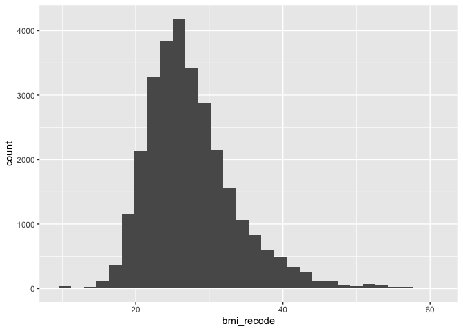
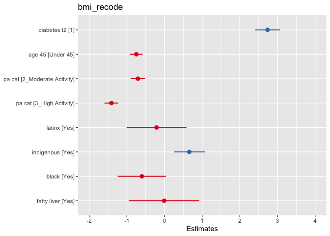
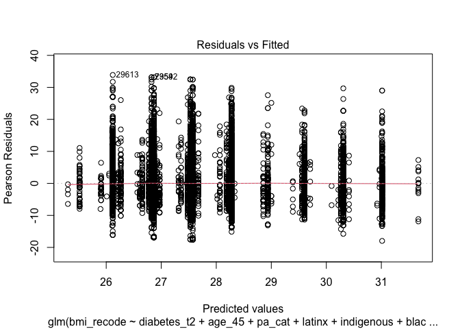
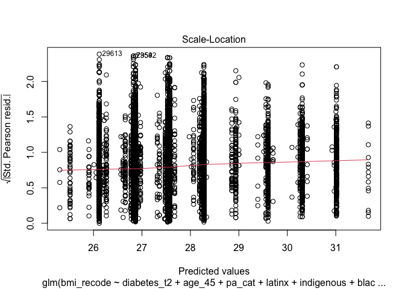
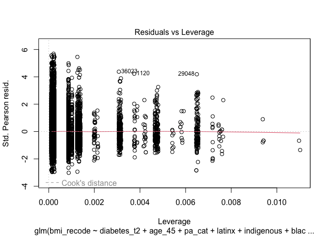

### 1. Linear Regression

A linear regression is a type of regression where the outcome variable is continuous and we assume it has a normal distribution. 

#### Variable selection

For this data work we are not going to worry about variable selection. Variable selection should be based on subject area knowledge about the study design and research question. Ideally, variable selection is done with the help of a DAG. 

### 2. Research question and data

Our research question is:  

- **What factors are associated with BMI?**

We have created a DAG and identified that the following factors are associated with BMI. These are the same variables as the logistic regression assignment. We should be very careful when working with BMI data not to victim blame and also not to look too much at statistical significance. We have good guidelines for what is a meaningful change in BMI in terms of health benefit. 

- `PM_BMI_SR` = BMI
- `DIS_DIAB_TYPE` = Diabetes yes or no
- `PA_TOTAL_SHORT` = Physical activity in MET Minutes per Week
- `SDC_AGE_CALC` = Are 45 years or older
- `diabetes == "Gestational"` = Have ever had gestational diabetes (diabetes during pregnancy) or given birth to a baby who weighed over 9 pounds
- `SDC_EB_ABORIGINAL` + `SDC_EB_LATIN` + `SDC_EB_BLACK` = Are an African American, Hispanic or Latino, American Indian, or Alaska Native person
- `DIS_LIVER_FATTY_EVER` = Have non-alcoholic fatty liver disease

Let's simplify the dataset so we are not working with so many variables. 


```r
data_working <- select(data, "DIS_DIAB_TYPE", "PM_BMI_SR", "PA_LEVEL_SHORT", "SDC_AGE_CALC", "PA_TOTAL_SHORT", "SDC_EB_ABORIGINAL", "SDC_EB_LATIN", "SDC_EB_BLACK", "DIS_LIVER_FATTY_EVER")

rm(data) ### Remove the old data from working memory
```

#### Outcome variable

Let's look at the outcome variable, recode, and drop observations that are not relevant. We need to do a histogram and check the distribution. Then we might deal with outliers.  


```r
summary(data_working$PM_BMI_SR)
```

```
##    Min. 1st Qu.  Median    Mean 3rd Qu.    Max.    NA's 
##    8.86   23.38   26.58   27.55   30.55   69.40   11976
```

```r
bmi_histogram <- ggplot(data = data_working, aes(PM_BMI_SR)) +
                  geom_histogram()
plot(bmi_histogram)
```

```
## `stat_bin()` using `bins = 30`. Pick better value with `binwidth`.
```

```
## Warning: Removed 11976 rows containing non-finite values (`stat_bin()`).
```

<!-- -->

Nice normal(ish) distribution here. We probably have some outliers on the low and high end with values of 8.86 and 69.40 

We can recode people who are less than 10 and greater than 60 to values of 10 and 60 respectively. 


```r
data_working <- data_working %>%
          mutate(bmi_recode = case_when(
            PM_BMI_SR < 10 ~ 10, 
            PM_BMI_SR > 60 ~ 60,
            TRUE ~ PM_BMI_SR
          ))
summary(data_working$bmi_recode)
```

```
##    Min. 1st Qu.  Median    Mean 3rd Qu.    Max.    NA's 
##   10.00   23.38   26.58   27.55   30.55   60.00   11976
```

```r
bmi_recode_histogram <- ggplot(data = data_working, aes(bmi_recode)) +
                  geom_histogram()
plot(bmi_recode_histogram)
```

```
## `stat_bin()` using `bins = 30`. Pick better value with `binwidth`.
```

```
## Warning: Removed 11976 rows containing non-finite values (`stat_bin()`).
```

<!-- -->

#### Preparing predictor variables

**Diabetes**


```r
table(data_working$DIS_DIAB_TYPE)
```

```
## 
##    -7     1     2     3 
## 36807   315  2160   425
```

```r
data_working <- data_working %>%
	mutate(diabetes_t2 = case_when(
    DIS_DIAB_TYPE == 2 ~ 1,
    DIS_DIAB_TYPE == -7 ~ 0, 
		TRUE ~ NA_real_
	))

data_working$diabetes_t2 <- as.factor(data_working$diabetes_t2)
```

**Age**


```r
glimpse(data_working$SDC_AGE_CALC)
```

```
##  num [1:41187] 47 57 62 58 64 40 36 63 58 60 ...
```

```r
summary(data_working$SDC_AGE_CALC) ### Lots of NAs! 
```

```
##    Min. 1st Qu.  Median    Mean 3rd Qu.    Max. 
##   30.00   43.00   52.00   51.48   60.00   74.00
```

```r
data_working <- data_working %>%
	mutate(age_45 = case_when(
	  SDC_AGE_CALC >= 45.00 ~ "Over 45",
		SDC_AGE_CALC < 45.00 ~ "Under 45"
	))

table(data_working$age_45)
```

```
## 
##  Over 45 Under 45 
##    29639    11548
```

**Physical Activity**


```r
glimpse(data_working$PA_LEVEL_SHORT)
```

```
##  num [1:41187] 3 1 NA 2 NA NA 3 1 NA 3 ...
```

```r
table(data_working$PA_LEVEL_SHORT)
```

```
## 
##     1     2     3 
##  9921 10957 13541
```

```r
data_working <- data_working %>%
	mutate(pa_cat = case_when(
		PA_LEVEL_SHORT == 1 ~ "1_Low Activity",
		PA_LEVEL_SHORT == 2 ~ "2_Moderate Activity",
		PA_LEVEL_SHORT == 3 ~ "3_High Activity"
	))

table(data_working$pa_cat, data_working$PA_LEVEL_SHORT)
```

```
##                      
##                           1     2     3
##   1_Low Activity       9921     0     0
##   2_Moderate Activity     0 10957     0
##   3_High Activity         0     0 13541
```

**Racialized**


```r
table(data_working$SDC_EB_ABORIGINAL)
```

```
## 
##     0     1 
## 36601  1431
```

```r
table(data_working$SDC_EB_LATIN)
```

```
## 
##     0     1 
## 37528   479
```

```r
table(data_working$SDC_EB_BLACK)
```

```
## 
##     0     1 
## 37445   555
```

```r
### Latinx

data_working <- data_working %>%
	mutate(latinx = case_when(
		SDC_EB_LATIN == 1 ~ "Yes",
		SDC_EB_LATIN == 0 ~ "No"
	))

table(data_working$SDC_EB_LATIN, data_working$latinx)
```

```
##    
##        No   Yes
##   0 37528     0
##   1     0   479
```

```r
### Indigenous

data_working <- data_working %>%
	mutate(indigenous = case_when(
		SDC_EB_ABORIGINAL == 1 ~ "Yes",
		SDC_EB_ABORIGINAL == 0 ~ "No"
	))

table(data_working$SDC_EB_ABORIGINAL, data_working$indigenous)
```

```
##    
##        No   Yes
##   0 36601     0
##   1     0  1431
```

```r
### Black

data_working <- data_working %>%
	mutate(black = case_when(
		SDC_EB_BLACK == 1 ~ "Yes",
		SDC_EB_BLACK == 0 ~ "No"
	))

table(data_working$SDC_EB_BLACK, data_working$black)
```

```
##    
##        No   Yes
##   0 37445     0
##   1     0   555
```

**Fatty liver disease**


```r
table(data_working$DIS_LIVER_FATTY_EVER)
```

```
## 
##   1   2 
##  61 270
```

```r
data_working <- data_working %>%
	mutate(fatty_liver = case_when(
		DIS_LIVER_FATTY_EVER == 1 ~ "Yes",
		DIS_LIVER_FATTY_EVER == 2 ~ "Yes"
	))

data_working <- data_working %>%
	mutate(fatty_liver = case_when(
		DIS_LIVER_FATTY_EVER == 1 ~ "Yes",
		DIS_LIVER_FATTY_EVER == 2 ~ "Yes"
	))

data_working <- data_working %>% 
                  mutate(fatty_liver = replace_na(fatty_liver, "No"))

table(data_working$fatty_liver)
```

```
## 
##    No   Yes 
## 40856   331
```

#### 3. Preliminary analysis

We want to start by doing bivariable regression on the outcome and each variable. This can a be a bit of a process if we have lots of variables. Here we are using the `glm` (General Linear Model) function. 


```r
model_t2_diab <- glm(bmi_recode ~ diabetes_t2, data = data_working, family = "gaussian")
summary(model_t2_diab)
```

```
## 
## Call:
## glm(formula = bmi_recode ~ diabetes_t2, family = "gaussian", 
##     data = data_working)
## 
## Deviance Residuals: 
##     Min       1Q   Median       3Q      Max  
## -17.355   -4.125   -0.857    2.936   32.645  
## 
## Coefficients:
##              Estimate Std. Error t value Pr(>|t|)    
## (Intercept)  27.35524    0.03732  733.08   <2e-16 ***
## diabetes_t21  2.96047    0.16158   18.32   <2e-16 ***
## ---
## Signif. codes:  0 '***' 0.001 '**' 0.01 '*' 0.05 '.' 0.1 ' ' 1
## 
## (Dispersion parameter for gaussian family taken to be 36.89966)
## 
##     Null deviance: 1045246  on 27992  degrees of freedom
## Residual deviance: 1032858  on 27991  degrees of freedom
##   (13194 observations deleted due to missingness)
## AIC: 180449
## 
## Number of Fisher Scoring iterations: 2
```

```r
cbind(coef(model_t2_diab), confint(model_t2_diab)) ## Old school way
```

```
## Waiting for profiling to be done...
```

```
##                           2.5 %    97.5 %
## (Intercept)  27.355244 27.28211 27.428381
## diabetes_t21  2.960468  2.64378  3.277155
```

```r
model_t2_diab_table <- tbl_regression(model_t2_diab) 

model_t2_diab_table %>% as_kable()
```


|**Characteristic** | **Beta** | **95% CI** | **p-value** |
|:------------------|:--------:|:----------:|:-----------:|
|diabetes_t2        |          |            |             |
|0                  |    —     |     —      |             |
|1                  |   3.0    |  2.6, 3.3  |   <0.001    |

There are advantages and disadvantages to different was to display models. The `summary` method is good because we all of relevant output from the models. On the downside it's very ugly and hard to make nice tables with. The `tbl_regression` way is nice because we get nice output but we can miss things that might be relevant to our models. 

We always want to look at all of the bivariate associations for each independent variable. We can do this quickly with the final fit package. For now ignore the multivariable model results. We just want to look at the bivariable. 


```r
univ_table <- data_working %>%
  select(bmi_recode, diabetes_t2, age_45, pa_cat, latinx, indigenous, black, fatty_liver) %>%
  tbl_uvregression(
    method = glm,
    y = bmi_recode,
    method.args = list(family = gaussian)) 

univ_table %>% as_kable()
```


|**Characteristic**  | **N**  | **Beta** |  **95% CI**  | **p-value** |
|:-------------------|:------:|:--------:|:------------:|:-----------:|
|diabetes_t2         | 27,993 |          |              |             |
|0                   |        |    —     |      —       |             |
|1                   |        |   3.0    |   2.6, 3.3   |   <0.001    |
|age_45              | 29,211 |          |              |             |
|Over 45             |        |    —     |      —       |             |
|Under 45            |        |  -0.82   | -0.97, -0.66 |   <0.001    |
|pa_cat              | 27,209 |          |              |             |
|1_Low Activity      |        |    —     |      —       |             |
|2_Moderate Activity |        |  -0.70   | -0.89, -0.52 |   <0.001    |
|3_High Activity     |        |   -1.5   |  -1.6, -1.3  |   <0.001    |
|latinx              | 28,396 |          |              |             |
|No                  |        |    —     |      —       |             |
|Yes                 |        |  -0.31   |  -1.0, 0.44  |     0.4     |
|indigenous          | 28,426 |          |              |             |
|No                  |        |    —     |      —       |             |
|Yes                 |        |   0.61   |  0.23, 0.99  |    0.002    |
|black               | 28,382 |          |              |             |
|No                  |        |    —     |      —       |             |
|Yes                 |        |  -0.68   | -1.3, -0.10  |    0.022    |
|fatty_liver         | 29,211 |          |              |             |
|No                  |        |    —     |      —       |             |
|Yes                 |        |   0.07   | -0.73, 0.88  |     0.9     |

#### Final Model

Let's run our final model with all variables. We are going to assume here that we have a solid DAG for this study design and model. 


```r
model_final <- glm(bmi_recode ~  diabetes_t2 +
                                  age_45 + 
                                  pa_cat + 
                                  latinx + 
                                  indigenous + 
                                  black + 
                                  fatty_liver, 
                    data = data_working, family = "gaussian")
summary(model_final)
```

```
## 
## Call:
## glm(formula = bmi_recode ~ diabetes_t2 + age_45 + pa_cat + latinx + 
##     indigenous + black + fatty_liver, family = "gaussian", data = data_working)
## 
## Deviance Residuals: 
##     Min       1Q   Median       3Q      Max  
## -17.970   -4.039   -0.910    2.892   33.881  
## 
## Coefficients:
##                           Estimate Std. Error t value Pr(>|t|)    
## (Intercept)               28.27826    0.07809 362.136  < 2e-16 ***
## diabetes_t21               2.73600    0.17142  15.960  < 2e-16 ***
## age_45Under 45            -0.74891    0.08455  -8.858  < 2e-16 ***
## pa_cat2_Moderate Activity -0.70561    0.09822  -7.184 6.97e-13 ***
## pa_cat3_High Activity     -1.41040    0.09428 -14.960  < 2e-16 ***
## latinxYes                 -0.21245    0.40556  -0.524  0.60038    
## indigenousYes              0.65882    0.20856   3.159  0.00159 ** 
## blackYes                  -0.60266    0.32757  -1.840  0.06581 .  
## fatty_liverYes            -0.01026    0.47708  -0.022  0.98283    
## ---
## Signif. codes:  0 '***' 0.001 '**' 0.01 '*' 0.05 '.' 0.1 ' ' 1
## 
## (Dispersion parameter for gaussian family taken to be 35.49538)
## 
##     Null deviance: 892351  on 24542  degrees of freedom
## Residual deviance: 870844  on 24534  degrees of freedom
##   (16644 observations deleted due to missingness)
## AIC: 157265
## 
## Number of Fisher Scoring iterations: 2
```

```r
multi_table <- tbl_regression(model_final) 

multi_table %>% as_kable()
```


|**Characteristic**  | **Beta** |  **95% CI**  | **p-value** |
|:-------------------|:--------:|:------------:|:-----------:|
|diabetes_t2         |          |              |             |
|0                   |    —     |      —       |             |
|1                   |   2.7    |   2.4, 3.1   |   <0.001    |
|age_45              |          |              |             |
|Over 45             |    —     |      —       |             |
|Under 45            |  -0.75   | -0.91, -0.58 |   <0.001    |
|pa_cat              |          |              |             |
|1_Low Activity      |    —     |      —       |             |
|2_Moderate Activity |  -0.71   | -0.90, -0.51 |   <0.001    |
|3_High Activity     |   -1.4   |  -1.6, -1.2  |   <0.001    |
|latinx              |          |              |             |
|No                  |    —     |      —       |             |
|Yes                 |  -0.21   |  -1.0, 0.58  |     0.6     |
|indigenous          |          |              |             |
|No                  |    —     |      —       |             |
|Yes                 |   0.66   |  0.25, 1.1   |    0.002    |
|black               |          |              |             |
|No                  |    —     |      —       |             |
|Yes                 |  -0.60   |  -1.2, 0.04  |    0.066    |
|fatty_liver         |          |              |             |
|No                  |    —     |      —       |             |
|Yes                 |  -0.01   | -0.95, 0.92  |    >0.9     |

```r
plot_model(model_final, type="est")
```

```
## Profiled confidence intervals may take longer time to compute.
##   Use `ci_method="wald"` for faster computation of CIs.
```

<!-- -->


```r
tbl_univ_multi <- tbl_merge(list(univ_table, multi_table))

tbl_univ_multi %>% as_kable()
```


|**Characteristic**  | **N**  | **Beta** |  **95% CI**  | **p-value** | **Beta** |  **95% CI**  | **p-value** |
|:-------------------|:------:|:--------:|:------------:|:-----------:|:--------:|:------------:|:-----------:|
|diabetes_t2         | 27,993 |          |              |             |          |              |             |
|0                   |        |    —     |      —       |             |    —     |      —       |             |
|1                   |        |   3.0    |   2.6, 3.3   |   <0.001    |   2.7    |   2.4, 3.1   |   <0.001    |
|age_45              | 29,211 |          |              |             |          |              |             |
|Over 45             |        |    —     |      —       |             |    —     |      —       |             |
|Under 45            |        |  -0.82   | -0.97, -0.66 |   <0.001    |  -0.75   | -0.91, -0.58 |   <0.001    |
|pa_cat              | 27,209 |          |              |             |          |              |             |
|1_Low Activity      |        |    —     |      —       |             |    —     |      —       |             |
|2_Moderate Activity |        |  -0.70   | -0.89, -0.52 |   <0.001    |  -0.71   | -0.90, -0.51 |   <0.001    |
|3_High Activity     |        |   -1.5   |  -1.6, -1.3  |   <0.001    |   -1.4   |  -1.6, -1.2  |   <0.001    |
|latinx              | 28,396 |          |              |             |          |              |             |
|No                  |        |    —     |      —       |             |    —     |      —       |             |
|Yes                 |        |  -0.31   |  -1.0, 0.44  |     0.4     |  -0.21   |  -1.0, 0.58  |     0.6     |
|indigenous          | 28,426 |          |              |             |          |              |             |
|No                  |        |    —     |      —       |             |    —     |      —       |             |
|Yes                 |        |   0.61   |  0.23, 0.99  |    0.002    |   0.66   |  0.25, 1.1   |    0.002    |
|black               | 28,382 |          |              |             |          |              |             |
|No                  |        |    —     |      —       |             |    —     |      —       |             |
|Yes                 |        |  -0.68   | -1.3, -0.10  |    0.022    |  -0.60   |  -1.2, 0.04  |    0.066    |
|fatty_liver         | 29,211 |          |              |             |          |              |             |
|No                  |        |    —     |      —       |             |    —     |      —       |             |
|Yes                 |        |   0.07   | -0.73, 0.88  |     0.9     |  -0.01   | -0.95, 0.92  |    >0.9     |

For linear regression models there are a number of assumptions we want to check. These are typically easy visualized using plots. We can produce the plots for the relevant visualizations using `plot` from base R. 


```r
plot(model_final)
```

<!-- --><!-- --><!-- --><!-- -->


