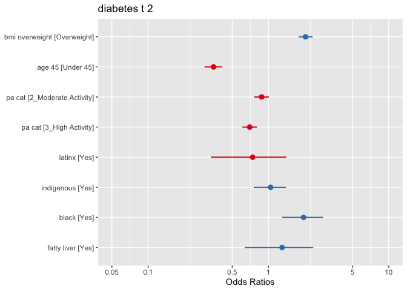
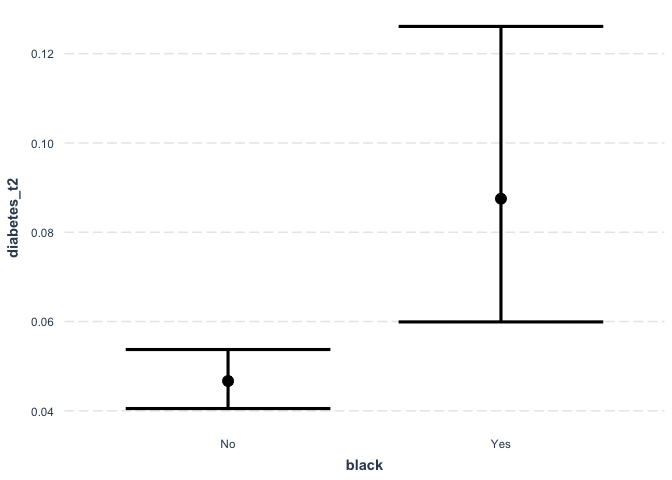
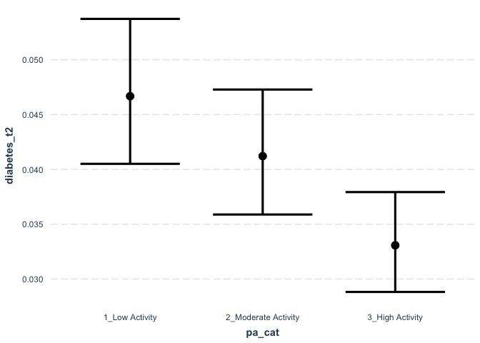
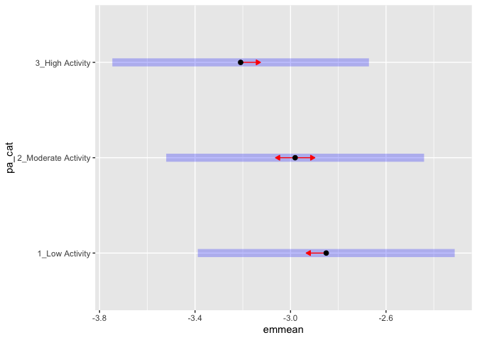

### 1. Logistic Regression

A logistic regression is a type of regression where the outcome variable is a 0 or 1 variable. That is the outcome can only have 2 possible values. The logistic in logistic regression refers to the fact that we are using a logistic function to fit a model for the 2 possible values (more on this later). More generally, logistic regression in a form of classification problem where we want to try and predict which group a unit (in our case usually a person) belongs to using variables about that unit. In logistic regression the outcome must be 0 or 1 but we can include both continous and categorical predictors in the model.

#### Variable selection

For this data work we are not going to worry about variable selection. Variable selection should be based on subject area knowledge about the study design and research question. Ideally, variable selection is done with the help of a DAG. 

### 2. Research question and data

Our research question is:  

- **What factors are associated with ever having been diagnosed with type 2 diabetes?**

We have created a DAG and identified that the following factors are associated with type 2 diabetes:   

- `No varaible in data` = Have prediabetes
- `PM_BMI_SR` = Are overweight
- `SDC_AGE_CALC` = Are 45 years or older
- `No varaible in data` = Have a parent, brother, or sister with type 2 diabetes
- `PA_LEVEL_LONG` = Are physically active less than 3 times a week
- `diabetes == "Gestational"` = Have ever had gestational diabetes (diabetes during pregnancy) or given birth to a baby who weighed over 9 pounds
- `SDC_EB_ABORIGINAL` + `SDC_EB_LATIN` + `SDC_EB_BLACK` = Are an African American, Hispanic or Latino, American Indian, or Alaska Native person
- `DIS_LIVER_FATTY_EVER` = Have non-alcoholic fatty liver disease

Let's simplify the dataset so we are not working with so many variables. 


```r
data_working <- select(data, "DIS_DIAB_TYPE", "PM_BMI_SR", "SDC_AGE_CALC", "PA_LEVEL_SHORT", "SDC_EB_ABORIGINAL", "SDC_EB_LATIN", "SDC_EB_BLACK", "DIS_LIVER_FATTY_EVER")

rm(data) ### Remove the old data from working memory
```

#### Outcome variable

Let's look at the outcome variable, recode, and drop observations that are not relevant. We know that the GLM function needs a 0/1 variable and we want to recode that way now so we don't need to change it after. We also know we want to keep our gestational diabetes variable because we need it later. 


```r
table(data_working$DIS_DIAB_TYPE)
```

```
## 
##    -7     1     2     3 
## 36807   315  2160   425
```

```r
data_working <- data_working %>%
	mutate(diabetes_t2 = case_when(
    DIS_DIAB_TYPE == 2 ~ 1,
    DIS_DIAB_TYPE == -7 ~ 0, 
		TRUE ~ NA_real_
	))

data_working$diabetes_t2 <- as.factor(data_working$diabetes_t2)

table(data_working$diabetes_t2, data_working$DIS_DIAB_TYPE)
```

```
##    
##        -7     1     2     3
##   0 36807     0     0     0
##   1     0     0  2160     0
```

```r
data_working <- data_working %>%
	mutate(diabetes_gestat = case_when(
    DIS_DIAB_TYPE == 3 ~ 1,
    DIS_DIAB_TYPE == -7 ~ 0, 
		TRUE ~ NA_real_
	))

data_working$diabetes_gestat <- as.factor(data_working$diabetes_gestat)


data_working <- filter(data_working, diabetes_t2 == 0 | diabetes_t2 == 1 | diabetes_gestat == 1)
```

For logistic regression in the case of a cross-section study we want the outcome to be ~10% of the total sample. Here we have `2160/36807*100 = 5.86%`. 

#### Preparing predictor variables

**BMI overweight**


```r
glimpse(data_working$PM_BMI_SR)
```

```
##  num [1:39392] NA 28.3 25.5 44.8 NA ...
```

```r
summary(data_working$PM_BMI_SR) ### Lots of NAs! 
```

```
##    Min. 1st Qu.  Median    Mean 3rd Qu.    Max.    NA's 
##    8.86   23.34   26.58   27.53   30.52   69.40   11124
```

```r
data_working <- data_working %>%
	mutate(bmi_overweight = case_when(
	  PM_BMI_SR >= 25.00 ~ "Overweight",
		PM_BMI_SR < 25.00 ~ "Not Overweight"
	))

table(data_working$bmi_overweight)
```

```
## 
## Not Overweight     Overweight 
##          10607          17661
```

**Age**


```r
glimpse(data_working$SDC_AGE_CALC)
```

```
##  num [1:39392] 47 57 62 64 40 36 63 58 60 41 ...
```

```r
summary(data_working$SDC_AGE_CALC) ### Lots of NAs! 
```

```
##    Min. 1st Qu.  Median    Mean 3rd Qu.    Max. 
##    30.0    43.0    52.0    51.5    60.0    74.0
```

```r
data_working <- data_working %>%
	mutate(age_45 = case_when(
	  SDC_AGE_CALC >= 45.00 ~ "Over 45",
		SDC_AGE_CALC < 45.00 ~ "Under 45"
	))

table(data_working$age_45)
```

```
## 
##  Over 45 Under 45 
##    28415    10977
```

**Physical Activity**


```r
glimpse(data_working$PA_LEVEL_SHORT)
```

```
##  num [1:39392] 3 1 NA NA NA 3 1 NA 3 3 ...
```

```r
table(data_working$PA_LEVEL_SHORT)
```

```
## 
##     1     2     3 
##  9538 10606 13140
```

```r
data_working <- data_working %>%
	mutate(pa_cat = case_when(
		PA_LEVEL_SHORT == 1 ~ "1_Low Activity",
		PA_LEVEL_SHORT == 2 ~ "2_Moderate Activity",
		PA_LEVEL_SHORT == 3 ~ "3_High Activity"
	))

table(data_working$pa_cat, data_working$PA_LEVEL_SHORT)
```

```
##                      
##                           1     2     3
##   1_Low Activity       9538     0     0
##   2_Moderate Activity     0 10606     0
##   3_High Activity         0     0 13140
```

**Racialized**


```r
table(data_working$SDC_EB_ABORIGINAL)
```

```
## 
##     0     1 
## 35331  1351
```

```r
table(data_working$SDC_EB_LATIN)
```

```
## 
##     0     1 
## 36221   451
```

```r
table(data_working$SDC_EB_BLACK)
```

```
## 
##     0     1 
## 36149   518
```

```r
### Latinx

data_working <- data_working %>%
	mutate(latinx = case_when(
		SDC_EB_LATIN == 1 ~ "Yes",
		SDC_EB_LATIN == 0 ~ "No"
	))

table(data_working$SDC_EB_LATIN, data_working$latinx)
```

```
##    
##        No   Yes
##   0 36221     0
##   1     0   451
```

```r
### Indigenous

data_working <- data_working %>%
	mutate(indigenous = case_when(
		SDC_EB_ABORIGINAL == 1 ~ "Yes",
		SDC_EB_ABORIGINAL == 0 ~ "No"
	))

table(data_working$SDC_EB_ABORIGINAL, data_working$indigenous)
```

```
##    
##        No   Yes
##   0 35331     0
##   1     0  1351
```

```r
### Black

data_working <- data_working %>%
	mutate(black = case_when(
		SDC_EB_BLACK == 1 ~ "Yes",
		SDC_EB_BLACK == 0 ~ "No"
	))

table(data_working$SDC_EB_BLACK, data_working$black)
```

```
##    
##        No   Yes
##   0 36149     0
##   1     0   518
```

**Fatty liver disease**


```r
table(data_working$DIS_LIVER_FATTY_EVER)
```

```
## 
##   1   2 
##  50 199
```

```r
data_working <- data_working %>%
	mutate(fatty_liver = case_when(
		DIS_LIVER_FATTY_EVER == 1 ~ "Yes",
		DIS_LIVER_FATTY_EVER == 2 ~ "Yes"
	))

data_working <- data_working %>%
	mutate(fatty_liver = case_when(
		DIS_LIVER_FATTY_EVER == 1 ~ "Yes",
		DIS_LIVER_FATTY_EVER == 2 ~ "Yes"
	))

data_working <- data_working %>% 
                  mutate(fatty_liver = replace_na(fatty_liver, "No"))

table(data_working$fatty_liver)
```

```
## 
##    No   Yes 
## 39143   249
```

#### 3. Preliminary analysis

We want to start by doing bivariable regression on the outcome and each variable. This can a be a bit of a process if we have lots of variables. Here we are using the `glm` (General Linear Model) function. 


```r
table(data_working$diabetes_t2, data_working$bmi_overweight)
```

```
##    
##     Not Overweight Overweight
##   0          10171      16329
##   1            349       1144
```

```r
model_weight <- glm(diabetes_t2 ~ bmi_overweight, data = data_working, family = "binomial")
summary(model_weight)
```

```
## 
## Call:
## glm(formula = diabetes_t2 ~ bmi_overweight, family = "binomial", 
##     data = data_working)
## 
## Deviance Residuals: 
##     Min       1Q   Median       3Q      Max  
## -0.3680  -0.3680  -0.3680  -0.2598   2.6100  
## 
## Coefficients:
##                          Estimate Std. Error z value Pr(>|z|)    
## (Intercept)              -3.37222    0.05444  -61.95   <2e-16 ***
## bmi_overweightOverweight  0.71381    0.06244   11.43   <2e-16 ***
## ---
## Signif. codes:  0 '***' 0.001 '**' 0.01 '*' 0.05 '.' 0.1 ' ' 1
## 
## (Dispersion parameter for binomial family taken to be 1)
## 
##     Null deviance: 11657  on 27992  degrees of freedom
## Residual deviance: 11512  on 27991  degrees of freedom
##   (11399 observations deleted due to missingness)
## AIC: 11516
## 
## Number of Fisher Scoring iterations: 6
```

```r
exp(cbind(coef(model_weight), confint(model_weight))) ## Old school way
```

```
## Waiting for profiling to be done...
```

```
##                                          2.5 %     97.5 %
## (Intercept)              0.03431324 0.03078491 0.03811045
## bmi_overweightOverweight 2.04175987 1.80871009 2.31048759
```

```r
model_weight_table <- tbl_regression(model_weight, exponentiate = TRUE) 

model_weight_table %>% as_kable()
```


|**Characteristic** | **OR** | **95% CI** | **p-value** |
|:------------------|:------:|:----------:|:-----------:|
|bmi_overweight     |        |            |             |
|Not Overweight     |   —    |     —      |             |
|Overweight         |  2.04  | 1.81, 2.31 |   <0.001    |

There are advantages and disadvantages to different was to display models. The `summary` method is good because we all of relevant output from the models. On the downside it's very ugly and hard to make nice tables with. The `tbl_regression` way is nice because we get nice output but we can miss things that might be relevant to our models. By default using the summary we don't get Odds Ratios and confidence intervals. I've shown two ways to get these results. 

We always want to look at all of the bivariate associations for each independent variable. We can do this quickly with the final fit package. For now ignore the multivariable model results. We just want to look at the bivariable. 


```r
univ_table <- data_working %>%
  select(diabetes_t2, bmi_overweight, age_45, pa_cat, latinx, indigenous, black, fatty_liver) %>%
  tbl_uvregression(
    method = glm,
    y = diabetes_t2,
    method.args = list(family = binomial),
    exponentiate = TRUE) 

univ_table %>% as_kable()
```


|**Characteristic**  | **N**  | **OR** | **95% CI** | **p-value** |
|:-------------------|:------:|:------:|:----------:|:-----------:|
|bmi_overweight      | 27,993 |        |            |             |
|Not Overweight      |        |   —    |     —      |             |
|Overweight          |        |  2.04  | 1.81, 2.31 |   <0.001    |
|age_45              | 38,967 |        |            |             |
|Over 45             |        |   —    |     —      |             |
|Under 45            |        |  0.35  | 0.31, 0.40 |   <0.001    |
|pa_cat              | 32,944 |        |            |             |
|1_Low Activity      |        |   —    |     —      |             |
|2_Moderate Activity |        |  0.85  | 0.76, 0.96 |    0.008    |
|3_High Activity     |        |  0.70  | 0.62, 0.79 |   <0.001    |
|latinx              | 36,283 |        |            |             |
|No                  |        |   —    |     —      |             |
|Yes                 |        |  0.82  | 0.51, 1.25 |     0.4     |
|indigenous          | 36,290 |        |            |             |
|No                  |        |   —    |     —      |             |
|Yes                 |        |  1.15  | 0.91, 1.43 |     0.2     |
|black               | 36,276 |        |            |             |
|No                  |        |   —    |     —      |             |
|Yes                 |        |  1.38  | 0.97, 1.91 |    0.062    |
|fatty_liver         | 38,967 |        |            |             |
|No                  |        |   —    |     —      |             |
|Yes                 |        |  2.05  | 1.33, 3.03 |   <0.001    |

#### Model diagnostics

We are not going to get into model selection at this point in the course (more on that later). For now, we want to get as much info as we can about our models. We will work on visualizing the results of the logistic regression, estimating marginal means, and saving predicted values. 

Let's run our final model with all variables. We are going to assume here that we have a solid DAG for this study design and model. 


```r
model_final <- glm(diabetes_t2 ~ bmi_overweight + 
                                  age_45 + 
                                  pa_cat + 
                                  latinx + 
                                  indigenous + 
                                  black + 
                                  fatty_liver, 
                    data = data_working, family = "binomial")
summary(model_final)
```

```
## 
## Call:
## glm(formula = diabetes_t2 ~ bmi_overweight + age_45 + pa_cat + 
##     latinx + indigenous + black + fatty_liver, family = "binomial", 
##     data = data_working)
## 
## Deviance Residuals: 
##     Min       1Q   Median       3Q      Max  
## -0.6721  -0.4094  -0.2901  -0.2454   2.9792  
## 
## Coefficients:
##                           Estimate Std. Error z value Pr(>|z|)    
## (Intercept)               -3.01671    0.07559 -39.910  < 2e-16 ***
## bmi_overweightOverweight   0.71017    0.06819  10.414  < 2e-16 ***
## age_45Under 45            -1.05078    0.08578 -12.249  < 2e-16 ***
## pa_cat2_Moderate Activity -0.13027    0.07084  -1.839 0.065905 .  
## pa_cat3_High Activity     -0.35858    0.07111  -5.042  4.6e-07 ***
## latinxYes                 -0.30177    0.36399  -0.829 0.407069    
## indigenousYes              0.04117    0.15727   0.262 0.793477    
## blackYes                   0.67227    0.19936   3.372 0.000746 ***
## fatty_liverYes             0.26148    0.33165   0.788 0.430448    
## ---
## Signif. codes:  0 '***' 0.001 '**' 0.01 '*' 0.05 '.' 0.1 ' ' 1
## 
## (Dispersion parameter for binomial family taken to be 1)
## 
##     Null deviance: 10088.0  on 24542  degrees of freedom
## Residual deviance:  9724.1  on 24534  degrees of freedom
##   (14849 observations deleted due to missingness)
## AIC: 9742.1
## 
## Number of Fisher Scoring iterations: 6
```

```r
multi_table <- tbl_regression(model_final, exponentiate = TRUE) 

multi_table %>% as_kable()
```


|**Characteristic**  | **OR** | **95% CI** | **p-value** |
|:-------------------|:------:|:----------:|:-----------:|
|bmi_overweight      |        |            |             |
|Not Overweight      |   —    |     —      |             |
|Overweight          |  2.03  | 1.78, 2.33 |   <0.001    |
|age_45              |        |            |             |
|Over 45             |   —    |     —      |             |
|Under 45            |  0.35  | 0.29, 0.41 |   <0.001    |
|pa_cat              |        |            |             |
|1_Low Activity      |   —    |     —      |             |
|2_Moderate Activity |  0.88  | 0.76, 1.01 |    0.066    |
|3_High Activity     |  0.70  | 0.61, 0.80 |   <0.001    |
|latinx              |        |            |             |
|No                  |   —    |     —      |             |
|Yes                 |  0.74  | 0.33, 1.41 |     0.4     |
|indigenous          |        |            |             |
|No                  |   —    |     —      |             |
|Yes                 |  1.04  | 0.76, 1.40 |     0.8     |
|black               |        |            |             |
|No                  |   —    |     —      |             |
|Yes                 |  1.96  | 1.30, 2.84 |   <0.001    |
|fatty_liver         |        |            |             |
|No                  |   —    |     —      |             |
|Yes                 |  1.30  | 0.64, 2.36 |     0.4     |

```r
plot_model(model_final, type="est")
```

```
## Profiled confidence intervals may take longer time to compute.
##   Use `ci_method="wald"` for faster computation of CIs.
```

<!-- -->


```r
tbl_univ_multi <- tbl_merge(list(univ_table, multi_table))

tbl_univ_multi %>% as_kable()
```


|**Characteristic**  | **N**  | **OR** | **95% CI** | **p-value** | **OR** | **95% CI** | **p-value** |
|:-------------------|:------:|:------:|:----------:|:-----------:|:------:|:----------:|:-----------:|
|bmi_overweight      | 27,993 |        |            |             |        |            |             |
|Not Overweight      |        |   —    |     —      |             |   —    |     —      |             |
|Overweight          |        |  2.04  | 1.81, 2.31 |   <0.001    |  2.03  | 1.78, 2.33 |   <0.001    |
|age_45              | 38,967 |        |            |             |        |            |             |
|Over 45             |        |   —    |     —      |             |   —    |     —      |             |
|Under 45            |        |  0.35  | 0.31, 0.40 |   <0.001    |  0.35  | 0.29, 0.41 |   <0.001    |
|pa_cat              | 32,944 |        |            |             |        |            |             |
|1_Low Activity      |        |   —    |     —      |             |   —    |     —      |             |
|2_Moderate Activity |        |  0.85  | 0.76, 0.96 |    0.008    |  0.88  | 0.76, 1.01 |    0.066    |
|3_High Activity     |        |  0.70  | 0.62, 0.79 |   <0.001    |  0.70  | 0.61, 0.80 |   <0.001    |
|latinx              | 36,283 |        |            |             |        |            |             |
|No                  |        |   —    |     —      |             |   —    |     —      |             |
|Yes                 |        |  0.82  | 0.51, 1.25 |     0.4     |  0.74  | 0.33, 1.41 |     0.4     |
|indigenous          | 36,290 |        |            |             |        |            |             |
|No                  |        |   —    |     —      |             |   —    |     —      |             |
|Yes                 |        |  1.15  | 0.91, 1.43 |     0.2     |  1.04  | 0.76, 1.40 |     0.8     |
|black               | 36,276 |        |            |             |        |            |             |
|No                  |        |   —    |     —      |             |   —    |     —      |             |
|Yes                 |        |  1.38  | 0.97, 1.91 |    0.062    |  1.96  | 1.30, 2.84 |   <0.001    |
|fatty_liver         | 38,967 |        |            |             |        |            |             |
|No                  |        |   —    |     —      |             |   —    |     —      |             |
|Yes                 |        |  2.05  | 1.33, 3.03 |   <0.001    |  1.30  | 0.64, 2.36 |     0.4     |

When we visually compare the ORs for `Black` and `Fatty Liver` we see that there is probably something of note happening here. We might suspect confounding based on the change in the OR (old way of doign things) but we need to make our DAG is indicating the potential for confounding. 

Let's check if there is a interaction between those variables 


```r
model_interaction <- glm(diabetes_t2 ~ bmi_overweight + 
                                  age_45 + 
                                  pa_cat + 
                                  latinx + 
                                  indigenous + 
                                  black * 
                                  fatty_liver, 
                    data = data_working, family = "binomial")
summary(model_interaction)
```

```
## 
## Call:
## glm(formula = diabetes_t2 ~ bmi_overweight + age_45 + pa_cat + 
##     latinx + indigenous + black * fatty_liver, family = "binomial", 
##     data = data_working)
## 
## Deviance Residuals: 
##     Min       1Q   Median       3Q      Max  
## -0.6125  -0.4094  -0.2901  -0.2454   2.9794  
## 
## Coefficients:
##                            Estimate Std. Error z value Pr(>|z|)    
## (Intercept)                -3.01639    0.07558 -39.910  < 2e-16 ***
## bmi_overweightOverweight    0.70987    0.06819  10.409  < 2e-16 ***
## age_45Under 45             -1.05091    0.08579 -12.250  < 2e-16 ***
## pa_cat2_Moderate Activity  -0.13073    0.07084  -1.845 0.064973 .  
## pa_cat3_High Activity      -0.35927    0.07111  -5.052 4.37e-07 ***
## latinxYes                  -0.30264    0.36401  -0.831 0.405743    
## indigenousYes               0.04060    0.15728   0.258 0.796293    
## blackYes                    0.68772    0.19948   3.448 0.000566 ***
## fatty_liverYes              0.30472    0.33177   0.918 0.358378    
## blackYes:fatty_liverYes   -10.36613  155.71956  -0.067 0.946925    
## ---
## Signif. codes:  0 '***' 0.001 '**' 0.01 '*' 0.05 '.' 0.1 ' ' 1
## 
## (Dispersion parameter for binomial family taken to be 1)
## 
##     Null deviance: 10088.0  on 24542  degrees of freedom
## Residual deviance:  9723.3  on 24533  degrees of freedom
##   (14849 observations deleted due to missingness)
## AIC: 9743.3
## 
## Number of Fisher Scoring iterations: 11
```

```r
interaction_table <- tbl_regression(model_interaction, exponentiate = TRUE) %>% as_kable()
```

```
## Warning: glm.fit: fitted probabilities numerically 0 or 1 occurred

## Warning: glm.fit: fitted probabilities numerically 0 or 1 occurred

## Warning: glm.fit: fitted probabilities numerically 0 or 1 occurred

## Warning: glm.fit: fitted probabilities numerically 0 or 1 occurred

## Warning: glm.fit: fitted probabilities numerically 0 or 1 occurred

## Warning: glm.fit: fitted probabilities numerically 0 or 1 occurred

## Warning: glm.fit: fitted probabilities numerically 0 or 1 occurred

## Warning: glm.fit: fitted probabilities numerically 0 or 1 occurred

## Warning: glm.fit: fitted probabilities numerically 0 or 1 occurred

## Warning: glm.fit: fitted probabilities numerically 0 or 1 occurred
```

```r
table(data_working$black, data_working$fatty_liver)
```

```
##      
##          No   Yes
##   No  35926   223
##   Yes   512     6
```

We wanted to run the interaction term but we have a very small cell size in Black=yes and Fatty liver=yes so our model is not happy. The estimate of -10 is a big red flag. The OR would be 4.539993\times 10^{-5} a implausibly small OR. So no interaction I guess. 

#### Plotting results

A nice way to visual results from logistic regression is with a predicted probability plot. 

In the saved model result `model_final` we have a bunch of nice information we can use to visualize our model. We will go through a few things. Here we can use the package `jtools` to get plots of categories of the predictor variables. Here are using this tutorial [https://rdrr.io/cran/jtools/man/effect_plot.html](https://rdrr.io/cran/jtools/man/effect_plot.html)

**Plot of Black predicted probabilities of diabetes


```r
effect_plot(model_final, pred = black, interval = TRUE) ## Black 
```

<!-- -->

```r
effect_plot(model_final, pred = pa_cat, interval = TRUE) ## Physical Activity 
```

<!-- -->

Our plots show us that there is likely a different between the three levels of PA but we don't a statistical test to examine that difference. They look different visually but the confidence intervals overlap. 

We can use marginal means to test the difference between the groups within a variable after we have done a regression analysis. Here we have the difference between the means of physical activity levels using the models, meaning over the levels of the other covariates in our model. Here we are using this tutorial [https://cran.r-project.org/web/packages/emmeans/vignettes/comparisons.html](https://cran.r-project.org/web/packages/emmeans/vignettes/comparisons.html)


```r
pa_cat_emm <- emmeans(model_final, "pa_cat")
pairs(pa_cat_emm)
```

```
##  contrast                              estimate     SE  df z.ratio p.value
##  1_Low Activity - 2_Moderate Activity     0.130 0.0708 Inf   1.839  0.1569
##  1_Low Activity - 3_High Activity         0.359 0.0711 Inf   5.042  <.0001
##  2_Moderate Activity - 3_High Activity    0.228 0.0704 Inf   3.245  0.0034
## 
## Results are averaged over the levels of: bmi_overweight, age_45, latinx, indigenous, black, fatty_liver 
## Results are given on the log odds ratio (not the response) scale. 
## P value adjustment: tukey method for comparing a family of 3 estimates
```

From the regression result we know there is a difference between low activity and high activity, and no difference between low activity and moderate activity. What we don't know is if there is a difference between moderate activity and high activity. Here we can see that there is a difference between moderate and high activity. 


```r
plot(pa_cat_emm, comparisons = TRUE)
```

<!-- -->


