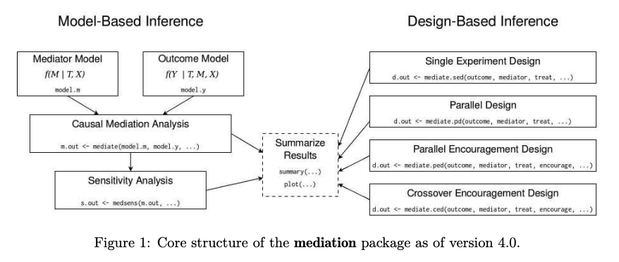
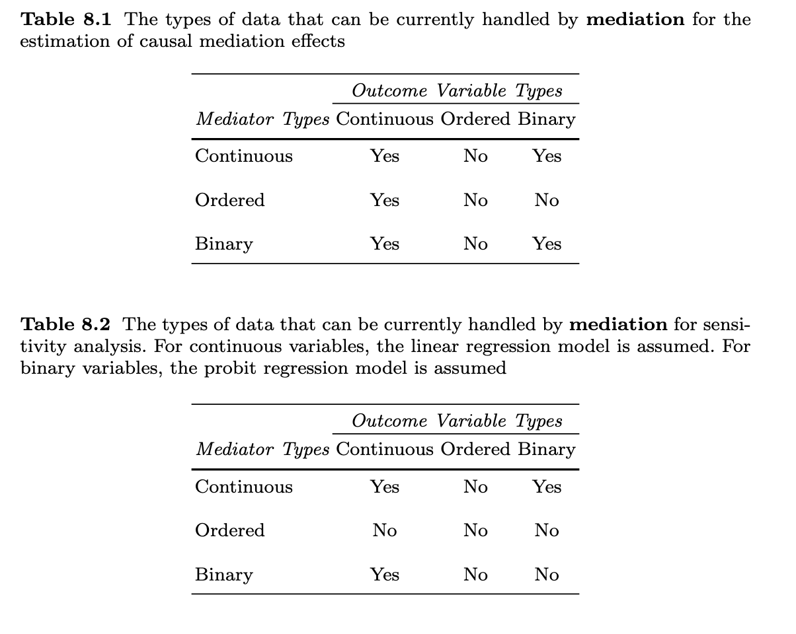

```{r}
library(knitr)
library(gtsummary)
library(mediation)
library(ggdag)
library(dagitty)
library(tidyverse)
```

## Mediation

The basic premise of mediation is that the relationship between a predictor (X) and an outcome (Y) is mediated by another variable (M). That is to say, X predicts M, which in turn predicts Y. When thinking about mediation, form a research perspective, we could be saying that the relationship between X and Y is explained by M. That is to say, M is the mechanism through which X influences Y.

The key difference between mediation and moderation is that mediation is about the third variable (M) explaining the relationship between X and Y, whereas moderation is about the third variable (M) changing the relationship between X and Y.


### Read in the data

```{r}
data <- read_csv("CANPATH_data.csv")
```

#### Variable selection

For this data work we are not going to worry about variable selection. Variable selection should be based on subject area knowledge about the study design and research question. Ideally, variable selection is done with the help of a DAG. 

### Research question and data

Our research question is:  

- **What factors are associated with BMI?**

We have created a DAG and identified that the following factors are associated with BMI. These are the same variables as the linear regression assignment. We should be very careful when working with BMI data not to victim blame and also not to look too much at statistical significance. We have good guidelines for what is a meaningful change in BMI in terms of health benefit. 

- `PM_BMI_SR` = BMI
- `DIS_DIAB_TYPE` = Diabetes yes or no
- `PA_TOTAL_SHORT` = Physical activity in MET Minutes per Week
- `SDC_AGE_CALC` = Are 45 years or older
- `diabetes == "Gestational"` = Have ever had gestational diabetes (diabetes during pregnancy) or given birth to a baby who weighed over 9 pounds

Let's simplify the dataset so we are not working with so many variables. 

```{r}
data <- data %>% dplyr::select(DIS_DIAB_TYPE, PM_BMI_SR, PA_LEVEL_SHORT, SDC_AGE_CALC, PA_TOTAL_SHORT)
```

### Data cleaning

We can recode people who are less than 10 and greater than 60 to values of 10 and 60 respectively. 

**Physical Activity**

```{r}
pa_histogram <- ggplot(data, aes(PA_TOTAL_SHORT)) +
                  geom_histogram()
plot(pa_histogram)

## Recoding PA to make it more interpretable. Converting to a 10unit change rather than a one unit change.

data$PA_TOTAL_SHORT <- data$PA_TOTAL_SHORT/100

summary(data$PA_TOTAL_SHORT)
```

**BMI**

```{r}
data <- data %>%
          mutate(bmi_recode = case_when(
            PM_BMI_SR < 10 ~ 10, 
            PM_BMI_SR > 60 ~ 60,
            TRUE ~ PM_BMI_SR
          ))
summary(data$bmi_recode)

bmi_recode_histogram <- ggplot(data = data, aes(bmi_recode)) +
                  geom_histogram()
plot(bmi_recode_histogram)
```

#### Preparing predictor variables

**Diabetes**

```{r}
table(data$DIS_DIAB_TYPE)

data <- data %>%
	mutate(diabetes_t2 = case_when(
    DIS_DIAB_TYPE == 2 ~ 1,
    DIS_DIAB_TYPE == -7 ~ 0, 
		TRUE ~ NA_real_
	))

table(data$diabetes_t2)
```

**Age**

```{r}
glimpse(data$SDC_AGE_CALC)

summary(data$SDC_AGE_CALC) ### Lots of NAs! 

data <- data %>%
	mutate(age_45 = case_when(
	  SDC_AGE_CALC >= 45.00 ~ "Over 45",
		SDC_AGE_CALC < 45.00 ~ "Under 45"
	))

table(data$age_45)
```

### Drop Na
```{r}
data <- data %>% drop_na()
```

## Mediation concept

We suspect that diabetes is a mediator in the association between physical activity and BMI. We want to examine this. Our DAG would look like this

```{r}
mediator_dag <- dagitty("dag{
E -> O
E -> M
M -> O
}")
tidy_dagitty(mediator_dag)
ggdag(mediator_dag, layout = "circle") + theme_dag() + coord_flip()
```


## Mediation analysis 

To conduct a mediation analysis we need to have a strong causal assumptions about the relationship between the mediator, the exposure, and the outcome. The DAG must be true and we can examine potential mediation using analyses. We covered this in class. 

The `mediate` function will run the mediation analysis on the models we have created. The [mediation package](https://cran.r-project.org/web/packages/mediation/vignettes/mediation.pdf) provides us with the functions we need to conduct the analysis. The results of the mediate package will give us the following estimates

  * Average Causal Mediation Effects (ACME)
    *  ACME should be significant. This is the indirect effect of M (total effect - direct effect) and thus this value tells us if our mediation effect is significant.
  * Average Direct Effects (ADE)
    * We can look at the ADE to see if the relationship between X and Y is direct. If this is not significant, then the relationship between X and Y is mediated by M. If it is significant (and the ACME is also significant), then the relationship between X and Y is both direct and indirect (partial mediation).
  * Combined indirect and direct effects (Total Effect)
    * Total Effect should be be significant. This is the relationship between X and Y (direct and indirect).
  * Yhe ratio of these estimates (Prop. Mediated).
    * The Prop Mediated value tells us the proportion of the total effect that is mediated by M. It is calculated by dividing the ACME by the Total Effect. The closer this value is to 1, the more of the total effect is mediated by M. We can usually read it like a percentage (e.g., 0.87 means 87% of the total effect is mediated). If your ACME is greater than 1, then it could be because the ACME and ADE are in opposite directions (i.e., one is positive and the other is negative). This would lead to a value more than 1 when calculating the proportion, but for practical purposes, we could interpret the ACME as if it were 1 (i.e., all of the effect is mediated by M).

## Running the regressions

In order to do a mediation analysis we need to run separate regressions for each of the mediation steps

* Mediation model
* Outcome model




#### Bootstrap

Bootstrapping takes a large number of samples from our data and runs the analysis on each of these samples. The sampling is done randomly with replacement, and each sample in the bootstrap is the same size as our dataset. Using this method, we can create estimates with that fall within a narrower confidence interval (since we have now run the analysis on 100’s of samples). Bootstrapping overcomes concerns about the distribution of our original dataset.

### Mediation Model 

The mediation model is a model that considers our mediator of interest `diabetes` as the outcome and our exposure of interest `physical activity` as the predictor. We can also include covariates in this model if the chose. We will include `SDC_AGE_CALC` as a covariate. 

```{r, warning=FALSE}
mediator_model <- glm(diabetes_t2 ~ PA_TOTAL_SHORT, data = data, family = binomial(link = "probit"))
summary(mediator_model)

multi_table <- tbl_regression(mediator_model, exponentiate = TRUE) 

multi_table %>% as_kable()
```

### Outcome Model 

The outcome model is a model that considers our mediator of interest `diabetes` as the outcome and our exposure of interest `physical activity` as the predictor. We can also include covariates in this model if the chose. We will include `SDC_AGE_CALC` as a covariate. 

```{r, warning=FALSE}
#data$diabetes_t2 <- as.factor(data$diabetes_t2)

outcome_model <- lm(bmi_recode ~ PA_TOTAL_SHORT + diabetes_t2, data = data)
summary(outcome_model)

multi_table <- tbl_regression(outcome_model) 

multi_table %>% as_kable()
```

### Mediation Model 

The outcome model is a model that considers our mediator of interest `diabetes` as the outcome and our exposure of interest `physical activity` as the predictor. We can also include covariates in this model if the chose. We will include `SDC_AGE_CALC` as a covariate. 

```{r, warning=FALSE}
mediation_model <- mediate(mediator_model, outcome_model, treat = "PA_TOTAL_SHORT", mediator = "diabetes_t2", boot = TRUE, sims = 500)

summary(mediation_model)

plot(mediation_model)
```

```{r, warning=FALSE, error = FALSE}
mediation_table <- tbl_regression(mediation_model) 

mediation_table %>% as_kable()
```

### Model interpretation

The outcome model is a model that considers our mediator of interest `diabetes` as the outcome and our exposure of interest `physical activity` as the predictor. We can also include covariates in this model if the chose. 

It will give us the following estimates. 

* Average Causal Mediation Effects (ACME)
* Average Direct Effects (ADE)
* Combined indirect and direct effects (Total Effect)
* The ratio of these estimates (Prop. Mediated).

For mediation to occur we need the following. 

1. Total Effect to be significant. This is the relationship between X and Y (direct and indirect).
2. ACME to be significant. This is the indirect effect of M (total effect - direct effect) and thus this value tells us if our mediation effect is significant.

We can also look for the following

* We can look at the ADE to see if the relationship between X and Y is direct. If this is not significant, then the relationship between X and Y is mediated by M. If it is significant (and the ACME is also significant), then the relationship between X and Y is both direct and indirect (partial mediation).
* The Prop Mediated value tells us the proportion of the total effect that is mediated by M. It is calculated by dividing the ACME by the Total Effect. The closer this value is to 1, the more of the total effect is mediated by M. We can usually read it like a percentage (e.g., 0.87 means 87% of the total effect is mediated). If your ACME is greater than 1, then it could be because the ACME and ADE are in opposite directions (i.e., one is positive and the other is negative). This would lead to a value more than 1 when calculating the proportion, but for practical purposes, we could interpret the ACME as if it were 1 (i.e., all of the effect is mediated by M).

When reporting mediation analysis, the indirect (ACME) result is most important. However you should make it the result of the total effect clear as well. You could also report the Prop Mediated values. For our data, were there is no mediation we could report.

The outcome model is a model that considers our mediator of interest `diabetes` as the outcome and our exposure of interest `physical activity` as the predictor. We can also include covariates in this model if the chose. We will include `SDC_AGE_CALC` as a covariate. 

> The mediating effect was using a bootstrapping approach (500 samples) with the mediation package in R. The relationship between physical activity and body mass index was not mediated by diabetes status (ACME = 0.004, 95% CI [-0.01, 0.01]). The total effect was significant (-0.01, 95% CI [-0.03, -0.003]). The proportion mediated was -0.4,(95% CI [-2.4, 0.4]) suggesting that only a small amount of the total effect of relationship between physical activity and body mass index was mediated by diabetes.

### Sensivity Analysis

Once analysts have estimated mediation effects, they should always explore how robust their finding is to the ignorability assumption. The `medsens()` function allows analysts to conduct sensitivity analyses for mediation effects. Next, we provide a demonstration of the functionality for the sensitivity analysis. Currently, mediation can conduct sensitivity analyses for the continuous–continuous case, the binary–continuous case, and the continuous–binary case. Make sure to use `lm` rather than `glm` for linear models.

```{r}
sens_analysis <- medsens(mediation_model, sims = 500)

plot(sens_analysis)
```

## Mediation possibility

Not all types of variables can be included in the mediation package. The methods either don't exist, are currently being developed, or have not been included in the package. Here is the list. 



## Further ressources

1. [https://christopherjwilson.github.io/intro_to_r/mediation.html](https://christopherjwilson.github.io/intro_to_r/mediation.html)
2. [https://rstudio-pubs-static.s3.amazonaws.com/1271701_a2eacac864414f259da1d3e1e79f47b9.html](https://rstudio-pubs-static.s3.amazonaws.com/1271701_a2eacac864414f259da1d3e1e79f47b9.html)
