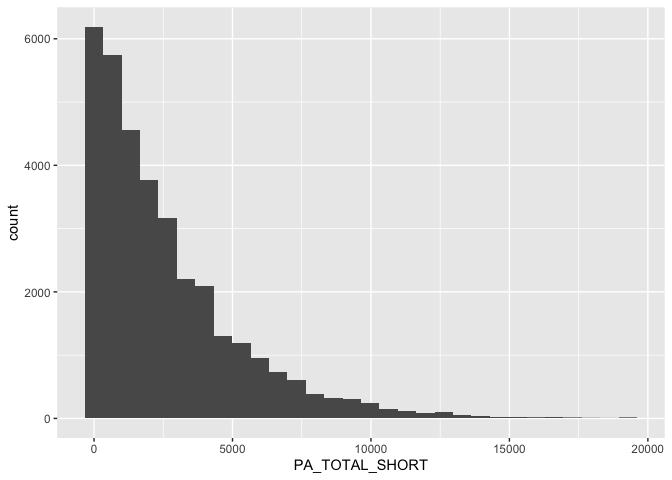
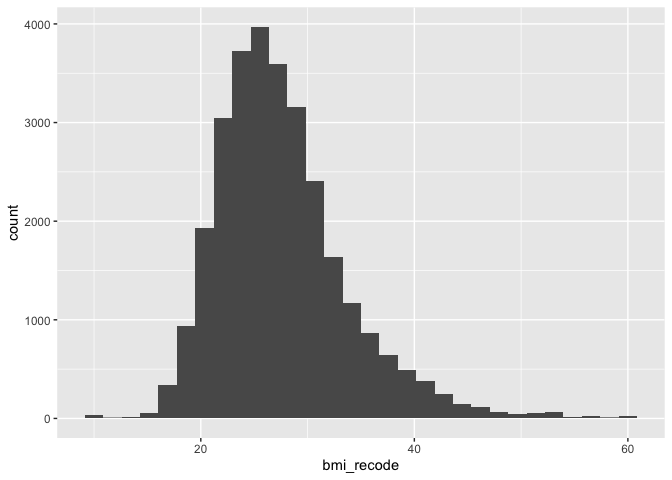
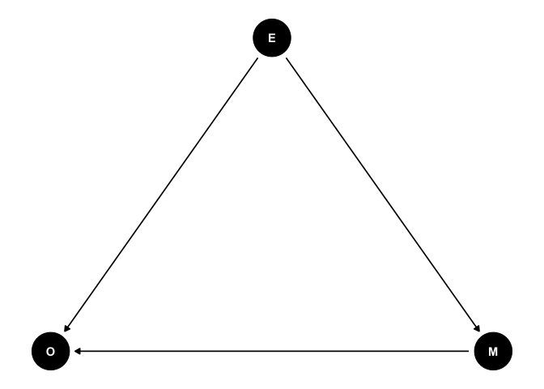
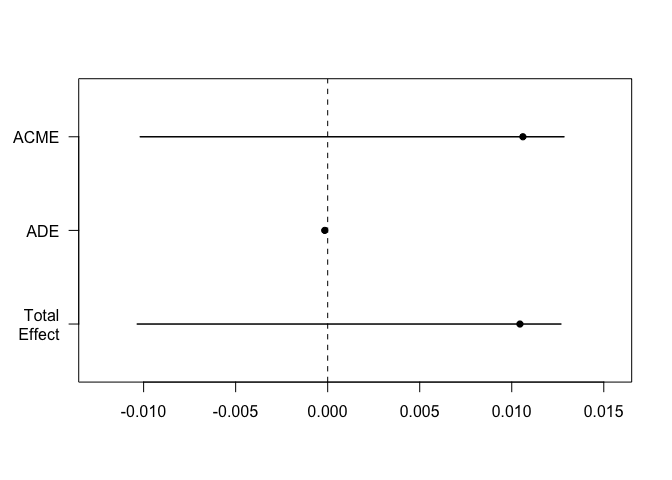

## Mediation

The basic premise of mediation is that the relationship between a predictor (X) and an outcome (Y) is mediated by another variable (M). That is to say, X predicts M, which in turn predicts Y. When thinking about mediation, form a research perspective, we could be saying that the relationship between X and Y is explained by M. That is to say, M is the mechanism through which X influences Y.

### Read in the data


``` r
data <- read_csv("CANPATH_data.csv")
```

```
## Warning: One or more parsing issues, call `problems()` on your data frame for details,
## e.g.:
##   dat <- vroom(...)
##   problems(dat)
```

```
## Rows: 41187 Columns: 440
## ── Column specification ────────────────────────────────────────────────────────
## Delimiter: ","
## chr   (5): ID, MSD11_PR, MSD11_REG, MSD11_ZONE, MSD11_CMA
## dbl (425): ADM_STUDY_ID, SDC_GENDER, SDC_AGE_CALC, SDC_MARITAL_STATUS, SDC_E...
## lgl  (10): DIS_MH_BIPOLAR_EVER, DIS_GEN_DS_EVER, DIS_GEN_SCA_EVER, DIS_GEN_T...
## 
## ℹ Use `spec()` to retrieve the full column specification for this data.
## ℹ Specify the column types or set `show_col_types = FALSE` to quiet this message.
```

#### Variable selection

For this data work we are not going to worry about variable selection. Variable selection should be based on subject area knowledge about the study design and research question. Ideally, variable selection is done with the help of a DAG. 

### Research question and data

Our research question is:  

- **What factors are associated with BMI?**

We have created a DAG and identified that the following factors are associated with BMI. These are the same variables as the linear regression assignment. We should be very careful when working with BMI data not to victim blame and also not to look too much at statistical significance. We have good guidelines for what is a meaningful change in BMI in terms of health benefit. 

- `PM_BMI_SR` = BMI
- `DIS_DIAB_TYPE` = Diabetes yes or no
- `PA_TOTAL_SHORT` = Physical activity in MET Minutes per Week
- `SDC_AGE_CALC` = Are 45 years or older
- `diabetes == "Gestational"` = Have ever had gestational diabetes (diabetes during pregnancy) or given birth to a baby who weighed over 9 pounds

Let's simplify the dataset so we are not working with so many variables. 


``` r
data_working <- data %>% dplyr::select(DIS_DIAB_TYPE, PM_BMI_SR, PA_LEVEL_SHORT, SDC_AGE_CALC, PA_TOTAL_SHORT)

rm(data) ### Remove the old data from working memory
```

### Data cleaning

We can recode people who are less than 10 and greater than 60 to values of 10 and 60 respectively. 

**Physical Activity**


``` r
pa_histogram <- ggplot(data = data_working, aes(PA_TOTAL_SHORT)) +
                  geom_histogram()
plot(pa_histogram)
```

```
## `stat_bin()` using `bins = 30`. Pick better value `binwidth`.
```

```
## Warning: Removed 6763 rows containing non-finite outside the scale range
## (`stat_bin()`).
```

<!-- -->

**BMI**


``` r
data_working <- data_working %>%
          mutate(bmi_recode = case_when(
            PM_BMI_SR < 10 ~ 10, 
            PM_BMI_SR > 60 ~ 60,
            TRUE ~ PM_BMI_SR
          ))
summary(data_working$bmi_recode)
```

```
##    Min. 1st Qu.  Median    Mean 3rd Qu.    Max.    NA's 
##   10.00   23.38   26.58   27.55   30.55   60.00   11976
```

``` r
bmi_recode_histogram <- ggplot(data = data_working, aes(bmi_recode)) +
                  geom_histogram()
plot(bmi_recode_histogram)
```

```
## `stat_bin()` using `bins = 30`. Pick better value `binwidth`.
```

```
## Warning: Removed 11976 rows containing non-finite outside the scale range
## (`stat_bin()`).
```

<!-- -->

#### Preparing predictor variables

**Diabetes**


``` r
table(data_working$DIS_DIAB_TYPE)
```

```
## 
##    -7     1     2     3 
## 36807   315  2160   425
```

``` r
data_working <- data_working %>%
	mutate(diabetes_t2 = case_when(
    DIS_DIAB_TYPE == 2 ~ 1,
    DIS_DIAB_TYPE == -7 ~ 0, 
		TRUE ~ NA_real_
	))

table(data_working$diabetes_t2)
```

```
## 
##     0     1 
## 36807  2160
```

**Age**


``` r
glimpse(data_working$SDC_AGE_CALC)
```

```
##  num [1:41187] 47 57 62 58 64 40 36 63 58 60 ...
```

``` r
summary(data_working$SDC_AGE_CALC) ### Lots of NAs! 
```

```
##    Min. 1st Qu.  Median    Mean 3rd Qu.    Max. 
##   30.00   43.00   52.00   51.48   60.00   74.00
```

``` r
data_working <- data_working %>%
	mutate(age_45 = case_when(
	  SDC_AGE_CALC >= 45.00 ~ "Over 45",
		SDC_AGE_CALC < 45.00 ~ "Under 45"
	))

table(data_working$age_45)
```

```
## 
##  Over 45 Under 45 
##    29639    11548
```

### Drop Na

``` r
data_working <- data_working %>% drop_na()
```

## Mediation concept

We suspect that diabetes is a mediator in the association between physical activity and BMI. We want to examine this. Our DAG would look like this


``` r
mediator_dag <- dagitty("dag{
E -> O
E -> M
M -> O
}")
tidy_dagitty(mediator_dag)
```

```
## # A DAG with 3 nodes and 3 edges
## #
## # A tibble: 4 × 8
##   name         x     y direction to        xend   yend circular
##   <chr>    <dbl> <dbl> <fct>     <chr>    <dbl>  <dbl> <lgl>   
## 1 E      0.706   0.970 ->        M     -0.00140  0.269 FALSE   
## 2 E      0.706   0.970 ->        O     -0.255    1.23  FALSE   
## 3 M     -0.00140 0.269 ->        O     -0.255    1.23  FALSE   
## 4 O     -0.255   1.23  <NA>      <NA>  NA       NA     FALSE
```

``` r
ggdag(mediator_dag, layout = "circle") + theme_dag() + coord_flip()
```

<!-- -->


## Mediation analysis 

To conduct a mediation analysis we need to have a strong causal assumptions about the relationship between the mediator, the exposure, and the outcome. The DAG must be true and we can examine potential mediation using analyses. 

The `mediate` function will run the mediation analysis on the models we have created. The [mediation package](https://cran.r-project.org/web/packages/mediation/vignettes/mediation.pdf) provides us with the functions we need to conduct the analysis. The results of the mediate package will give us the following estimates

  * Average Causal Mediation Effects (ACME)
    *  ACME should be significant. This is the indirect effect of M (total effect - direct effect) and thus this value tells us if our mediation effect is significant.
  * Average Direct Effects (ADE)
    * We can look at the ADE to see if the relationship between X and Y is direct. If this is not significant, then the relationship between X and Y is mediated by M. If it is significant (and the ACME is also significant), then the relationship between X and Y is both direct and indirect (partial mediation).
  * Combined indirect and direct effects (Total Effect)
    * Total Effect should be be significant. This is the relationship between X and Y (direct and indirect).
  * Yhe ratio of these estimates (Prop. Mediated).
    * The Prop Mediated value tells us the proportion of the total effect that is mediated by M. It is calculated by dividing the ACME by the Total Effect. The closer this value is to 1, the more of the total effect is mediated by M. We can usually read it like a percentage (e.g., 0.87 means 87% of the total effect is mediated). If your ACME is greater than 1, then it could be because the ACME and ADE are in opposite directions (i.e., one is positive and the other is negative). This would lead to a value more than 1 when calculating the proportion, but for practical purposes, we could interpret the ACME as if it were 1 (i.e., all of the effect is mediated by M).

## Running the regressions

In order to do a mediation analysis we need to run separate regressions for each of the mediation steps

* Mediation model
* Outcome model


### Mediation Model 

The mediation model is a model that considers our mediator of interest `diabetes` as the outcome and our exposure of interest `physical activity` as the predictor. We can also include covariates in this model if the chose. We will include `SDC_AGE_CALC` as a covariate. 


``` r
mediator_model <- glm(diabetes_t2 ~ PA_TOTAL_SHORT + age_45, data = data_working, family = "binomial")
summary(mediator_model)
```

```
## 
## Call:
## glm(formula = diabetes_t2 ~ PA_TOTAL_SHORT + age_45, family = "binomial", 
##     data = data_working)
## 
## Coefficients:
##                  Estimate Std. Error z value Pr(>|z|)    
## (Intercept)    -2.606e+00  4.070e-02 -64.036   <2e-16 ***
## PA_TOTAL_SHORT -2.630e-05  1.104e-05  -2.381   0.0173 *  
## age_45Under 45 -1.084e+00  8.278e-02 -13.095   <2e-16 ***
## ---
## Signif. codes:  0 '***' 0.001 '**' 0.01 '*' 0.05 '.' 0.1 ' ' 1
## 
## (Dispersion parameter for binomial family taken to be 1)
## 
##     Null deviance: 10745  on 26075  degrees of freedom
## Residual deviance: 10524  on 26073  degrees of freedom
## AIC: 10530
## 
## Number of Fisher Scoring iterations: 6
```

``` r
multi_table <- tbl_regression(mediator_model, exponentiate = TRUE) 

multi_table %>% as_kable()
```


|**Characteristic** | **OR** | **95% CI** | **p-value** |
|:------------------|:------:|:----------:|:-----------:|
|PA_TOTAL_SHORT     |  1.00  | 1.00, 1.00 |    0.017    |
|age_45             |        |            |             |
|Over 45            |   —    |     —      |             |
|Under 45           |  0.34  | 0.29, 0.40 |   <0.001    |

### Outcome Model 

The outcome model is a model that considers our mediator of interest `diabetes` as the outcome and our exposure of interest `physical activity` as the predictor. We can also include covariates in this model if the chose. We will include `SDC_AGE_CALC` as a covariate. 


``` r
outcome_model <- glm(bmi_recode ~ diabetes_t2 + PA_TOTAL_SHORT + age_45, data = data_working)
summary(outcome_model)
```

```
## 
## Call:
## glm(formula = bmi_recode ~ diabetes_t2 + PA_TOTAL_SHORT + age_45, 
##     data = data_working)
## 
## Coefficients:
##                  Estimate Std. Error t value Pr(>|t|)    
## (Intercept)     2.795e+01  5.907e-02 473.067   <2e-16 ***
## diabetes_t2     2.822e+00  1.672e-01  16.878   <2e-16 ***
## PA_TOTAL_SHORT -1.607e-04  1.417e-05 -11.343   <2e-16 ***
## age_45Under 45 -7.799e-01  8.259e-02  -9.443   <2e-16 ***
## ---
## Signif. codes:  0 '***' 0.001 '**' 0.01 '*' 0.05 '.' 0.1 ' ' 1
## 
## (Dispersion parameter for gaussian family taken to be 36.04989)
## 
##     Null deviance: 958851  on 26075  degrees of freedom
## Residual deviance: 939893  on 26072  degrees of freedom
## AIC: 167486
## 
## Number of Fisher Scoring iterations: 2
```

``` r
multi_table <- tbl_regression(outcome_model) 

multi_table %>% as_kable()
```


|**Characteristic** | **Beta** |  **95% CI**  | **p-value** |
|:------------------|:--------:|:------------:|:-----------:|
|diabetes_t2        |   2.8    |   2.5, 3.1   |   <0.001    |
|PA_TOTAL_SHORT     |   0.00   |  0.00, 0.00  |   <0.001    |
|age_45             |          |              |             |
|Over 45            |    —     |      —       |             |
|Under 45           |  -0.78   | -0.94, -0.62 |   <0.001    |

### Mediation Model 

The outcome model is a model that considers our mediator of interest `diabetes` as the outcome and our exposure of interest `physical activity` as the predictor. We can also include covariates in this model if the chose. We will include `SDC_AGE_CALC` as a covariate. 


``` r
mediation_model <- mediate(mediator_model, outcome_model, treat = "PA_TOTAL_SHORT", mediator = "diabetes_t2", robustSE = TRUE, boot = TRUE, sims = 100)
```

```
## Running nonparametric bootstrap
```

``` r
summary(mediation_model)
```

```
## 
## Causal Mediation Analysis 
## 
## Nonparametric Bootstrap Confidence Intervals with the Percentile Method
## 
##                   Estimate 95% CI Lower 95% CI Upper p-value    
## ACME            0.01060643  -0.01018180   0.01283613    0.94    
## ADE            -0.00016070  -0.00018678  -0.00013197  <2e-16 ***
## Total Effect    0.01044573  -0.01034435   0.01266940    0.92    
## Prop. Mediated  1.01538426   0.27033588   1.28371455    0.02 *  
## ---
## Signif. codes:  0 '***' 0.001 '**' 0.01 '*' 0.05 '.' 0.1 ' ' 1
## 
## Sample Size Used: 26076 
## 
## 
## Simulations: 100
```

``` r
plot(mediation_model)
```

<!-- -->
