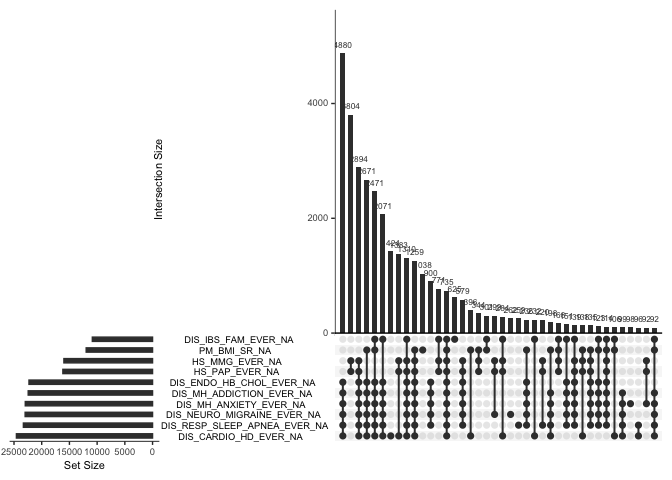
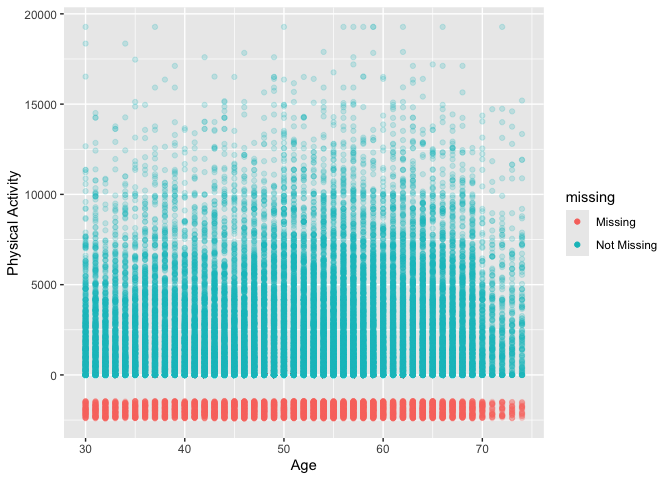
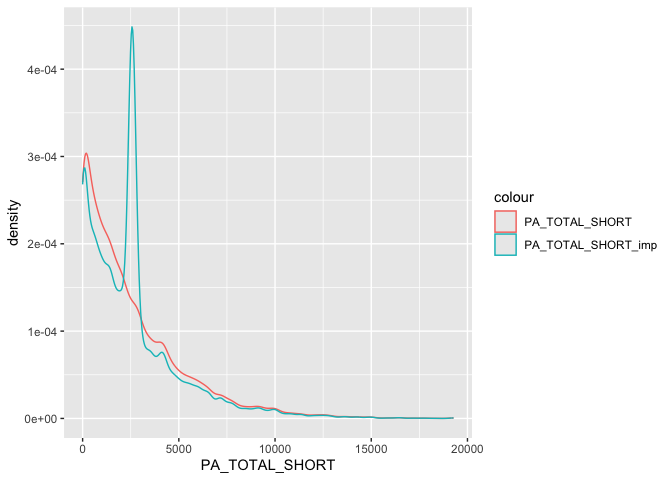
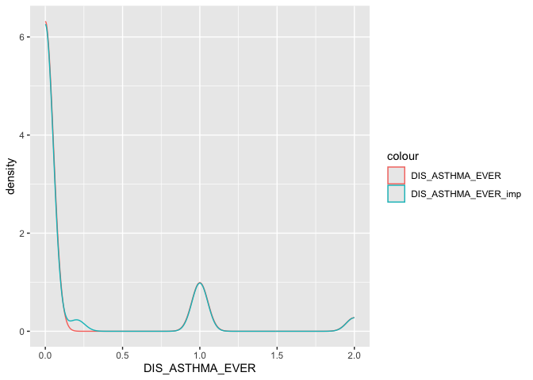
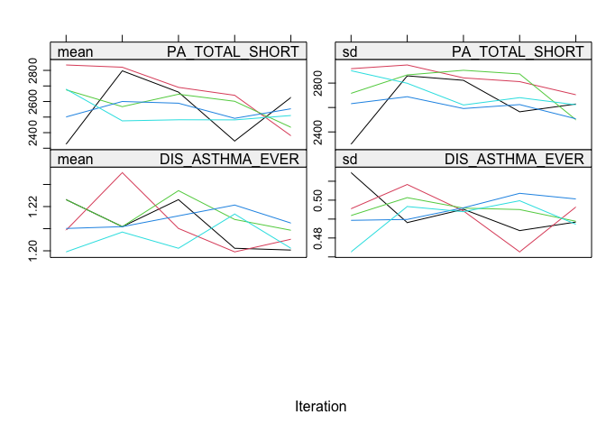
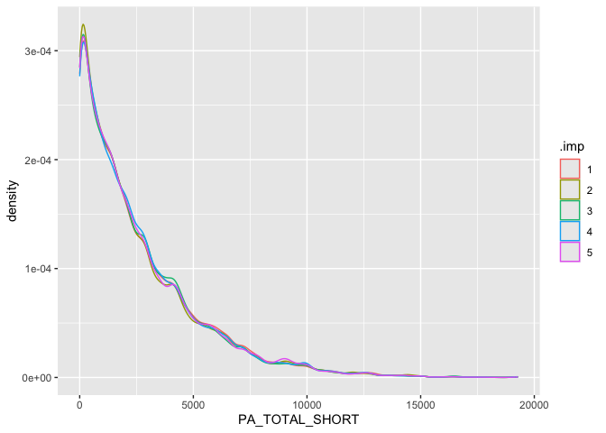

``` r
knitr::opts_chunk$set(echo = TRUE)
library(tidyverse)
```

```
## ── Attaching core tidyverse packages ──────────────────────── tidyverse 2.0.0 ──
## ✔ dplyr     1.1.4     ✔ readr     2.1.5
## ✔ forcats   1.0.0     ✔ stringr   1.5.1
## ✔ ggplot2   3.5.1     ✔ tibble    3.2.1
## ✔ lubridate 1.9.4     ✔ tidyr     1.3.1
## ✔ purrr     1.0.4     
## ── Conflicts ────────────────────────────────────────── tidyverse_conflicts() ──
## ✖ dplyr::filter() masks stats::filter()
## ✖ dplyr::lag()    masks stats::lag()
## ℹ Use the conflicted package (<http://conflicted.r-lib.org/>) to force all conflicts to become errors
```

``` r
library(visdat)
library(naniar)
library(mice)
```

```
## 
## Attaching package: 'mice'
## 
## The following object is masked from 'package:stats':
## 
##     filter
## 
## The following objects are masked from 'package:base':
## 
##     cbind, rbind
```

## Missing data


``` r
data <- read_csv("CANPATH_data.csv")
```

```
## Warning: One or more parsing issues, call `problems()` on your data frame for details,
## e.g.:
##   dat <- vroom(...)
##   problems(dat)
```

```
## Rows: 41187 Columns: 440
## ── Column specification ────────────────────────────────────────────────────────
## Delimiter: ","
## chr   (5): ID, MSD11_PR, MSD11_REG, MSD11_ZONE, MSD11_CMA
## dbl (425): ADM_STUDY_ID, SDC_GENDER, SDC_AGE_CALC, SDC_MARITAL_STATUS, SDC_E...
## lgl  (10): DIS_MH_BIPOLAR_EVER, DIS_GEN_DS_EVER, DIS_GEN_SCA_EVER, DIS_GEN_T...
## 
## ℹ Use `spec()` to retrieve the full column specification for this data.
## ℹ Specify the column types or set `show_col_types = FALSE` to quiet this message.
```

``` r
data <- data %>% select(ID:HS_GEN_HEALTH, PA_TOTAL_SHORT, PM_BMI_SR, contains("_EVER"), contains("WRK_"))
```

## Ways R encodes missing(ish) data

### NaN and Inf are related to NA.

#### NaN

NaN represents `Not a Number`. NaN can be generated, for example, by taking the log of a negative number. They can be tested for with is.nan()


``` r
x <- log(c(1, -1, NA))
```

```
## Warning in log(c(1, -1, NA)): NaNs produced
```

``` r
x
```

```
## [1]   0 NaN  NA
```

``` r
is.nan(x)
```

```
## [1] FALSE  TRUE FALSE
```

#### Inf

Inf and -Inf represent positive and negative infinite numbers respectively. These can be generated, for example, by dividing by zero, and tested for with is.infinite()


``` r
y <- c(-Inf, 0, Inf)
is.infinite(y)
```

```
## [1]  TRUE FALSE  TRUE
```

### Comparison of missing types

The test is.finite() it TRUE if the value is numeric and not NA, NaN, Inf or -Inf.

| value |	is.na |	is.nan |	is.infinite |	is.finite |
| ----- | ------ | ------ | ------ |
| 1 	| FALSE |	FALSE |	FALSE |	TRUE
| NA 	| TRUE |	FALSE |	FALSE |	FALSE
| NaN |	TRUE |	TRUE |	FALSE |	FALSE
| Inf |	FALSE |	FALSE |	TRUE |	FALSE
| -Inf |	FALSE |	FALSE |	TRUE |	FALSE

## Missing data analysis

### We want a quick summary of missing data for each variable. This function is from the `naniar` package. We have lots of variables so let's save this as a table that we inspect a little easier. 


``` r
missing_table <- miss_var_summary(data)
missing_table
```

```
## # A tibble: 195 × 3
##    variable                       n_miss pct_miss
##    <chr>                           <int>    <num>
##  1 DIS_MH_BIPOLAR_EVER             41171    100. 
##  2 DIS_GEN_DS_EVER                 41143     99.9
##  3 DIS_GEN_AIS_EVER                41143     99.9
##  4 DIS_GEN_HEMOPHILIA_EVER         41143     99.9
##  5 DIS_GEN_KS_EVER                 41143     99.9
##  6 DIS_GEN_TS_EVER                 41143     99.9
##  7 DIS_GEN_CAH_EVER                41141     99.9
##  8 DIS_GEN_CF_EVER                 41138     99.9
##  9 DIS_GEN_THALASSEMIA_EVER        41107     99.8
## 10 DIS_CARDIO_PREM_HD_FEMALE_EVER  41081     99.7
## # ℹ 185 more rows
```

We can see that we have around 100 variables with more than 85% missing. In general it will be hard to salvage those data with missing data techniques because we won't really have enough non-missing data to do much, and simple imputations (like mean) probably won't be meaningful because the sample mean with some data is probably very far away from the population mean. In missing data words, the data are MNAR (Missing Not at Random). Another possibility here for these data is that the participants did not have this outcome but it's coded as missing when maybe in real life it should be zero. The data from the data dictionary are coded as

* 0	Never had `diease`
* 1	Ever had `diease`
* 2	Presumed - Never had `diease`

But most of these variables have 99.9% missing. Let's take `DIS_GEN_DS_EVER` as an example 


``` r
table(data$DIS_GEN_DS_EVER)
```

```
## 
## FALSE 
##    44
```

OK. Interesting. This is read as logical by `read_csv` and there are 44 cells with `FALSE` as the contents and nothing else. So we don't even actually have data here. Let's see the other columns read as logical. 


``` r
data %>% 
  select_if(is_logical) %>% 
  glimpse()
```

```
## Rows: 41,187
## Columns: 10
## $ DIS_MH_BIPOLAR_EVER      <lgl> NA, NA, NA, NA, NA, NA, NA, NA, NA, NA, NA, N…
## $ DIS_GEN_DS_EVER          <lgl> NA, NA, NA, NA, NA, NA, NA, NA, NA, NA, NA, N…
## $ DIS_GEN_SCA_EVER         <lgl> NA, NA, NA, NA, NA, NA, NA, NA, NA, NA, NA, N…
## $ DIS_GEN_THALASSEMIA_EVER <lgl> NA, NA, NA, NA, NA, NA, NA, NA, NA, NA, NA, N…
## $ DIS_GEN_CAH_EVER         <lgl> NA, NA, NA, NA, NA, NA, NA, NA, NA, NA, NA, N…
## $ DIS_GEN_AIS_EVER         <lgl> NA, NA, NA, NA, NA, NA, NA, NA, NA, NA, NA, N…
## $ DIS_GEN_HEMOPHILIA_EVER  <lgl> NA, NA, NA, NA, NA, NA, NA, NA, NA, NA, NA, N…
## $ DIS_GEN_CF_EVER          <lgl> NA, NA, NA, NA, NA, NA, NA, NA, NA, NA, NA, N…
## $ DIS_GEN_KS_EVER          <lgl> NA, NA, NA, NA, NA, NA, NA, NA, NA, NA, NA, N…
## $ DIS_GEN_TS_EVER          <lgl> NA, NA, NA, NA, NA, NA, NA, NA, NA, NA, NA, N…
```

We have 10 variables that are logical so let's get rid of those.


``` r
### Select specific columns
logical_cols <- c("DIS_MH_BIPOLAR_EVER", "DIS_GEN_DS_EVER", "DIS_GEN_SCA_EVER", "DIS_GEN_THALASSEMIA_EVER", "DIS_GEN_CAH_EVER", "DIS_GEN_AIS_EVER", "DIS_GEN_HEMOPHILIA_EVER", "DIS_GEN_CF_EVER", "DIS_GEN_KS_EVER", "DIS_GEN_TS_EVER")

data <- data %>% select(!(logical_cols))
```

```
## Warning: Using an external vector in selections was deprecated in tidyselect 1.1.0.
## ℹ Please use `all_of()` or `any_of()` instead.
##   # Was:
##   data %>% select(logical_cols)
## 
##   # Now:
##   data %>% select(all_of(logical_cols))
## 
## See <https://tidyselect.r-lib.org/reference/faq-external-vector.html>.
## This warning is displayed once every 8 hours.
## Call `lifecycle::last_lifecycle_warnings()` to see where this warning was
## generated.
```

Now let's review again and filter out all variables with more than 85% missing. 


``` r
missing_table <- miss_var_summary(data)
```


``` r
data <- data %>%
          select(where(~sum(is.na(.x))/length(.x) < 0.85))

missing_table <- miss_var_summary(data)
```

We have now reduced our dataset to 92 variables down from the 184 we started with. We were not going to be able to do much with those variables anyway so not the end of the world. Hopefully, in your data you have a much higher quality on average. 

Now that we have a more manageable dataframe let's visualize missing with the package `visdat` to quickly visualize the entire dataframe and check missing.


``` r
vis_dat(data, warn_large_data = FALSE)
```

<!-- -->

We have fixed the problem with logical variables and those with too much missing to do anything with really. Now let's move on to what we can actually do. 

## You got some SPSS data! 

When you are dealing with missing values, you might want to replace values with a missing values (NA). This is useful in cases when you know the origin of the data and can be certain which values should be missing. For example, you might know that all values of “N/A”, “N A”, and “Not Available”, or -99, or -1 are supposed to be missing.

naniar provides functions to specifically work on this type of problem using the function replace_with_na. This function is the compliment to tidyr::replace_na, which replaces an NA value with a specified value, whereas naniar::replace_with_na replaces a value with an NA:

* `tidyr::replace_na`: Missing values turns into a value (NA –> -99)
* `naniar::replace_with_na`: Value becomes a missing value (-99 –> NA)

## Upset plot

When we are thinking about missing data mechanism, an upset plot can help us visuliaze potential patterns in missing data that will give is information about which variables to include or exclude from our missing data model. The `naniar` package has this built in [gg_miss_upset](https://naniar.njtierney.com/reference/gg_miss_upset.html).


``` r
gg_miss_upset(data, order.by = "freq", nsets = 10)
```

<!-- -->

What are we looking for here? We are looking for patterns of missing data and things that might group together. A clear pattern is that the 
__HS__ variables tend to be missing together. These are mammography and pap test variables so men may be missing these data but the dataset is not capturing this well. It is also common for people to be missing many of the disease specific variables except `IBS_FAM` but it's clear that there is a good explanation for why this might be in terms of missing. 

### A new geom 

The `naniar` package has a new geom we can use called `geom_miss_point()`. Recall when we did the age by physical activity scatter plot that `tidyverse` was removing 6763 rows due to missing. `geom_miss_point()` lets us visualize is happening. This is great for key exposure and outcome associations you are interested in testing. 


``` r
scatter_plot_miss <- ggplot(data, aes(x = SDC_AGE_CALC, y = PA_TOTAL_SHORT)) + 
                  geom_point(alpha = 0.2) + 
                  geom_smooth(colour = "red") + 
                  geom_smooth(method = "lm", colour = "#088da5") +
                  labs(x = "Age", y = "Physical Activity")
plot(scatter_plot_miss)
```

```
## `geom_smooth()` using method = 'gam' and formula = 'y ~ s(x, bs = "cs")'
```

```
## Warning: Removed 6763 rows containing non-finite outside the scale range
## (`stat_smooth()`).
```

```
## `geom_smooth()` using formula = 'y ~ x'
```

```
## Warning: Removed 6763 rows containing non-finite outside the scale range
## (`stat_smooth()`).
```

```
## Warning: Removed 6763 rows containing missing values or values outside the scale range
## (`geom_point()`).
```

<!-- -->


``` r
scatter_plot_no_miss <- ggplot(data, aes(x = SDC_AGE_CALC, y = PA_TOTAL_SHORT)) + 
                          geom_miss_point(alpha = 0.2) +                 
                          labs(x = "Age", y = "Physical Activity")
plot(scatter_plot_no_miss)
```

<!-- -->

There are missing across the entire association but it looks like perhaps fewer missing among people who are older than 70. 

### Shadow Matrix

`naniar` has a function to create what it calls a shadow matrix. Essentially, a dummy variable for each column that identifies missing yes/no and appends that variable to the dataframe. The new columns have a `_NA` label to identify them. This doubles the number of columns but lets you quickly visualize missing. 


``` r
data_shadow <- data %>% 
  bind_shadow()

## names(data_shadow) Not run
```

### Imputing missing data

Now we have a good idea what our missing data looks like. We could have made some different decisions depending on our study for the filtering of missing >85% but let's just keep moving for teaching purposes. Now we need to deal with our missing data. We know that for the most part the data are being read as numeric but are actually factor. That's ok so far but it's going to become a challenge in a minute. 

### Summarizing data with missing

By default R does not summarize well with missing data. We need to use list wise deletion to calculate means or medians.


``` r
summary(data$PA_TOTAL_SHORT)
```

```
##    Min. 1st Qu.  Median    Mean 3rd Qu.    Max.    NA's 
##       0     600    1782    2574    3732   19278    6763
```

``` r
data %>% summarise(n_pa = n_distinct(PA_TOTAL_SHORT),
          na_pa = sum(is.na(PA_TOTAL_SHORT)),
          median_pa = median(PA_TOTAL_SHORT), 
          mean_pa = median(PA_TOTAL_SHORT))
```

```
## # A tibble: 1 × 4
##    n_pa na_pa median_pa mean_pa
##   <int> <int>     <dbl>   <dbl>
## 1  3421  6763        NA      NA
```

Not that we get `NA` for median_pa and mean_pa. This is not because we don't have data but because R does not calculate the summary statistics if there are missing data. Now with `na.rm = TRUE`


``` r
data %>% summarise(n_pa = n_distinct(PA_TOTAL_SHORT),
          na_pa = sum(is.na(PA_TOTAL_SHORT)),
          median_pa = median(PA_TOTAL_SHORT, na.rm = TRUE), 
          mean_pa = median(PA_TOTAL_SHORT, na.rm = TRUE))
```

```
## # A tibble: 1 × 4
##    n_pa na_pa median_pa mean_pa
##   <int> <int>     <dbl>   <dbl>
## 1  3421  6763      1782    1782
```

Now we get a value for median and mean but we just removed all of the missing so we need to be careful here with just removing the data. 

### Mean imputation

The mean can be imputed using `impute_mean` from `naniar`, and is useful to explore structure in missingness, but are not recommended for use in analysis. 

#### Impute mean for a specific variable


``` r
data_shadow$pa_not_imputed <- data_shadow$PA_TOTAL_SHORT
data_shadow <- impute_mean_at(data_shadow, .vars = vars(PA_TOTAL_SHORT)) 
median(data_shadow$pa_not_imputed, na.rm = TRUE)
```

```
## [1] 1782
```

``` r
median(data_shadow$PA_TOTAL_SHORT)
```

```
## [1] 2379
```

``` r
density_mean_imp <- ggplot(data_shadow) +
                geom_density(aes(pa_not_imputed, colour= "pa_not_imputed")) +
                geom_density(aes(PA_TOTAL_SHORT, colour= "PA_TOTAL_SHORT"))
plot(density_mean_imp)
```

```
## Warning: Removed 6763 rows containing non-finite outside the scale range
## (`stat_density()`).
```

<!-- -->

When we input the mean we don't change the mean so it's not really worth looking at differences in the mean. But we look at the median we can see differences. Also, I plotted the imputed data `PA_TOTAL_SHORT` and the not imputed data `pa_not_imputed`. We can see they are almost identical but there are values imputed with the mean for `PA_TOTAL_SHORT`. 

###  Multivariate Imputation by Chained Equations (MICE)

We can do mean with imputation with `mice` as well. Slightly different function and structure to the calls but let's try it. `mice` will be the main package we will use for imputation so best we get used to this now.

#### Mean imputation with mice

Here we specify the `mice` package and we have three arguments `method` specifies the type of imputation method to use, `m` = specifies the number of multiple imputations (more on this later) the default is 5 but we want to keep it at 1 for now, `maxit` specifies the number of iterations we want to use (the default is 5). 

Now we havea new object in our environment called `data_imp_1` but this is not a dataframe. This object has details about the imputation as well as the new imputed dataframe. To get the dataframe we need to use the `complete` function. 


``` r
data_imp <- mice(data, method = "mean", m = 1, maxit = 1)
```

```
## 
##  iter imp variable
##   1   1  SDC_MARITAL_STATUS  SDC_EDU_LEVEL  SDC_EDU_LEVEL_AGE  SDC_INCOME  SDC_INCOME_IND_NB  SDC_HOUSEHOLD_ADULTS_NB  SDC_HOUSEHOLD_CHILDREN_NB  HS_GEN_HEALTH  PA_TOTAL_SHORT  PM_BMI_SR  HS_ROUTINE_VISIT_EVER  HS_DENTAL_VISIT_EVER  HS_FOBT_EVER  HS_COL_EVER  HS_SIG_EVER  HS_SIG_COL_EVER  HS_POLYP_EVER  HS_PSA_EVER  WH_CONTRACEPTIVES_EVER  WH_HFT_EVER  WH_MENOPAUSE_EVER  WH_HRT_EVER  WH_HYSTERECTOMY_EVER  WH_OOPHORECTOMY_EVER  HS_MMG_EVER  HS_PAP_EVER  DIS_HBP_EVER  DIS_MI_EVER  DIS_STROKE_EVER  DIS_ASTHMA_EVER  DIS_COPD_EVER  DIS_DEP_EVER  DIS_DIAB_EVER  DIS_LC_EVER  DIS_CH_EVER  DIS_CROHN_EVER  DIS_UC_EVER  DIS_IBS_EVER  DIS_ECZEMA_EVER  DIS_SLE_EVER  DIS_PS_EVER  DIS_MS_EVER  DIS_OP_EVER  DIS_ARTHRITIS_EVER  DIS_CANCER_EVER  DIS_HBP_FAM_EVER  DIS_MI_FAM_EVER  DIS_STROKE_FAM_EVER  DIS_ASTHMA_FAM_EVER  DIS_COPD_FAM_EVER  DIS_DEP_FAM_EVER  DIS_DIAB_FAM_EVER  DIS_LC_FAM_EVER  DIS_CH_FAM_EVER  DIS_CROHN_FAM_EVER  DIS_UC_FAM_EVER  DIS_IBS_FAM_EVER  DIS_ECZEMA_FAM_EVER  DIS_SLE_FAM_EVER  DIS_PS_FAM_EVER  DIS_MS_FAM_EVER  DIS_OP_FAM_EVER  DIS_ARTHRITIS_FAM_EVER  DIS_CANCER_FAM_EVER  DIS_CANCER_F_EVER  DIS_CANCER_M_EVER  DIS_CANCER_SIB_EVER  DIS_CANCER_CHILD_EVER  ALC_EVER  SMK_CIG_EVER  SMK_CIG_WHOLE_EVER  DIS_ENDO_HB_CHOL_EVER  DIS_CARDIO_HD_EVER  DIS_RESP_SLEEP_APNEA_EVER  DIS_MH_ANXIETY_EVER  DIS_MH_ADDICTION_EVER  DIS_NEURO_MIGRAINE_EVER  PSE_ADULT_WRK_DURATION  PSE_WRK_FREQ  WRK_FULL_TIME  WRK_PART_TIME  WRK_RETIREMENT  WRK_HOME_FAMILY  WRK_UNABLE  WRK_UNEMPLOYED  WRK_UNPAID  WRK_STUDENT  WRK_EMPLOYMENT  WRK_SCHEDULE_CUR_CAT
```

```
## Warning: Number of logged events: 13
```

``` r
data_imp_c <- complete(data_imp)

miss_data <- miss_var_summary(data)
miss_data_imp_c <- miss_var_summary(data_imp_c)
```

Let's plot the two distributions of PA_TOTAL_SHORT and see what they look like.

First we are going to create a dataframe that includes the imputed and non-imputed data. I'm purposefully making this only a subset. 


``` r
data_pa <- select(data, ID, PA_TOTAL_SHORT, SDC_AGE_CALC, DIS_ASTHMA_EVER)
data_pa_imp <- select(data_imp_c, ID, PA_TOTAL_SHORT, SDC_AGE_CALC, DIS_ASTHMA_EVER)
data_pa_imp$PA_TOTAL_SHORT_imp <- data_pa_imp$PA_TOTAL_SHORT
data_pa_imp$SDC_AGE_CALC_imp <- data_pa_imp$SDC_AGE_CALC
data_pa_imp$DIS_ASTHMA_EVER_imp <- data_pa_imp$DIS_ASTHMA_EVER
data_pa_imp$PA_TOTAL_SHORT <- NULL
data_pa_imp$SDC_AGE_CALC <- NULL
data_pa_imp$DIS_ASTHMA_EVER <- NULL

data_pa_imp <- full_join(data_pa, data_pa_imp, by = "ID", suffix = c("", ""))
```

Now let's check the mean imputation again. We should see that large spike like we saw previously at around 2574 minutes. 


``` r
summary(data_pa_imp$PA_TOTAL_SHORT)
```

```
##    Min. 1st Qu.  Median    Mean 3rd Qu.    Max.    NA's 
##       0     600    1782    2574    3732   19278    6763
```

``` r
summary(data_pa_imp$PA_TOTAL_SHORT_imp)
```

```
##    Min. 1st Qu.  Median    Mean 3rd Qu.    Max. 
##       0     792    2379    2574    3199   19278
```

``` r
density_imp <- ggplot(data_pa_imp) +
                geom_density(aes(PA_TOTAL_SHORT, colour= "PA_TOTAL_SHORT")) +
                geom_density(aes(PA_TOTAL_SHORT_imp, colour= "PA_TOTAL_SHORT_imp"))
plot(density_imp)
```

```
## Warning: Removed 6763 rows containing non-finite outside the scale range
## (`stat_density()`).
```

<!-- -->

### Variable types

Now, remember that we had all of the variables as numeric here eventhough we know some of them are factor. Many of the imputation methods work only with either numeric or factor variables and we probably need to specify which one for specific variables, or get the package to identify variable types and help us make an informed decision. 

Let's keep check our `DIS_ASTHMA_EVER` variable and see what the imputation looks like when the package things it's a numeric variable from 0-1. 


``` r
summary(data_pa_imp$DIS_ASTHMA_EVER)
```

```
##    Min. 1st Qu.  Median    Mean 3rd Qu.    Max.    NA's 
##  0.0000  0.0000  0.0000  0.2039  0.0000  2.0000    1228
```

``` r
table(data_pa_imp$DIS_ASTHMA_EVER)
```

```
## 
##     0     1     2 
## 33275  5221  1463
```

``` r
density_imp_asthma <- ggplot(data_pa_imp) +
                geom_density(aes(DIS_ASTHMA_EVER, colour= "DIS_ASTHMA_EVER")) +
                geom_density(aes(DIS_ASTHMA_EVER_imp, colour= "DIS_ASTHMA_EVER_imp"))
plot(density_imp_asthma)
```

```
## Warning: Removed 1228 rows containing non-finite outside the scale range
## (`stat_density()`).
```

<!-- -->

Slightly harder to visualize but we can see that there is now a small imputation effect at 0.2 that was not there before. Let's convert this to factor and try again. 


``` r
data_pa$DIS_ASTHMA_EVER <- as.factor(data_pa$DIS_ASTHMA_EVER)

data_pa_imp <- mice(data_pa, method = "mean", m = 1, maxit = 1)
```

```
## Warning: Type mismatch for variable(s): DIS_ASTHMA_EVER
## Imputation method mean is not for factors with >2 levels.
```

```
## 
##  iter imp variable
##   1   1  PA_TOTAL_SHORT  DIS_ASTHMA_EVER
```

```
## Warning in mean.default(y[ry]): argument is not numeric or logical: returning
## NA
```

```
## Warning: Number of logged events: 1
```

``` r
data_pa_imp_c <- complete(data_pa_imp)
```

Now we get a warning that mean imputation does not work with factors with >2 levels. The imputation still happens for the other variables where `mice` can impute using mean imputation but it does nothing for the factor variable with >2 levels.

Let's look at the possible methods for `mice` and what the different approaches are. This is from the original publication in 2011 but there are a number of more advanced methods as well. 

> van Buuren, S., & Groothuis-Oudshoorn, K. (2011). mice: Multivariate Imputation by Chained Equations in R. Journal of Statistical Software, 45(3), 1–67. https://doi.org/10.18637/jss.v045.i03

| Method       | Description                     | Scale type          | Default |
|--------------|---------------------------------|---------------------|---------|
| pmm          | Predictive mean matching        | numeric             | Y       |
| norm         | Bayesian linear regression      | numeric             |         |
| norm.nob     | Linear regression, non-Bayesian | numeric             |         |
| mean         | Unconditional mean imputation   | numeric             |         |
| 2L.norm      | Two-level linear model          | numeric             |         |
| logreg       | Logistic regression             | factor, 2 levels    | Y       |
| polyreg      | Multinomial logit model         | factor, >2 levels   | Y       |
| polr         | Ordered logit model             | ordered, >2 levels  | Y       |
| lda          | Linear discriminant analysis    | factor              |         |
| sample       | Random sample from the observed data | any              |         |

We can get all of the possible methods using `methods(mice)`


``` r
methods(mice)
```

```
## Warning in .S3methods(generic.function, class, envir, all.names = all.names, :
## function 'mice' appears not to be S3 generic; found functions that look like S3
## methods
```

```
##  [1] mice.impute.2l.bin              mice.impute.2l.lmer            
##  [3] mice.impute.2l.norm             mice.impute.2l.pan             
##  [5] mice.impute.2lonly.mean         mice.impute.2lonly.norm        
##  [7] mice.impute.2lonly.pmm          mice.impute.cart               
##  [9] mice.impute.jomoImpute          mice.impute.lasso.logreg       
## [11] mice.impute.lasso.norm          mice.impute.lasso.select.logreg
## [13] mice.impute.lasso.select.norm   mice.impute.lda                
## [15] mice.impute.logreg              mice.impute.logreg.boot        
## [17] mice.impute.mean                mice.impute.midastouch         
## [19] mice.impute.mnar.logreg         mice.impute.mnar.norm          
## [21] mice.impute.mpmm                mice.impute.norm               
## [23] mice.impute.norm.boot           mice.impute.norm.nob           
## [25] mice.impute.norm.predict        mice.impute.panImpute          
## [27] mice.impute.passive             mice.impute.pmm                
## [29] mice.impute.polr                mice.impute.polyreg            
## [31] mice.impute.quadratic           mice.impute.rf                 
## [33] mice.impute.ri                  mice.impute.sample             
## [35] mice.mids                       mice.theme                     
## see '?methods' for accessing help and source code
```

### Mice default

If we just let `mice` go and don't specify the method, the package will use the defaults to decide which type of imputation method to use. We can get that information using the `method` function on the saved `mids` object we generated. 


``` r
mice_1 <- mice(data_pa, m = 1, maxit = 1)
```

```
## 
##  iter imp variable
##   1   1  PA_TOTAL_SHORT  DIS_ASTHMA_EVER
```

```
## Warning: Number of logged events: 1
```

``` r
mice_1$method
```

```
##              ID  PA_TOTAL_SHORT    SDC_AGE_CALC DIS_ASTHMA_EVER 
##              ""           "pmm"              ""       "polyreg"
```

Here the package is using `pmm` [predictive mean matching](https://www.rdocumentation.org/packages/mice/versions/3.17.0/topics/mice.impute.pmm)  for the PA_TOTAL_SHORT imputation and `polyreg` [polytomous regression](https://www.rdocumentation.org/packages/mice/versions/3.17.0/topics/mice.impute.polyreg) for the DIS_ASTHMA_EVER variable. 


``` r
data_mice_1 <- complete(mice_1)

miss_var_summary(data_mice_1)
```

```
## # A tibble: 4 × 3
##   variable        n_miss pct_miss
##   <chr>            <int>    <num>
## 1 ID                   0        0
## 2 PA_TOTAL_SHORT       0        0
## 3 SDC_AGE_CALC         0        0
## 4 DIS_ASTHMA_EVER      0        0
```

``` r
miss_var_summary(data_pa)
```

```
## # A tibble: 4 × 3
##   variable        n_miss pct_miss
##   <chr>            <int>    <num>
## 1 PA_TOTAL_SHORT    6763    16.4 
## 2 DIS_ASTHMA_EVER   1228     2.98
## 3 ID                   0     0   
## 4 SDC_AGE_CALC         0     0
```

### m and maxit? 

A critical part of `mice` and imputation in general is that it's not deterministic for more complex models. If you run the an imputation model once, and the run it again, you will not get the same answer. This is both good, because be can account for the uncertainty in our imputations but also a challenge because we need to use methods to pool the results of multiple different imputations + regressions to get our estiamte of interest. 

Let's look at m and maxit from the documentation

* m: Number of multiple imputations. The default is m=5.
* maxit: A scalar giving the number of iterations. The default is 5.


``` r
mice_2 <- mice(data_pa, m = 5, maxit = 5) ### m = 5 is the default. If you don't specify it will estimate 5 models. 
```

```
## 
##  iter imp variable
##   1   1  PA_TOTAL_SHORT  DIS_ASTHMA_EVER
##   1   2  PA_TOTAL_SHORT  DIS_ASTHMA_EVER
##   1   3  PA_TOTAL_SHORT  DIS_ASTHMA_EVER
##   1   4  PA_TOTAL_SHORT  DIS_ASTHMA_EVER
##   1   5  PA_TOTAL_SHORT  DIS_ASTHMA_EVER
##   2   1  PA_TOTAL_SHORT  DIS_ASTHMA_EVER
##   2   2  PA_TOTAL_SHORT  DIS_ASTHMA_EVER
##   2   3  PA_TOTAL_SHORT  DIS_ASTHMA_EVER
##   2   4  PA_TOTAL_SHORT  DIS_ASTHMA_EVER
##   2   5  PA_TOTAL_SHORT  DIS_ASTHMA_EVER
##   3   1  PA_TOTAL_SHORT  DIS_ASTHMA_EVER
##   3   2  PA_TOTAL_SHORT  DIS_ASTHMA_EVER
##   3   3  PA_TOTAL_SHORT  DIS_ASTHMA_EVER
##   3   4  PA_TOTAL_SHORT  DIS_ASTHMA_EVER
##   3   5  PA_TOTAL_SHORT  DIS_ASTHMA_EVER
##   4   1  PA_TOTAL_SHORT  DIS_ASTHMA_EVER
##   4   2  PA_TOTAL_SHORT  DIS_ASTHMA_EVER
##   4   3  PA_TOTAL_SHORT  DIS_ASTHMA_EVER
##   4   4  PA_TOTAL_SHORT  DIS_ASTHMA_EVER
##   4   5  PA_TOTAL_SHORT  DIS_ASTHMA_EVER
##   5   1  PA_TOTAL_SHORT  DIS_ASTHMA_EVER
##   5   2  PA_TOTAL_SHORT  DIS_ASTHMA_EVER
##   5   3  PA_TOTAL_SHORT  DIS_ASTHMA_EVER
##   5   4  PA_TOTAL_SHORT  DIS_ASTHMA_EVER
##   5   5  PA_TOTAL_SHORT  DIS_ASTHMA_EVER
```

```
## Warning: Number of logged events: 1
```

``` r
mice_2$method
```

```
##              ID  PA_TOTAL_SHORT    SDC_AGE_CALC DIS_ASTHMA_EVER 
##              ""           "pmm"              ""       "polyreg"
```

``` r
mice_2_long <- complete(mice_2, action = "long")
mice_2_long$.imp <- as.factor(mice_2_long$.imp)

plot(mice_2)
```

<!-- -->

``` r
density_m_5 <- ggplot(mice_2_long, aes(x = PA_TOTAL_SHORT, colour = .imp)) +
                geom_density()
plot(density_m_5)
```

<!-- -->

If we run this command again we won't necessarily get the same results again. If we want our results to be reproducible we need to `set.seed()` to give a starting value to the process and ensure reproducibility. This can be any number really. 

### Accounting for uncertainty in regression

Now have an imputation model with some uncertainty and we want to get a pooled regression result the also accounts for the uncertainty. If we wanted to could just take our result from the imputation model with `m = 1` and use that for a regression model but we would not be accounting for the uncertainty of the imputed data (we will be doing this in the class) but you are going to have to read and make informed decisions about how appropriate this may or may not be depending on your data, how you think the missing data are created, and whether accounting for uncertainty of the models (pooling) is possible with the type of model you are using.

#### Using imputed data

> Quite often people are suggesting that using the average imputed dataset - so taking the average over the imputed data set such that any realized cell depicts the average over the corresponding data in the imputed data - would be efficient. This is not true. Doing this will yield false inference. The average workflow is faster and easier than the correct methods, since there is no need to replicate the analyses m times. In the words of Dempster and Rubin (1983), this workflow is seductive because it can lull the user into the pleasurable state of believing that the data are complete after all. The ensuing statistical analysis does not know which data are observed and which are missing, and treats all data values as real, which will underestimate the uncertainty of the parameters. The reported standard errors and p-values after data-averaging are generally too low. The correlations between the variables of the averaged data will be too high. For example, the correlation matrix in the average data are more extreme than the average of the m correlation matrices, which is an example of ecological fallacy. As researchers tend to like low p-values and high correlations, there is a cynical reward for the analysis of the average data. However, analysis of the average data cannot give a fair representation of the uncertainties associated with the underlying data, and hence is not recommended.

Now, let's say we want to predict PA using asthma as a variable. 


``` r
set.seed(123)

## Typical regression 
pa_asthma <- lm(PA_TOTAL_SHORT ~ DIS_ASTHMA_EVER, data = data_pa)
summary(pa_asthma)
```

```
## 
## Call:
## lm(formula = PA_TOTAL_SHORT ~ DIS_ASTHMA_EVER, data = data_pa)
## 
## Residuals:
##     Min      1Q  Median      3Q     Max 
## -2626.3 -1968.0  -790.3  1164.0 16710.0 
## 
## Coefficients:
##                  Estimate Std. Error t value Pr(>|t|)    
## (Intercept)       2568.02      15.57 164.939   <2e-16 ***
## DIS_ASTHMA_EVER1    58.32      43.14   1.352    0.176    
## DIS_ASTHMA_EVER2  -166.76     147.79  -1.128    0.259    
## ---
## Signif. codes:  0 '***' 0.001 '**' 0.01 '*' 0.05 '.' 0.1 ' ' 1
## 
## Residual standard error: 2654 on 33723 degrees of freedom
##   (7461 observations deleted due to missingness)
## Multiple R-squared:  9.553e-05,	Adjusted R-squared:  3.623e-05 
## F-statistic: 1.611 on 2 and 33723 DF,  p-value: 0.1997
```

``` r
## Pooled regression 
pa_asthma_miss <- mice_2 %>% with(lm(PA_TOTAL_SHORT ~ DIS_ASTHMA_EVER))
summary(pa_asthma_miss)
```

```
## # A tibble: 15 × 7
##    term             estimate std.error statistic      p.value  nobs df.residual
##    <chr>               <dbl>     <dbl>     <dbl>        <dbl> <int>       <dbl>
##  1 (Intercept)        2568.       14.3   179.    0            41187       41184
##  2 DIS_ASTHMA_EVER1     71.5      38.9     1.84  0.0661       41187       41184
##  3 DIS_ASTHMA_EVER2    145.       69.7     2.08  0.0371       41187       41184
##  4 (Intercept)        2515.       14.4   175.    0            41187       41184
##  5 DIS_ASTHMA_EVER1     96.9      39.1     2.48  0.0132       41187       41184
##  6 DIS_ASTHMA_EVER2    389.       70.0     5.56  0.0000000268 41187       41184
##  7 (Intercept)        2539.       14.2   179.    0            41187       41184
##  8 DIS_ASTHMA_EVER1     82.6      38.6     2.14  0.0321       41187       41184
##  9 DIS_ASTHMA_EVER2     23.4      69.2     0.338 0.735        41187       41184
## 10 (Intercept)        2570.       14.2   181.    0            41187       41184
## 11 DIS_ASTHMA_EVER1     27.2      38.6     0.705 0.481        41187       41184
## 12 DIS_ASTHMA_EVER2    -67.0      69.1    -0.969 0.332        41187       41184
## 13 (Intercept)        2563.       14.3   179.    0            41187       41184
## 14 DIS_ASTHMA_EVER1     13.9      38.9     0.358 0.720        41187       41184
## 15 DIS_ASTHMA_EVER2    -27.6      69.7    -0.396 0.692        41187       41184
```

`with` function: Evaluate an R expression in an environment constructed from data, possibly modifying (a copy of) the original data.

Here we get the regression results of the 5 different regression because m = 5. We can pool those results (with uncertainty) using the `pool` function which computes the total variance over the repeated analyses by Rubin's rules (Rubin, 1987, p. 76).


``` r
pa_asthma_miss_pooled <- pool(pa_asthma_miss)
summary(pa_asthma_miss_pooled)
```

```
##               term   estimate std.error statistic        df      p.value
## 1      (Intercept) 2551.01787  29.25581 87.196978  6.893332 9.529931e-12
## 2 DIS_ASTHMA_EVER1   58.43972  55.36115  1.055609 15.458121 3.073667e-01
## 3 DIS_ASTHMA_EVER2   92.64383 213.22283  0.434493  5.003410 6.820302e-01
```

``` r
summary(pa_asthma)
```

```
## 
## Call:
## lm(formula = PA_TOTAL_SHORT ~ DIS_ASTHMA_EVER, data = data_pa)
## 
## Residuals:
##     Min      1Q  Median      3Q     Max 
## -2626.3 -1968.0  -790.3  1164.0 16710.0 
## 
## Coefficients:
##                  Estimate Std. Error t value Pr(>|t|)    
## (Intercept)       2568.02      15.57 164.939   <2e-16 ***
## DIS_ASTHMA_EVER1    58.32      43.14   1.352    0.176    
## DIS_ASTHMA_EVER2  -166.76     147.79  -1.128    0.259    
## ---
## Signif. codes:  0 '***' 0.001 '**' 0.01 '*' 0.05 '.' 0.1 ' ' 1
## 
## Residual standard error: 2654 on 33723 degrees of freedom
##   (7461 observations deleted due to missingness)
## Multiple R-squared:  9.553e-05,	Adjusted R-squared:  3.623e-05 
## F-statistic: 1.611 on 2 and 33723 DF,  p-value: 0.1997
```

Here we get quite different results from when we don't deal with missing data. 

1. 7461 observations (~ 18%) of the data are deleted due to missing. 
2. In the pooled model the standard error is correctly estimated and is very large. If we just took the imputed data with `m = 1` the standard error (and thus p value and CI) would be incorrectly estimated. 

* van Buuren, S. (2018). Flexible Imputation of Missing Data, Second Edition (2nd ed.). Chapman and Hall/CRC. [https://doi.org/10.1201/9780429492259](https://doi.org/10.1201/9780429492259)

### All the data! 

Let's try mice on all of the data and see what happens. First, we have to fix our data because there's still lots of numeric in there. 


``` r
data <- data %>% mutate_at(3, factor)
data <- data %>% mutate_at(5:12, factor)
data <- data %>% mutate_at(14:81, factor)
data <- data %>% mutate_at(83:93, factor)

# mice_all <- mice(data, method = "cart", m = 1, maxit = 1) ### NOT RUN Takes 2 days to run this
# mice_all$method

# mice_all_imp <- complete(mice_all)
# write_csv(mice_all_imp, "mice_all_imp.csv")
```

> Imputation of categorical data is more difficult than continuous data. As a rule of thumb, in logistic regression we need at least 10 events per predictor in order to get reasonably stable estimates of the regression coefficients (Van Belle 2002, 87). So if we impute 10 binary outcomes, we need 100 events, and if the events occur with a probability of 0.1, then we need n>1000 cases. If we impute outcomes with more categories, the numbers rapidly increase for two reasons. First, we have more possible outcomes, and we need 10 events for each category. Second, when used as predictor, each nominal variable is expanded into dummy variables, so the number of predictors multiplies by the number of categories minus 1. The defaults logreg, polyreg and polr tend to preserve the main effects well provided that the parameters are identified and can be reasonably well estimated. In many datasets, especially those with many categories, the ratio of the number of fitted parameters relative to the number of events easily drops below 10, which may lead to estimation problems. In those cases, the advice is to specify more robust methods, like pmm, cart or rf. [https://stefvanbuuren.name/fimd/sec-categorical.html#evaluation](https://stefvanbuuren.name/fimd/sec-categorical.html#evaluation)

# Ressources

1. [CRAN Task View for Missing data](https://cran.r-project.org/web/views/MissingData.html)
2. [Missing Data Workshop with MICE](https://amices.org/Winnipeg/)
3. [Missing Data with Tidymodels](https://tidymodels.aml4td.org/chapters/missing-data.html)
4. [Smart Handling of Missing Data](https://towardsdatascience.com/smart-handling-of-missing-data-in-r-6425f8a559f2)
5. [Epi R Handbook - Missing Data](https://epirhandbook.com/new_pages/missing_data.html)
