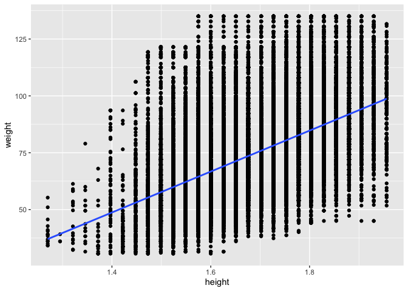
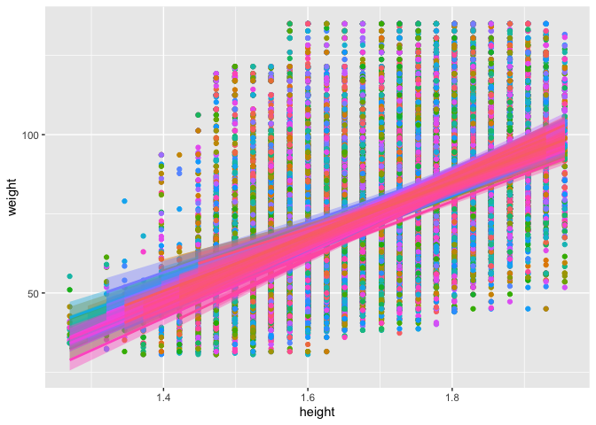
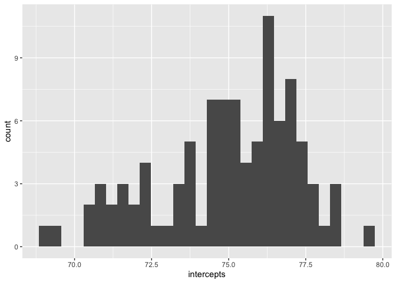
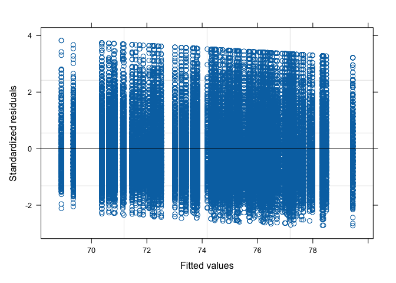
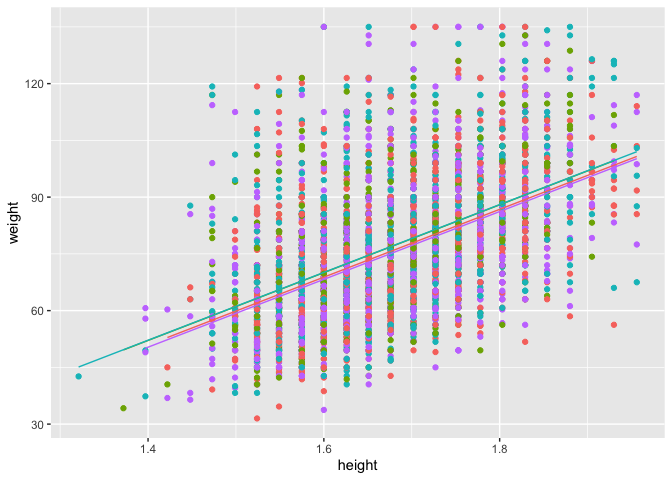

```r
knitr::opts_chunk$set(echo = FALSE)
library(tidyverse)
```

```
## ── Attaching core tidyverse packages ──────────────────────── tidyverse 2.0.0 ──
## ✔ dplyr     1.1.4     ✔ readr     2.1.5
## ✔ forcats   1.0.0     ✔ stringr   1.5.1
## ✔ ggplot2   3.4.4     ✔ tibble    3.2.1
## ✔ lubridate 1.9.3     ✔ tidyr     1.3.1
## ✔ purrr     1.0.2     
## ── Conflicts ────────────────────────────────────────── tidyverse_conflicts() ──
## ✖ dplyr::filter() masks stats::filter()
## ✖ dplyr::lag()    masks stats::lag()
## ℹ Use the conflicted package (<http://conflicted.r-lib.org/>) to force all conflicts to become errors
```

```r
library(nlme)
```

```
## 
## Attaching package: 'nlme'
## 
## The following object is masked from 'package:dplyr':
## 
##     collapse
```

```r
library(gtsummary)
```

## Multilevel Models

###  Example Study

We want to know how predictors at the individual level (level 1) and health region (level 2) influence body weight. We assume people in the same health region are correlated with each other. Once we clean all of the data we will have 97 health regions and 116937 individuals. 

### Reading in the data


```
## Rows: 124929 Columns: 36
## ── Column specification ────────────────────────────────────────────────────────
## Delimiter: ","
## dbl (36): CASEID, verdate, adm_prx, adm_n09, adm_n10, adm_n11, adm_rno, pmkp...
## 
## ℹ Use `spec()` to retrieve the full column specification for this data.
## ℹ Specify the column types or set `show_col_types = FALSE` to quiet this message.
```

### Data cleaning


### Removing missing data


## Association between height and weight

<!-- -->

## Variation between height and weight by health region

<!-- -->

## Modelling intercepts

Linear regression. Assumes only one intercept for the entire sample. 


Multil-level model. Assumes one intercept for each group. In our case health region, it could be people, neighbourhoods, etc. 


```
## Linear mixed-effects model fit by REML
##   Data: cchs 
##        AIC      BIC    logLik
##   998515.6 998544.6 -499254.8
## 
## Random effects:
##  Formula: ~1 | health_region
##         (Intercept) Residual
## StdDev:    2.320711 17.27456
## 
## Fixed effects:  weight ~ 1 
##                Value Std.Error     DF  t-value p-value
## (Intercept) 74.98066  0.241984 116840 309.8579       0
## 
## Standardized Within-Group Residuals:
##         Min          Q1         Med          Q3         Max 
## -2.72339251 -0.73946105 -0.09913402  0.60461971  3.82587271 
## 
## Number of Observations: 116937
## Number of Groups: 97
```

1. Fixed effects. Our level 1 variables go here. In this case the ~ 1 means model only the intercept.  
2. Random effects. The intercept is computed at the level of health region (nesting factor), and that health region is treated as a random variable.

## Modelling intercepts


```
##  [1] 68.90971 69.34156 70.37387 70.62793 70.80829 70.81941 70.84924 71.13176
##  [9] 71.16899 71.46816 71.59748 71.74022 71.87310 72.08206 72.19866 72.26691
## [17] 72.39228 72.42491 72.51959 73.01531 73.24575 73.25078 73.41756 73.66315
## [25] 73.71250 73.79691 73.80866 73.83375 74.18620 74.31723 74.35034 74.36313
## [33] 74.42187 74.45667 74.50399 74.64477 74.74438 74.81421 74.95353 74.97141
## [41] 75.01088 75.01372 75.01825 75.18591 75.23684 75.24497 75.26510 75.28499
## [49] 75.31321 75.34908 75.51315 75.68787 75.68866 75.72201 75.84569 75.86044
## [57] 75.90499 76.06604 76.10820 76.13088 76.18727 76.19502 76.20039 76.21387
## [65] 76.26588 76.35085 76.36997 76.43896 76.44053 76.47027 76.47828 76.48754
## [73] 76.53131 76.65206 76.70332 76.70837 76.89234 76.99292 77.01283 77.05815
## [81] 77.11569 77.15687 77.15953 77.20128 77.25088 77.25333 77.30546 77.31714
## [89] 77.41123 77.59229 77.65685 77.88355 77.98983 78.34811 78.38261 78.48663
## [97] 79.44542
```

## Plot the distribution of intercepts


```
## `stat_bin()` using `bins = 30`. Pick better value with `binwidth`.
```

<!-- -->

## Intercept Model Intraclass correlation


```
## Linear mixed-effects model fit by REML
##   Data: cchs 
##        AIC      BIC    logLik
##   998515.6 998544.6 -499254.8
## 
## Random effects:
##  Formula: ~1 | health_region
##         (Intercept) Residual
## StdDev:    2.320711 17.27456
## 
## Fixed effects:  weight ~ 1 
##                Value Std.Error     DF  t-value p-value
## (Intercept) 74.98066  0.241984 116840 309.8579       0
## 
## Standardized Within-Group Residuals:
##         Min          Q1         Med          Q3         Max 
## -2.72339251 -0.73946105 -0.09913402  0.60461971  3.82587271 
## 
## Number of Observations: 116937
## Number of Groups: 97
```

```
## [1] 1.772804
```

~1.8% of the variance in weight is explained by health region. 

## Plot regression diagnostics

<!-- -->

## Adding level 1 covariates

```
## Linear mixed-effects model fit by REML
##   Data: cchs 
##        AIC      BIC    logLik
##   959754.5 959802.8 -479872.2
## 
## Random effects:
##  Formula: ~1 | health_region
##         (Intercept) Residual
## StdDev:    2.102705 14.63517
## 
## Fixed effects:  weight ~ height + factor(gender) 
##                         Value Std.Error     DF   t-value p-value
## (Intercept)         -45.86797 1.0498286 116838 -43.69091       0
## height               73.19835 0.5821636 116838 125.73503       0
## factor(gender)Woman  -4.86924 0.1174500 116838 -41.45798       0
##  Correlation: 
##                     (Intr) height
## height              -0.977       
## factor(gender)Woman -0.698  0.681
## 
## Standardized Within-Group Residuals:
##        Min         Q1        Med         Q3        Max 
## -3.7087932 -0.6907715 -0.1389380  0.5404409  4.6431287 
## 
## Number of Observations: 116937
## Number of Groups: 97
```

## Adding level 1 covariates

We add height and gender as a predictor to the fixed portion of the model. Height is a significant predictor of weight (B = 73.19, t = 125.73). We see that gender was a significant predictor of weight (B = -4.86, t = -41.45).

## Level 1 Covariates Intraclass correlation


```
## [1] 2.022495
```

## We can predict Level 2 intercepts using covariates

- We can model the intercepts with other variables at the same level  
- Health regions relevant variables  
    - Number of hospitals per capita  
    - Emergency wards  
    - Number of health promotion programs per capita  

## Adding level 2 covariates

```
## Linear mixed-effects model fit by REML
##   Data: cchs 
##        AIC      BIC    logLik
##   959752.3 959810.4 -479870.2
## 
## Random effects:
##  Formula: ~1 | health_region
##         (Intercept) Residual
## StdDev:     2.11338 14.63518
## 
## Fixed effects:  weight ~ height + factor(gender) + hospitals 
##                         Value Std.Error     DF   t-value p-value
## (Intercept)         -48.71458 12.348994 116838  -3.94482  0.0001
## height               73.19786  0.582166 116838 125.73360  0.0000
## factor(gender)Woman  -4.86930  0.117450 116838 -41.45842  0.0000
## hospitals             0.71180  3.076082     95   0.23140  0.8175
##  Correlation: 
##                     (Intr) height fct()W
## height              -0.081              
## factor(gender)Woman -0.058  0.681       
## hospitals           -0.996 -0.002 -0.001
## 
## Standardized Within-Group Residuals:
##        Min         Q1        Med         Q3        Max 
## -3.7089562 -0.6908413 -0.1389469  0.5404515  4.6431427 
## 
## Number of Observations: 116937
## Number of Groups: 97
```

## Adding level 2 covariates

We add number of hospitals hospitals as a level 2 predictor. Note the degrees of freedom are the level 2 sample size. Number of hospitals is not associated with BMI. 

## Level 2 Covariates Intraclass correlation


```
## [1] 2.025678
```

## Random Intercepts

<!-- -->

## Random slopes

```
## Linear mixed-effects model fit by REML
##   Data: cchs 
##        AIC      BIC    logLik
##   961460.6 961518.6 -480724.3
## 
## Random effects:
##  Formula: ~height | health_region
##  Structure: General positive-definite, Log-Cholesky parametrization
##             StdDev     Corr  
## (Intercept)  2.0370020 (Intr)
## height       0.5714726 -0.159
## Residual    14.7422341       
## 
## Fixed effects:  weight ~ height 
##                 Value Std.Error     DF   t-value p-value
## (Intercept) -76.31116 0.7558833 116839 -100.9563       0
## height       89.67135 0.4339484 116839  206.6406       0
##  Correlation: 
##        (Intr)
## height -0.957
## 
## Standardized Within-Group Residuals:
##        Min         Q1        Med         Q3        Max 
## -3.7808473 -0.6962563 -0.1347733  0.5407130  4.8859609 
## 
## Number of Observations: 116937
## Number of Groups: 97
```

## Random slopes (Not a good example here)

<!-- -->


## Great Ressources

* [https://rpsychologist.com/r-guide-longitudinal-lme-lmer](https://rpsychologist.com/r-guide-longitudinal-lme-lmer)
* [https://stats.idre.ucla.edu/other/mult-pkg/introduction-to-linear-mixed-models/](https://stats.idre.ucla.edu/other/mult-pkg/introduction-to-linear-mixed-models/)
* Bingenheimer, J. B., Raudenbush, S. W. Statistical and Substantive Inferences in Public Health: Issues in the Application of Multilevel Models. Annu. Rev. Public Health. 2004. 25:53–77. [doi.org/10.1146/annurev.publhealth.25.050503.153925](doi.org/10.1146/annurev.publhealth.25.050503.153925)
