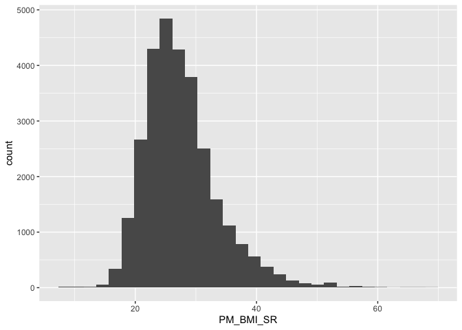
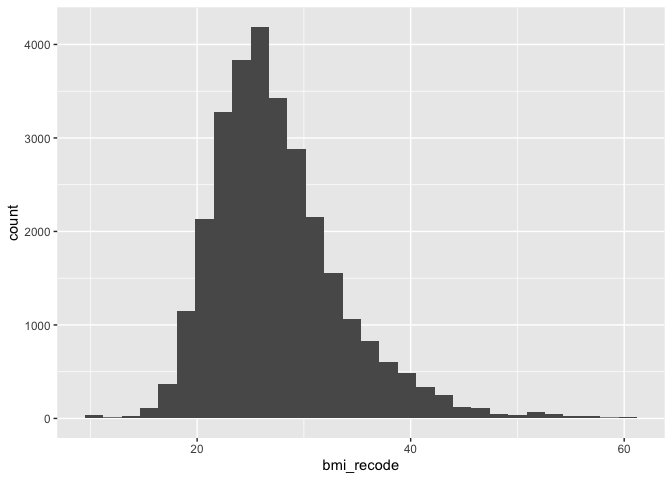

```r
knitr::opts_chunk$set(echo = TRUE)
library(tidyverse)
```

```
## ── Attaching packages ─────────────────────────────────────── tidyverse 1.3.2 ──
## ✔ ggplot2 3.4.0      ✔ purrr   0.3.5 
## ✔ tibble  3.1.8      ✔ dplyr   1.0.10
## ✔ tidyr   1.2.1      ✔ stringr 1.4.1 
## ✔ readr   2.1.3      ✔ forcats 0.5.2 
## ── Conflicts ────────────────────────────────────────── tidyverse_conflicts() ──
## ✖ dplyr::filter() masks stats::filter()
## ✖ dplyr::lag()    masks stats::lag()
```

```r
library(sjPlot)
```

```
## #refugeeswelcome
```

```r
library(finalfit)
library(knitr)
library(marginaleffects)
library(jtools)
library(emmeans)
library(lindia)
library(gtsummary)
library(lmtest)
```

```
## Loading required package: zoo
## 
## Attaching package: 'zoo'
## 
## The following objects are masked from 'package:base':
## 
##     as.Date, as.Date.numeric
```

```r
data <- read_csv("Data.csv")
```

```
## Warning: One or more parsing issues, call `problems()` on your data frame for details,
## e.g.:
##   dat <- vroom(...)
##   problems(dat)
```

```
## Rows: 41187 Columns: 440
## ── Column specification ────────────────────────────────────────────────────────
## Delimiter: ","
## chr   (5): ID, MSD11_PR, MSD11_REG, MSD11_ZONE, MSD11_CMA
## dbl (425): ADM_STUDY_ID, SDC_GENDER, SDC_AGE_CALC, SDC_MARITAL_STATUS, SDC_E...
## lgl  (10): DIS_MH_BIPOLAR_EVER, DIS_GEN_DS_EVER, DIS_GEN_SCA_EVER, DIS_GEN_T...
## 
## ℹ Use `spec()` to retrieve the full column specification for this data.
## ℹ Specify the column types or set `show_col_types = FALSE` to quiet this message.
```

### 1. Model Selection

Here we will demonstrate the different model selection methods we discussed in class. In class we talked about the following methods. 

1. More or less automated process (DO NOT do these)
    - Backwards selection
    - Forwards selection
    - Backwards and forwards selection 

2. Traditional confounding criteria, change-in-estimate or significance (p < 0.2 in bivariate)

3. Information criterion for relative comparison
    - Akaike’s Information Criterion (AIC)
    - Bayesian Information Criterion  (BIC)

### 2. Research question and data

Our research question is:  

- **What factors are associated with BMI?**

We have identified the following variables that will be potentially included in our models. We assume we have done all of the data checking and cleaning. 

- `PM_BMI_SR` = BMI
- `DIS_DIAB_TYPE` = Diabetes yes or no
- `PA_TOTAL_SHORT` = Physical activity in MET Minutes per Week
- `SDC_AGE_CALC` = Are 45 years or older
- `diabetes == "Gestational"` = Have ever had gestational diabetes (diabetes during pregnancy) or given birth to a baby who weighed over 9 pounds
- `SDC_EB_ABORIGINAL` + `SDC_EB_LATIN` + `SDC_EB_BLACK` = Are an African American, Hispanic or Latino, American Indian, or Alaska Native person
- `DIS_LIVER_FATTY_EVER` = Have non-alcoholic fatty liver disease

Let's simplify the dataset so we are not working with so many variables. 


```r
data_working <- select(data, "DIS_DIAB_TYPE", "PM_BMI_SR", "PA_LEVEL_SHORT", "SDC_AGE_CALC", "PA_TOTAL_SHORT", "SDC_EB_ABORIGINAL", "SDC_EB_LATIN", "SDC_EB_BLACK", "DIS_LIVER_FATTY_EVER")

rm(data) ### Remove the old data from working memory
```

#### Outcome variable

Let's look at the outcome variable, recode, and drop observations that are not relevant. We need to do a histogram and check the distribution. Then we might deal with outliers.  


```r
summary(data_working$PM_BMI_SR)
```

```
##    Min. 1st Qu.  Median    Mean 3rd Qu.    Max.    NA's 
##    8.86   23.38   26.58   27.55   30.55   69.40   11976
```

```r
bmi_histogram <- ggplot(data = data_working, aes(PM_BMI_SR)) +
                  geom_histogram()
plot(bmi_histogram)
```

```
## `stat_bin()` using `bins = 30`. Pick better value with `binwidth`.
```

```
## Warning: Removed 11976 rows containing non-finite values (`stat_bin()`).
```

<!-- -->

Nice normal(ish) distribution here. We probably have some outliers on the low and high end with values of 8.86 and 69.40 

We can recode people who are less than 10 and greater than 60 to values of 10 and 60 respectively. 


```r
data_working <- data_working %>%
          mutate(bmi_recode = case_when(
            PM_BMI_SR < 10 ~ 10, 
            PM_BMI_SR > 60 ~ 60,
            TRUE ~ PM_BMI_SR
          ))
summary(data_working$bmi_recode)
```

```
##    Min. 1st Qu.  Median    Mean 3rd Qu.    Max.    NA's 
##   10.00   23.38   26.58   27.55   30.55   60.00   11976
```

```r
bmi_recode_histogram <- ggplot(data = data_working, aes(bmi_recode)) +
                  geom_histogram()
plot(bmi_recode_histogram)
```

```
## `stat_bin()` using `bins = 30`. Pick better value with `binwidth`.
```

```
## Warning: Removed 11976 rows containing non-finite values (`stat_bin()`).
```

<!-- -->

#### Preparing predictor variables

**Diabetes**


```r
table(data_working$DIS_DIAB_TYPE)
```

```
## 
##    -7     1     2     3 
## 36807   315  2160   425
```

```r
data_working <- data_working %>%
	mutate(diabetes_t2 = case_when(
    DIS_DIAB_TYPE == 2 ~ 1,
    DIS_DIAB_TYPE == -7 ~ 0, 
		TRUE ~ NA_real_
	))

data_working$diabetes_t2 <- as.factor(data_working$diabetes_t2)
```

**Age**


```r
glimpse(data_working$SDC_AGE_CALC)
```

```
##  num [1:41187] 47 57 62 58 64 40 36 63 58 60 ...
```

```r
summary(data_working$SDC_AGE_CALC) ### Lots of NAs! 
```

```
##    Min. 1st Qu.  Median    Mean 3rd Qu.    Max. 
##   30.00   43.00   52.00   51.48   60.00   74.00
```

```r
data_working <- data_working %>%
	mutate(age_45 = case_when(
	  SDC_AGE_CALC >= 45.00 ~ "Over 45",
		SDC_AGE_CALC < 45.00 ~ "Under 45"
	))

table(data_working$age_45)
```

```
## 
##  Over 45 Under 45 
##    29639    11548
```

**Physical Activity**


```r
glimpse(data_working$PA_LEVEL_SHORT)
```

```
##  num [1:41187] 3 1 NA 2 NA NA 3 1 NA 3 ...
```

```r
table(data_working$PA_LEVEL_SHORT)
```

```
## 
##     1     2     3 
##  9921 10957 13541
```

```r
data_working <- data_working %>%
	mutate(pa_cat = case_when(
		PA_LEVEL_SHORT == 1 ~ "1_Low Activity",
		PA_LEVEL_SHORT == 2 ~ "2_Moderate Activity",
		PA_LEVEL_SHORT == 3 ~ "3_High Activity"
	))

table(data_working$pa_cat, data_working$PA_LEVEL_SHORT)
```

```
##                      
##                           1     2     3
##   1_Low Activity       9921     0     0
##   2_Moderate Activity     0 10957     0
##   3_High Activity         0     0 13541
```

**Racialized**


```r
table(data_working$SDC_EB_ABORIGINAL)
```

```
## 
##     0     1 
## 36601  1431
```

```r
table(data_working$SDC_EB_LATIN)
```

```
## 
##     0     1 
## 37528   479
```

```r
table(data_working$SDC_EB_BLACK)
```

```
## 
##     0     1 
## 37445   555
```

```r
### Latinx

data_working <- data_working %>%
	mutate(latinx = case_when(
		SDC_EB_LATIN == 1 ~ "Yes",
		SDC_EB_LATIN == 0 ~ "No"
	))

table(data_working$SDC_EB_LATIN, data_working$latinx)
```

```
##    
##        No   Yes
##   0 37528     0
##   1     0   479
```

```r
### Indigenous

data_working <- data_working %>%
	mutate(indigenous = case_when(
		SDC_EB_ABORIGINAL == 1 ~ "Yes",
		SDC_EB_ABORIGINAL == 0 ~ "No"
	))

table(data_working$SDC_EB_ABORIGINAL, data_working$indigenous)
```

```
##    
##        No   Yes
##   0 36601     0
##   1     0  1431
```

```r
### Black

data_working <- data_working %>%
	mutate(black = case_when(
		SDC_EB_BLACK == 1 ~ "Yes",
		SDC_EB_BLACK == 0 ~ "No"
	))

table(data_working$SDC_EB_BLACK, data_working$black)
```

```
##    
##        No   Yes
##   0 37445     0
##   1     0   555
```

**Fatty liver disease**


```r
table(data_working$DIS_LIVER_FATTY_EVER)
```

```
## 
##   1   2 
##  61 270
```

```r
data_working <- data_working %>%
	mutate(fatty_liver = case_when(
		DIS_LIVER_FATTY_EVER == 1 ~ "Yes",
		DIS_LIVER_FATTY_EVER == 2 ~ "Yes"
	))

data_working <- data_working %>%
	mutate(fatty_liver = case_when(
		DIS_LIVER_FATTY_EVER == 1 ~ "Yes",
		DIS_LIVER_FATTY_EVER == 2 ~ "Yes"
	))

data_working <- data_working %>% 
                  mutate(fatty_liver = replace_na(fatty_liver, "No"))

table(data_working$fatty_liver)
```

```
## 
##    No   Yes 
## 40856   331
```

## Removing missing for convenience


```r
data_working <- select(data_working, bmi_recode, diabetes_t2, age_45, pa_cat, latinx, indigenous, black, fatty_liver) 

data_working <- data_working %>% drop_na()
```

#### 3. Preliminary analysis

We want to start by doing bivariable regression on the outcome and each variable. This can a be a bit of a process if we have lots of variables. Here we are using the `glm` (General Linear Model) function. 


```r
model_t2_diab <- glm(bmi_recode ~ diabetes_t2, data = data_working, family = "gaussian")
summary(model_t2_diab)
```

```
## 
## Call:
## glm(formula = bmi_recode ~ diabetes_t2, family = "gaussian", 
##     data = data_working)
## 
## Deviance Residuals: 
##     Min       1Q   Median       3Q      Max  
## -17.277   -4.104   -0.843    2.902   32.723  
## 
## Coefficients:
##              Estimate Std. Error t value Pr(>|t|)    
## (Intercept)  27.27663    0.03931  693.96   <2e-16 ***
## diabetes_t21  2.94549    0.17171   17.15   <2e-16 ***
## ---
## Signif. codes:  0 '***' 0.001 '**' 0.01 '*' 0.05 '.' 0.1 ' ' 1
## 
## (Dispersion parameter for gaussian family taken to be 35.93081)
## 
##     Null deviance: 892351  on 24542  degrees of freedom
## Residual deviance: 881778  on 24541  degrees of freedom
## AIC: 157557
## 
## Number of Fisher Scoring iterations: 2
```

```r
cbind(coef(model_t2_diab), confint(model_t2_diab)) ## Old school way
```

```
## Waiting for profiling to be done...
```

```
##                            2.5 %   97.5 %
## (Intercept)  27.276630 27.199592 27.35367
## diabetes_t21  2.945491  2.608943  3.28204
```

```r
model_t2_diab_table <- tbl_regression(model_t2_diab) 

model_t2_diab_table %>% as_kable()
```


|**Characteristic** | **Beta** | **95% CI** | **p-value** |
|:------------------|:--------:|:----------:|:-----------:|
|diabetes_t2        |          |            |             |
|0                  |    —     |     —      |             |
|1                  |   2.9    |  2.6, 3.3  |   <0.001    |

There are advantages and disadvantages to different was to display models. The `summary` method is good because we all of relevant output from the models. On the downside it's very ugly and hard to make nice tables with. The `tbl_regression` way is nice because we get nice output but we can miss things that might be relevant to our models. 

We always want to look at all of the bivariate associations for each independent variable. We can do this quickly with the final fit package. For now ignore the multivariable model results. We just want to look at the bivariable. 


```r
univ_table <- data_working %>%
  select(bmi_recode, diabetes_t2, age_45, pa_cat, latinx, indigenous, black, fatty_liver) %>%
  tbl_uvregression(
    method = glm,
    y = bmi_recode,
    method.args = list(family = gaussian)) 

univ_table %>% as_kable()
```


|**Characteristic**  | **N**  | **Beta** |  **95% CI**  | **p-value** |
|:-------------------|:------:|:--------:|:------------:|:-----------:|
|diabetes_t2         | 24,543 |          |              |             |
|0                   |        |    —     |      —       |             |
|1                   |        |   2.9    |   2.6, 3.3   |   <0.001    |
|age_45              | 24,543 |          |              |             |
|Over 45             |        |    —     |      —       |             |
|Under 45            |        |  -0.82   | -0.99, -0.66 |   <0.001    |
|pa_cat              | 24,543 |          |              |             |
|1_Low Activity      |        |    —     |      —       |             |
|2_Moderate Activity |        |  -0.71   | -0.91, -0.52 |   <0.001    |
|3_High Activity     |        |   -1.4   |  -1.6, -1.2  |   <0.001    |
|latinx              | 24,543 |          |              |             |
|No                  |        |    —     |      —       |             |
|Yes                 |        |  -0.42   |  -1.2, 0.39  |     0.3     |
|indigenous          | 24,543 |          |              |             |
|No                  |        |    —     |      —       |             |
|Yes                 |        |   0.56   |  0.15, 0.97  |    0.008    |
|black               | 24,543 |          |              |             |
|No                  |        |    —     |      —       |             |
|Yes                 |        |  -0.58   |  -1.2, 0.06  |    0.077    |
|fatty_liver         | 24,543 |          |              |             |
|No                  |        |    —     |      —       |             |
|Yes                 |        |   0.05   | -0.90, 0.99  |    >0.9     |

## 1. Forward Selection


```r
intercept_only <- lm(bmi_recode ~ 1, data=data_working)

#define model with all predictors
all <- lm(bmi_recode ~ diabetes_t2 + age_45 + pa_cat + latinx + indigenous + black + fatty_liver, data=data_working)

#perform forward stepwise regression
forward <- step(intercept_only, direction='forward', scope=formula(all))
```

```
## Start:  AIC=88195.61
## bmi_recode ~ 1
## 
##               Df Sum of Sq    RSS   AIC
## + diabetes_t2  1   10572.6 881778 87905
## + pa_cat       2    8276.8 884074 87971
## + age_45       1    3387.7 888963 88104
## + indigenous   1     255.7 892095 88191
## + black        1     113.4 892237 88194
## <none>                     892351 88196
## + latinx       1      37.6 892313 88197
## + fatty_liver  1       0.3 892350 88198
## 
## Step:  AIC=87905.09
## bmi_recode ~ diabetes_t2
## 
##               Df Sum of Sq    RSS   AIC
## + pa_cat       2    7664.0 874114 87695
## + age_45       1    2477.4 879301 87838
## + indigenous   1     253.5 881525 87900
## + black        1     156.1 881622 87903
## <none>                     881778 87905
## + latinx       1      29.6 881748 87906
## + fatty_liver  1       0.0 881778 87907
## 
## Step:  AIC=87694.84
## bmi_recode ~ diabetes_t2 + pa_cat
## 
##               Df Sum of Sq    RSS   AIC
## + age_45       1   2790.79 871323 87618
## + indigenous   1    317.61 873796 87688
## + black        1    147.25 873967 87693
## <none>                     874114 87695
## + latinx       1     15.33 874099 87696
## + fatty_liver  1      0.46 874114 87697
## 
## Step:  AIC=87618.36
## bmi_recode ~ diabetes_t2 + pa_cat + age_45
## 
##               Df Sum of Sq    RSS   AIC
## + indigenous   1    348.02 870975 87611
## + black        1    116.15 871207 87617
## <none>                     871323 87618
## + latinx       1     10.66 871313 87620
## + fatty_liver  1      0.04 871323 87620
## 
## Step:  AIC=87610.55
## bmi_recode ~ diabetes_t2 + pa_cat + age_45 + indigenous
## 
##               Df Sum of Sq    RSS   AIC
## + black        1   121.746 870853 87609
## <none>                     870975 87611
## + latinx       1    11.315 870964 87612
## + fatty_liver  1     0.050 870975 87613
## 
## Step:  AIC=87609.12
## bmi_recode ~ diabetes_t2 + pa_cat + age_45 + indigenous + black
## 
##               Df Sum of Sq    RSS   AIC
## <none>                     870853 87609
## + latinx       1    9.7434 870844 87611
## + fatty_liver  1    0.0190 870853 87611
```

```r
forward$anova
```

```
##            Step Df   Deviance Resid. Df Resid. Dev      AIC
## 1               NA         NA     24542   892350.6 88195.61
## 2 + diabetes_t2 -1 10572.6182     24541   881778.0 87905.09
## 3      + pa_cat -2  7663.9650     24539   874114.0 87694.84
## 4      + age_45 -1  2790.7902     24538   871323.2 87618.36
## 5  + indigenous -1   348.0185     24537   870975.2 87610.55
## 6       + black -1   121.7456     24536   870853.5 87609.12
```

```r
forward$coefficients
```

```
##               (Intercept)              diabetes_t21 pa_cat2_Moderate Activity 
##                28.2767628                 2.7364680                -0.7054425 
##     pa_cat3_High Activity            age_45Under 45             indigenousYes 
##                -1.4111898                -0.7494427                 0.6582689 
##                  blackYes 
##                -0.6064991
```

The final model using forward selection selects all of the variables except fatty liver disease. 

## 1. Backward Selection


```r
#define model with all predictors
all <- lm(bmi_recode ~ diabetes_t2 + age_45 + pa_cat + latinx + indigenous + black + fatty_liver, data=data_working)

backward <- step(all, direction='backward', scope=formula(all))
```

```
## Start:  AIC=87612.85
## bmi_recode ~ diabetes_t2 + age_45 + pa_cat + latinx + indigenous + 
##     black + fatty_liver
## 
##               Df Sum of Sq    RSS   AIC
## - fatty_liver  1       0.0 870844 87611
## - latinx       1       9.7 870853 87611
## <none>                     870844 87613
## - black        1     120.1 870964 87614
## - indigenous   1     354.2 871198 87621
## - age_45       1    2784.9 873629 87689
## - pa_cat       2    8025.2 878869 87834
## - diabetes_t2  1    9041.8 879886 87864
## 
## Step:  AIC=87610.85
## bmi_recode ~ diabetes_t2 + age_45 + pa_cat + latinx + indigenous + 
##     black
## 
##               Df Sum of Sq    RSS   AIC
## - latinx       1       9.7 870853 87609
## <none>                     870844 87611
## - black        1     120.2 870964 87612
## - indigenous   1     354.2 871198 87619
## - age_45       1    2785.3 873629 87687
## - pa_cat       2    8025.7 878869 87832
## - diabetes_t2  1    9041.9 879886 87862
## 
## Step:  AIC=87609.12
## bmi_recode ~ diabetes_t2 + age_45 + pa_cat + indigenous + black
## 
##               Df Sum of Sq    RSS   AIC
## <none>                     870853 87609
## - black        1     121.7 870975 87611
## - indigenous   1     353.6 871207 87617
## - age_45       1    2789.5 873643 87686
## - pa_cat       2    8038.1 878892 87831
## - diabetes_t2  1    9045.4 879899 87861
```

```r
backward$anova
```

```
##            Step Df   Deviance Resid. Df Resid. Dev      AIC
## 1               NA         NA     24534   870843.7 87612.85
## 2 - fatty_liver  1 0.01643181     24535   870843.7 87610.85
## 3      - latinx  1 9.74340046     24536   870853.5 87609.12
```

```r
backward$coefficients
```

```
##               (Intercept)              diabetes_t21            age_45Under 45 
##                28.2767628                 2.7364680                -0.7494427 
## pa_cat2_Moderate Activity     pa_cat3_High Activity             indigenousYes 
##                -0.7054425                -1.4111898                 0.6582689 
##                  blackYes 
##                -0.6064991
```

The final model using backward selection selects all of the variables except fatty liver disease. The forward and backward selection selected the same model in this case but that does not happen all of the time. We already ran the bivariable models and we can run the full model and compare. 

## 2. Traditional confounding criteria, change-in-estimate 

Here we can compare the change in estimate from the bivariate model to a full model with all of the variables of interest. We can compare these here. 


```r
model_final <- glm(bmi_recode ~  diabetes_t2 +
                                  age_45 + 
                                  pa_cat + 
                                  latinx + 
                                  indigenous + 
                                  black + 
                                  fatty_liver, 
                    data = data_working, family = "gaussian")
summary(model_final)
```

```
## 
## Call:
## glm(formula = bmi_recode ~ diabetes_t2 + age_45 + pa_cat + latinx + 
##     indigenous + black + fatty_liver, family = "gaussian", data = data_working)
## 
## Deviance Residuals: 
##     Min       1Q   Median       3Q      Max  
## -17.970   -4.039   -0.910    2.892   33.881  
## 
## Coefficients:
##                           Estimate Std. Error t value Pr(>|t|)    
## (Intercept)               28.27826    0.07809 362.136  < 2e-16 ***
## diabetes_t21               2.73600    0.17142  15.960  < 2e-16 ***
## age_45Under 45            -0.74891    0.08455  -8.858  < 2e-16 ***
## pa_cat2_Moderate Activity -0.70561    0.09822  -7.184 6.97e-13 ***
## pa_cat3_High Activity     -1.41040    0.09428 -14.960  < 2e-16 ***
## latinxYes                 -0.21245    0.40556  -0.524  0.60038    
## indigenousYes              0.65882    0.20856   3.159  0.00159 ** 
## blackYes                  -0.60266    0.32757  -1.840  0.06581 .  
## fatty_liverYes            -0.01026    0.47708  -0.022  0.98283    
## ---
## Signif. codes:  0 '***' 0.001 '**' 0.01 '*' 0.05 '.' 0.1 ' ' 1
## 
## (Dispersion parameter for gaussian family taken to be 35.49538)
## 
##     Null deviance: 892351  on 24542  degrees of freedom
## Residual deviance: 870844  on 24534  degrees of freedom
## AIC: 157265
## 
## Number of Fisher Scoring iterations: 2
```

```r
multi_table <- tbl_regression(model_final) 
```


```r
tbl_univ_multi <- tbl_merge(list(univ_table, multi_table))

tbl_univ_multi %>% as_kable()
```


|**Characteristic**  | **N**  | **Beta** |  **95% CI**  | **p-value** | **Beta** |  **95% CI**  | **p-value** |
|:-------------------|:------:|:--------:|:------------:|:-----------:|:--------:|:------------:|:-----------:|
|diabetes_t2         | 24,543 |          |              |             |          |              |             |
|0                   |        |    —     |      —       |             |    —     |      —       |             |
|1                   |        |   2.9    |   2.6, 3.3   |   <0.001    |   2.7    |   2.4, 3.1   |   <0.001    |
|age_45              | 24,543 |          |              |             |          |              |             |
|Over 45             |        |    —     |      —       |             |    —     |      —       |             |
|Under 45            |        |  -0.82   | -0.99, -0.66 |   <0.001    |  -0.75   | -0.91, -0.58 |   <0.001    |
|pa_cat              | 24,543 |          |              |             |          |              |             |
|1_Low Activity      |        |    —     |      —       |             |    —     |      —       |             |
|2_Moderate Activity |        |  -0.71   | -0.91, -0.52 |   <0.001    |  -0.71   | -0.90, -0.51 |   <0.001    |
|3_High Activity     |        |   -1.4   |  -1.6, -1.2  |   <0.001    |   -1.4   |  -1.6, -1.2  |   <0.001    |
|latinx              | 24,543 |          |              |             |          |              |             |
|No                  |        |    —     |      —       |             |    —     |      —       |             |
|Yes                 |        |  -0.42   |  -1.2, 0.39  |     0.3     |  -0.21   |  -1.0, 0.58  |     0.6     |
|indigenous          | 24,543 |          |              |             |          |              |             |
|No                  |        |    —     |      —       |             |    —     |      —       |             |
|Yes                 |        |   0.56   |  0.15, 0.97  |    0.008    |   0.66   |  0.25, 1.1   |    0.002    |
|black               | 24,543 |          |              |             |          |              |             |
|No                  |        |    —     |      —       |             |    —     |      —       |             |
|Yes                 |        |  -0.58   |  -1.2, 0.06  |    0.077    |  -0.60   |  -1.2, 0.04  |    0.066    |
|fatty_liver         | 24,543 |          |              |             |          |              |             |
|No                  |        |    —     |      —       |             |    —     |      —       |             |
|Yes                 |        |   0.05   | -0.90, 0.99  |    >0.9     |  -0.01   | -0.95, 0.92  |    >0.9     |

Based on this criteria we would include variables were the model estimate (Beta or OR) changes by more than 10%, this suggests some confounding. Here we would include `latinx`, `fatty_liver` and maybe `age_45`. The other variables appear to say relatively the same between the bivariable and multivariable models. 

This is a different model from the the forward and backward model selection approaches. 

## 2. P value criteria in bivariable

Some people use a p-value criteria of p < 0.02 in bivariable models and include those variables in the model, regardless of what happens in the multivariable model. If we did this we would just examine the variables and include everything except `latinx` and `fatty_liver`. 

## 3. Information criteria 

Here we would suggest a few potential models then compare them. Here we can compare the models we had proposed and use AIC to compare them. Remember that these have to be nested models. 

#### Forward/Backward Selection


```r
forward_backward <- lm(bmi_recode ~ diabetes_t2 + age_45 + pa_cat + latinx + indigenous + black, data=data_working)
```

#### Confounding


```r
confounding <- lm(bmi_recode ~ age_45 + latinx + fatty_liver, data=data_working)
```

#### P Value


```r
p_value <- lm(bmi_recode ~ diabetes_t2 + age_45 + pa_cat + indigenous + black, data=data_working)
```

We can see the AIC values for each model using the AIC command. 


```r
AIC(forward_backward)
```

```
## [1] 157262.9
```

```r
AIC(confounding)
```

```
## [1] 157759.4
```

```r
AIC(p_value)
```

```
## [1] 157261.1
```

The smallest AIC is the one from the p-value approach, whether we like that or not. 

##### Comparing models with ANOVA

We can also compare the models using ANOVA to see if they are significantly different. 


```r
anova(forward_backward, confounding)
```

```
## Analysis of Variance Table
## 
## Model 1: bmi_recode ~ diabetes_t2 + age_45 + pa_cat + latinx + indigenous + 
##     black
## Model 2: bmi_recode ~ age_45 + latinx + fatty_liver
##   Res.Df    RSS Df Sum of Sq      F    Pr(>F)    
## 1  24535 870844                                  
## 2  24539 888932 -4    -18088 127.41 < 2.2e-16 ***
## ---
## Signif. codes:  0 '***' 0.001 '**' 0.01 '*' 0.05 '.' 0.1 ' ' 1
```

The forward/backward model is significantly better than the confounding model in the ANOVA test. This is corroborated by the AIC values. 


```r
anova(confounding, p_value)
```

```
## Analysis of Variance Table
## 
## Model 1: bmi_recode ~ age_45 + latinx + fatty_liver
## Model 2: bmi_recode ~ diabetes_t2 + age_45 + pa_cat + indigenous + black
##   Res.Df    RSS Df Sum of Sq      F    Pr(>F)    
## 1  24539 888932                                  
## 2  24536 870853  3     18079 169.79 < 2.2e-16 ***
## ---
## Signif. codes:  0 '***' 0.001 '**' 0.01 '*' 0.05 '.' 0.1 ' ' 1
```

The P value model is significantly better than the confounding model in the ANOVA test. This is corroborated by the AIC values. 


```r
anova(forward_backward, p_value)
```

```
## Analysis of Variance Table
## 
## Model 1: bmi_recode ~ diabetes_t2 + age_45 + pa_cat + latinx + indigenous + 
##     black
## Model 2: bmi_recode ~ diabetes_t2 + age_45 + pa_cat + indigenous + black
##   Res.Df    RSS Df Sum of Sq      F Pr(>F)
## 1  24535 870844                           
## 2  24536 870853 -1   -9.7434 0.2745 0.6003
```

There is no difference between the P value and forward/backward models. 

##### Comparing models with likelihood ratio test

Here we need to compare nested models. The model with the most variables is the `forward_backward` model so we use that for the comparison. 

Let's the likelihood ratio from each model then compare just like we did with ANOVA. Just like AIC smaller is better for likelihood ratios. 


```r
logLik(forward_backward)
```

```
## 'log Lik.' -78622.43 (df=9)
```

```r
logLik(confounding)
```

```
## 'log Lik.' -78874.71 (df=5)
```

```r
logLik(p_value)
```

```
## 'log Lik.' -78622.57 (df=8)
```


```r
lrtest(forward_backward, confounding)
```

```
## Likelihood ratio test
## 
## Model 1: bmi_recode ~ diabetes_t2 + age_45 + pa_cat + latinx + indigenous + 
##     black
## Model 2: bmi_recode ~ age_45 + latinx + fatty_liver
##   #Df LogLik Df  Chisq Pr(>Chisq)    
## 1   9 -78622                         
## 2   5 -78875 -4 504.57  < 2.2e-16 ***
## ---
## Signif. codes:  0 '***' 0.001 '**' 0.01 '*' 0.05 '.' 0.1 ' ' 1
```

The forward/backward model is significantly better than the confounding model in the `lrtest`. This is corroborated by the LR values. 


```r
lrtest(confounding, p_value)
```

```
## Likelihood ratio test
## 
## Model 1: bmi_recode ~ age_45 + latinx + fatty_liver
## Model 2: bmi_recode ~ diabetes_t2 + age_45 + pa_cat + indigenous + black
##   #Df LogLik Df  Chisq Pr(>Chisq)    
## 1   5 -78875                         
## 2   8 -78623  3 504.29  < 2.2e-16 ***
## ---
## Signif. codes:  0 '***' 0.001 '**' 0.01 '*' 0.05 '.' 0.1 ' ' 1
```

The P value model is significantly better than the confounding model in the `lrtest`. This is corroborated by the LR values. 


```r
lrtest(forward_backward, p_value)
```

```
## Likelihood ratio test
## 
## Model 1: bmi_recode ~ diabetes_t2 + age_45 + pa_cat + latinx + indigenous + 
##     black
## Model 2: bmi_recode ~ diabetes_t2 + age_45 + pa_cat + indigenous + black
##   #Df LogLik Df  Chisq Pr(>Chisq)
## 1   9 -78622                     
## 2   8 -78623 -1 0.2746     0.6003
```

There is no difference between the P value for the `lrtest` and forward/backward models. 


