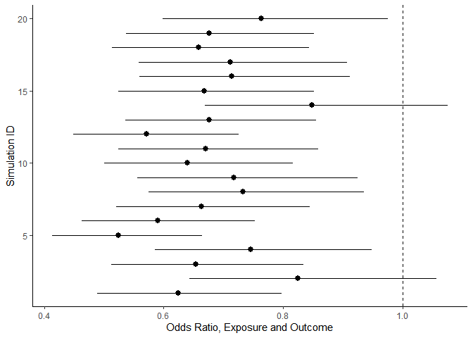

We will create a collider variable from the binary exposure and outcome. This is not a confounder, as the causal direction is from the exposure and outcome to the collider. 

```r
  # Create a binary outcome variable 
  outcome<-rbinom(n=2000,size=1,prob=0.7)
  head(outcome, 40) # list first 40 values
```

```
##  [1] 0 1 1 1 1 1 1 1 0 1 1 0 1 1 1 1 1 0 1 1 0 1 1 1 1 1 1 0 1 0 0 1 1 0 1 1 1 1
## [39] 1 1
```

```r
  mean(outcome) # proportion of 1, do not use mean, if values are in factor (categorical)
```

```
## [1] 0.711
```

```r
  # Create a binary exposure variable 
  Exposure<-rbinom(n=2000,size=1,prob=0.3)
  head(Exposure, 40)
```

```
##  [1] 1 0 0 0 0 0 0 0 0 1 0 0 0 0 0 0 0 1 0 0 1 0 1 0 0 0 0 1 0 0 0 0 0 0 0 0 0 1
## [39] 0 0
```

```r
  mean(Exposure)
```

```
## [1] 0.295
```

```r
  # Create a third variable (fake confounder) from the outcome and exposure  
  theta = 0 + 1.5*Exposure + 2*outcome  # Generate logit of confounder
  prob <- 1/(1+exp(-theta))  # convert logit values into probabilities
  conf= rbinom(2000,1,prob) # Generate the binary values from Bernoulli based the probabilities
  head(Exposure, 40) # display values 
```

```
##  [1] 1 0 0 0 0 0 0 0 0 1 0 0 0 0 0 0 0 1 0 0 1 0 1 0 0 0 0 1 0 0 0 0 0 0 0 0 0 1
## [39] 0 0
```

```r
  mean(Exposure)
```

```
## [1] 0.295
```


Checking associations between the three variables. We do not expect the association between the exposure and the outcome, since the two variables were independently generated. 

```r
  # Descriptive 2x2 associations 
  epitools::epitab(Exposure, outcome, method = "oddsratio")$tab[, c(1,3,5,6,7,8)]
```

```
##          Outcome
## Predictor   0   1 oddsratio     lower    upper   p.value
##         0 416 994  1.000000        NA       NA        NA
##         1 162 428  1.105696 0.8927006 1.369511 0.3868597
```

```r
  epitools::epitab(Exposure, conf, method = "oddsratio")$tab[, c(1,3,5,6,7,8)]
```

```
##          Outcome
## Predictor   0    1 oddsratio    lower    upper      p.value
##         0 350 1060  1.000000       NA       NA           NA
##         1  34  556  5.399556 3.741865 7.791624 9.953847e-27
```

```r
  epitools::epitab(outcome, conf, method = "oddsratio")$tab[, c(1,3,5,6,7,8)]
```

```
##          Outcome
## Predictor   0    1 oddsratio    lower    upper     p.value
##         0 245  333     1.000       NA       NA          NA
##         1 139 1283     6.791 5.339257 8.637471 5.66258e-58
```


Now, perform stratification (condition analysis on C) and investigate the association between the exposure and the outcome 

```r
  # Make a data tables from these 3 variables, one for all people, another for people restricted to C=1, and the third for C=0
  myData <- data.frame(Exposure, outcome, conf) # all data
  onlyZero <- myData %>%  filter(conf== 0) # stratified by the status of C
  onlyOne <- myData %>%  filter(conf== 1)  # stratified by the status of C
  
  # Stratum C=1
  epitools::epitab(onlyZero$Exposure, onlyZero$outcome, method = "oddsratio")$tab[, c(1,3,5,6,7,8)]
```

```
##          Outcome
## Predictor   0   1 oddsratio    lower    upper   p.value
##         0 222 128 1.0000000       NA       NA        NA
##         1  23  11 0.8294837 0.391544 1.757256 0.7106708
```

```r
  # Stratum C=0
  epitools::epitab(onlyOne$Exposure, onlyOne$outcome, method = "oddsratio")$tab[, c(1,3,5,6,7,8)]
```

```
##          Outcome
## Predictor   0   1 oddsratio     lower     upper     p.value
##         0 194 866 1.0000000        NA        NA          NA
##         1 139 417 0.6720554 0.5248883 0.8604849 0.001868471
```

In addition to stratification, we will also run regression-based adjustment to confirm the results 

```r
regress_eo <- glm(outcome~Exposure,data=myData,family="binomial")
coefplot(regress_eo, main = "Not adjusted for C")
```

<!-- -->

```r
regress_eoc <- glm(outcome~Exposure + conf,data=myData,family="binomial")
coefplot(regress_eoc, main = "Adjusted for C")
```

<!-- -->


Is this association by chance? Simulate with multiple realizations to check 

```r
# Function to run the data generation and analysis repeatedly 
myFunc <- function(){
  
  # Create a binary outcome variable 
  outcome<-rbinom(n=2000,size=1,prob=0.7)
  head(outcome, 40)
  mean(outcome)
  
  # Create a binary exposure variable 
  Exposure<-rbinom(n=2000,size=1,prob=0.3)
  head(Exposure, 40)
  mean(Exposure)
  
  # Create a fake confounded variable from the outcome and exposure  
  theta = 0 + 1.5*Exposure + 2*outcome 
  prob <- 1/(1+exp(-theta))  
  conf= rbinom(2000,1,prob)
  head(Exposure, 40)
  mean(Exposure)

  # Make a data table from these 3 variables 
  myData <- data.frame(Exposure, outcome, conf)
  onlyZero <- myData %>%  filter(conf== 0) 
  onlyOne <- myData %>%  filter(conf== 1) 
  
  tabZeroStrata <- epitools::epitab(onlyZero$Exposure, onlyZero$outcome, method = "oddsratio")
  tabOneStrata <- epitools::epitab(onlyOne$Exposure, onlyOne$outcome, method = "oddsratio")
  
  c(
  mean <- tabOneStrata$tab[2,5],
  lo <- tabOneStrata$tab[2,6],
  hi <- tabOneStrata$tab[2,7]
  )
}

# Replicate the function above and compile results (odds ratio) across simulations and display as a forestplot 
d <- replicate(20, myFunc())
d <- data.frame(t(d))
names(d) <- c("Point", "Lower", "Upper")
d$simulationID <- 1:nrow(d)

ggplot(d, aes(x=simulationID, y=Point, ymin=Lower, ymax=Upper))+
    geom_pointrange()+
    geom_hline(yintercept = 1, linetype=2)+
    coord_flip()+
    xlab('Simulation ID') + 
    ylab("Odds Ratio, Exposure and Outcome") + 
    theme_classic()
```

<!-- -->
