## Setup 
Load library, set figure size

```r
rm(list=ls()) # clear all workspace, very important to do this to refresh 
knitr::opts_chunk$set(echo = TRUE)
knitr::opts_chunk$set(fig.width=4.5, fig.height=4.5) 
library(tidyverse)
```

```
## ── Attaching packages ─────────────────────────────────────── tidyverse 1.3.2 ──
## ✔ ggplot2 3.4.0      ✔ purrr   0.3.5 
## ✔ tibble  3.1.8      ✔ dplyr   1.0.10
## ✔ tidyr   1.2.1      ✔ stringr 1.5.0 
## ✔ readr   2.1.3      ✔ forcats 0.5.2 
## ── Conflicts ────────────────────────────────────────── tidyverse_conflicts() ──
## ✖ dplyr::filter() masks stats::filter()
## ✖ dplyr::lag()    masks stats::lag()
```

```r
library(epitools)
library(htmlTable)
library(autoReg)
library(labelled)
```

### Data size for simulation and custom function to format table names 

```r
N = 200

funcColNames <- function(d){
  colnames(d)[colnames(d) == "term"] <- "Coefficient"
  colnames(d)[colnames(d) == "conf.low"] <- "ConfInt.Lower"
  colnames(d)[colnames(d) == "conf.high"] <- "ConfInt.Higher"
  return(d)
}
# Make shorter variables names 
funcColNames2 <- function(d){
  colnames(d)[colnames(d) == "term"] <- "Coef"
  colnames(d)[colnames(d) == "conf.low"] <- "CI.Lower"
  colnames(d)[colnames(d) == "conf.high"] <- "CI.Higher"
  d <- d %>% select(-c(p.value, statistic))
  return(d)
}
```


## Real data to check the assumptions 
FEV (Forced Expiration Volume) study, can be download from many sources    
Some anlaysis examples https://www.tandfonline.com/doi/full/10.1080/10691898.2005.11910559   
An Exhalent Problem for Teaching Statistics, Kahn (2017) https://doi.org/10.1080/10691898.2005.11910559

```r
url <- "http://www.emersonstatistics.com/datasets/fev.txt"
download.file(url, "fev.txt" )
dat <- read.csv("~/GitHub/chep801_usask/Lecture_mis/Lecture_Regression1/fev.txt", sep="")

# Describe data 
glimpse(dat)
```

```
## Rows: 654
## Columns: 7
## $ seqnbr <int> 1, 2, 3, 4, 5, 6, 7, 8, 9, 10, 11, 12, 13, 14, 15, 16, 17, 18, …
## $ subjid <int> 301, 451, 501, 642, 901, 1701, 1752, 1753, 1901, 1951, 1952, 20…
## $ age    <int> 9, 8, 7, 9, 9, 8, 6, 6, 8, 9, 6, 8, 8, 8, 8, 7, 5, 6, 9, 9, 5, …
## $ fev    <dbl> 1.708, 1.724, 1.720, 1.558, 1.895, 2.336, 1.919, 1.415, 1.987, …
## $ height <dbl> 57.0, 67.5, 54.5, 53.0, 57.0, 61.0, 58.0, 56.0, 58.5, 60.0, 53.…
## $ sex    <int> 2, 2, 2, 1, 1, 2, 2, 2, 2, 2, 2, 1, 2, 1, 1, 1, 1, 2, 1, 1, 2, …
## $ smoke  <int> 2, 2, 2, 2, 2, 2, 2, 2, 2, 2, 2, 2, 2, 2, 2, 2, 2, 2, 2, 2, 2, …
```

```r
# Make categorical varaibles out of characters 
dat$sex <- factor(dat$sex)
levels(dat$sex) = c("Female", "Male")
table(dat$sex)
```

```
## 
## Female   Male 
##    336    318
```

```r
dat$smoke <- factor(dat$smoke)
levels(dat$smoke) <- c("Smoker", "Non-smoker")
table(dat$smoke)
```

```
## 
##     Smoker Non-smoker 
##         65        589
```

```r
pairs(dat %>%  select(-c("seqnbr", subjid)))
```

<!-- -->


We will start from descriptive statistics
### We will assess the association of each variables as well as potential non-linearity and effect measure modification 
Descritpive plots - histogram 

```r
# Distribution of continuous outcomes 
hist(dat$age, main = "Age", cex.main = 1)
hist(dat$fev, main = "FEV, outcome", cex.main = 1)
hist(dat$height, main = "Height", cex.main = 1)
```

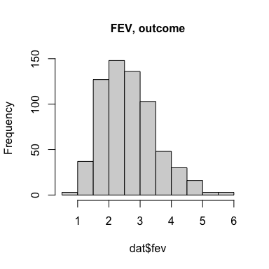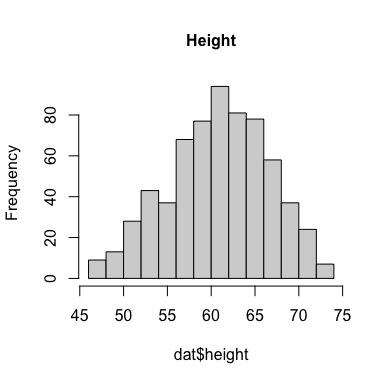

### Descriptive plots - xy age and fev

```r
ggplot(dat, aes(x= age, y = fev)) + 
  geom_point() +
  theme_classic() + 
  ggtitle("Relationship between Age (years) and FEV (Litres)") + 
  theme(plot.title = element_text(size = 9)) + 
   geom_smooth(se=FALSE)
```

```
## `geom_smooth()` using method = 'loess' and formula = 'y ~ x'
```

```r
ggplot(dat, aes(x= age, y = fev)) + 
  geom_point() +
  theme_classic() + 
  ggtitle("Relationship between Age (years) and FEV (Litres) \n  by Sex") + 
  facet_wrap(~sex) + 
  theme(plot.title = element_text(size = 9)) + 
   geom_smooth(se=FALSE)
```

```
## `geom_smooth()` using method = 'loess' and formula = 'y ~ x'
```

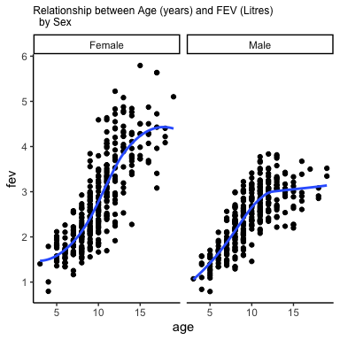

### Descriptive plots - height and fev 

```r
ggplot(dat, aes(x= height, y = fev)) + 
  geom_point() +
  theme_classic() + 
  ggtitle("Relationship between Height (years) and FEV (Litres)")+ 
  theme(plot.title = element_text(size = 9)) + 
   geom_smooth(se=FALSE)
```

```
## `geom_smooth()` using method = 'loess' and formula = 'y ~ x'
```

```r
ggplot(dat, aes(x= height, y = fev)) + 
  geom_point() +
  theme_classic() + 
  ggtitle("Relationship between Height (years) and FEV (Litres) \n by smoking status") + 
  facet_wrap(~smoke)+ 
  theme(plot.title = element_text(size = 9)) + 
   geom_smooth(se=FALSE)
```

```
## `geom_smooth()` using method = 'loess' and formula = 'y ~ x'
```

```r
ggplot(dat, aes(x= age, y = height)) + 
  geom_point() +
  theme_classic() + 
  ggtitle("Relationship between Age (years) and FEV (Litres)")+ 
  theme(plot.title = element_text(size = 9)) + 
   geom_smooth(se=FALSE)
```

```
## `geom_smooth()` using method = 'loess' and formula = 'y ~ x'
```

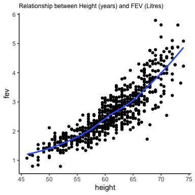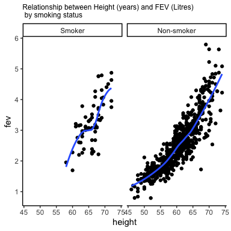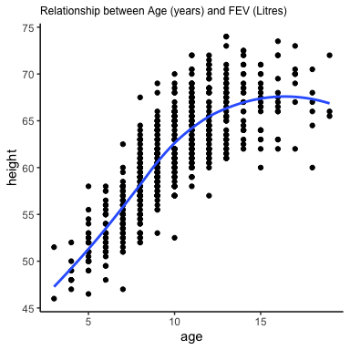

### Descriptive plots - height and fev 

```r
ggplot(dat, aes(sex, fev)) + geom_boxplot() + theme_classic() + ggtitle("FEV by sex")
ggplot(dat, aes(smoke, fev)) + geom_boxplot() + theme_classic() + ggtitle("FEV by smoking status")

knitr::kable(table(dat$sex), digits = 2, caption = "Results: Linear model ")
```


Table: Results: Linear model 

|Var1   | Freq|
|:------|----:|
|Female |  336|
|Male   |  318|

```r
knitr::kable(table(dat$smoke), digits = 2, caption = "Results: Linear model ")
```


Table: Results: Linear model 

|Var1       | Freq|
|:----------|----:|
|Smoker     |   65|
|Non-smoker |  589|

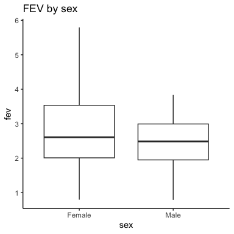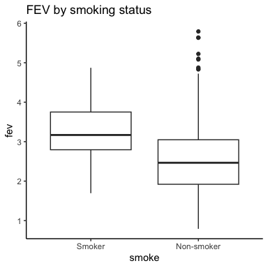

### Plot all varaibles at once, execpt person IDs 

```r
dat %>% select(-c(seqnbr, subjid)) %>% pairs
```

<!-- -->


## Exploratory regression analysis,  
#### single variable regression between FEV and each covariate
#### remember though, just looking at coefficients only is not as imformative as x-y plots above 

```r
independentVariables <- c("age", "height", "smoke", "sex")
independentVariablesData<- dat[, independentVariables]
fitList <- lapply(1:ncol(independentVariablesData), function(x) lm(dat$fev ~ independentVariablesData[,x]))

# extract just coefficients
sapply(fitList, coef)
```

```
##                                    [,1]       [,2]       [,3]       [,4]
## (Intercept)                   0.4316481 -5.4326788  3.2768615  2.8124464
## independentVariablesData[, x] 0.2220410  0.1319756 -0.7107189 -0.3612766
```

```r
fit=lm(fev~age+sex+height+smoke,data=dat)

#fit=lm(fev~age*sex*height*smoke,data=dat)
autoReg(fit,uni=TRUE, threshold=0.2) %>% myft()
```

```{=html}
<div class="tabwid"><style>.cl-813ac432{}.cl-81304f66{font-family:'Arial';font-size:11pt;font-weight:normal;font-style:normal;text-decoration:none;color:rgba(0, 0, 0, 1.00);background-color:transparent;}.cl-81304f7a{font-family:'Arial';font-size:10pt;font-weight:normal;font-style:normal;text-decoration:none;color:rgba(0, 0, 0, 1.00);background-color:transparent;}.cl-8133fd8c{margin:0;text-align:center;border-bottom: 0 solid rgba(0, 0, 0, 1.00);border-top: 0 solid rgba(0, 0, 0, 1.00);border-left: 0 solid rgba(0, 0, 0, 1.00);border-right: 0 solid rgba(0, 0, 0, 1.00);padding-bottom:2pt;padding-top:2pt;padding-left:5pt;padding-right:5pt;line-height: 1;background-color:transparent;}.cl-8133fda0{margin:0;text-align:left;border-bottom: 0 solid rgba(0, 0, 0, 1.00);border-top: 0 solid rgba(0, 0, 0, 1.00);border-left: 0 solid rgba(0, 0, 0, 1.00);border-right: 0 solid rgba(0, 0, 0, 1.00);padding-bottom:2pt;padding-top:2pt;padding-left:5pt;padding-right:5pt;line-height: 1;background-color:transparent;}.cl-8133fdaa{margin:0;text-align:right;border-bottom: 0 solid rgba(0, 0, 0, 1.00);border-top: 0 solid rgba(0, 0, 0, 1.00);border-left: 0 solid rgba(0, 0, 0, 1.00);border-right: 0 solid rgba(0, 0, 0, 1.00);padding-bottom:2pt;padding-top:2pt;padding-left:5pt;padding-right:5pt;line-height: 1;background-color:transparent;}.cl-8133fdab{margin:0;text-align:left;border-bottom: 0 solid rgba(0, 0, 0, 1.00);border-top: 0 solid rgba(0, 0, 0, 1.00);border-left: 0 solid rgba(0, 0, 0, 1.00);border-right: 0 solid rgba(0, 0, 0, 1.00);padding-bottom:5pt;padding-top:5pt;padding-left:5pt;padding-right:5pt;line-height: 1;background-color:transparent;}.cl-81341326{width:1.321in;background-color:transparent;vertical-align: middle;border-bottom: 2pt solid rgba(0, 0, 0, 1.00);border-top: 2pt solid rgba(0, 0, 0, 1.00);border-left: 0 solid rgba(0, 0, 0, 1.00);border-right: 0 solid rgba(0, 0, 0, 1.00);margin-bottom:0;margin-top:0;margin-left:0;margin-right:0;}.cl-81341330{width:1.586in;background-color:transparent;vertical-align: middle;border-bottom: 2pt solid rgba(0, 0, 0, 1.00);border-top: 2pt solid rgba(0, 0, 0, 1.00);border-left: 0 solid rgba(0, 0, 0, 1.00);border-right: 0 solid rgba(0, 0, 0, 1.00);margin-bottom:0;margin-top:0;margin-left:0;margin-right:0;}.cl-81341331{width:0.979in;background-color:transparent;vertical-align: middle;border-bottom: 2pt solid rgba(0, 0, 0, 1.00);border-top: 2pt solid rgba(0, 0, 0, 1.00);border-left: 0 solid rgba(0, 0, 0, 1.00);border-right: 0 solid rgba(0, 0, 0, 1.00);margin-bottom:0;margin-top:0;margin-left:0;margin-right:0;}.cl-8134133a{width:0.902in;background-color:transparent;vertical-align: middle;border-bottom: 2pt solid rgba(0, 0, 0, 1.00);border-top: 2pt solid rgba(0, 0, 0, 1.00);border-left: 0 solid rgba(0, 0, 0, 1.00);border-right: 0 solid rgba(0, 0, 0, 1.00);margin-bottom:0;margin-top:0;margin-left:0;margin-right:0;}.cl-8134133b{width:2.065in;background-color:transparent;vertical-align: middle;border-bottom: 2pt solid rgba(0, 0, 0, 1.00);border-top: 2pt solid rgba(0, 0, 0, 1.00);border-left: 0 solid rgba(0, 0, 0, 1.00);border-right: 0 solid rgba(0, 0, 0, 1.00);margin-bottom:0;margin-top:0;margin-left:0;margin-right:0;}.cl-81341344{width:1.321in;background-color:transparent;vertical-align: middle;border-bottom: 0 solid rgba(0, 0, 0, 1.00);border-top: 0 solid rgba(0, 0, 0, 1.00);border-left: 0 solid rgba(0, 0, 0, 1.00);border-right: 0 solid rgba(0, 0, 0, 1.00);margin-bottom:0;margin-top:0;margin-left:0;margin-right:0;}.cl-81341345{width:1.586in;background-color:transparent;vertical-align: middle;border-bottom: 0 solid rgba(0, 0, 0, 1.00);border-top: 0 solid rgba(0, 0, 0, 1.00);border-left: 0 solid rgba(0, 0, 0, 1.00);border-right: 0 solid rgba(0, 0, 0, 1.00);margin-bottom:0;margin-top:0;margin-left:0;margin-right:0;}.cl-8134134e{width:0.979in;background-color:transparent;vertical-align: middle;border-bottom: 0 solid rgba(0, 0, 0, 1.00);border-top: 0 solid rgba(0, 0, 0, 1.00);border-left: 0 solid rgba(0, 0, 0, 1.00);border-right: 0 solid rgba(0, 0, 0, 1.00);margin-bottom:0;margin-top:0;margin-left:0;margin-right:0;}.cl-8134134f{width:0.902in;background-color:transparent;vertical-align: middle;border-bottom: 0 solid rgba(0, 0, 0, 1.00);border-top: 0 solid rgba(0, 0, 0, 1.00);border-left: 0 solid rgba(0, 0, 0, 1.00);border-right: 0 solid rgba(0, 0, 0, 1.00);margin-bottom:0;margin-top:0;margin-left:0;margin-right:0;}.cl-81341358{width:2.065in;background-color:transparent;vertical-align: middle;border-bottom: 0 solid rgba(0, 0, 0, 1.00);border-top: 0 solid rgba(0, 0, 0, 1.00);border-left: 0 solid rgba(0, 0, 0, 1.00);border-right: 0 solid rgba(0, 0, 0, 1.00);margin-bottom:0;margin-top:0;margin-left:0;margin-right:0;}.cl-81341362{width:1.321in;background-color:transparent;vertical-align: middle;border-bottom: 2pt solid rgba(0, 0, 0, 1.00);border-top: 0 solid rgba(0, 0, 0, 1.00);border-left: 0 solid rgba(0, 0, 0, 1.00);border-right: 0 solid rgba(0, 0, 0, 1.00);margin-bottom:0;margin-top:0;margin-left:0;margin-right:0;}.cl-8134136c{width:1.586in;background-color:transparent;vertical-align: middle;border-bottom: 2pt solid rgba(0, 0, 0, 1.00);border-top: 0 solid rgba(0, 0, 0, 1.00);border-left: 0 solid rgba(0, 0, 0, 1.00);border-right: 0 solid rgba(0, 0, 0, 1.00);margin-bottom:0;margin-top:0;margin-left:0;margin-right:0;}.cl-81341376{width:0.979in;background-color:transparent;vertical-align: middle;border-bottom: 2pt solid rgba(0, 0, 0, 1.00);border-top: 0 solid rgba(0, 0, 0, 1.00);border-left: 0 solid rgba(0, 0, 0, 1.00);border-right: 0 solid rgba(0, 0, 0, 1.00);margin-bottom:0;margin-top:0;margin-left:0;margin-right:0;}.cl-81341377{width:0.902in;background-color:transparent;vertical-align: middle;border-bottom: 2pt solid rgba(0, 0, 0, 1.00);border-top: 0 solid rgba(0, 0, 0, 1.00);border-left: 0 solid rgba(0, 0, 0, 1.00);border-right: 0 solid rgba(0, 0, 0, 1.00);margin-bottom:0;margin-top:0;margin-left:0;margin-right:0;}.cl-81341380{width:2.065in;background-color:transparent;vertical-align: middle;border-bottom: 2pt solid rgba(0, 0, 0, 1.00);border-top: 0 solid rgba(0, 0, 0, 1.00);border-left: 0 solid rgba(0, 0, 0, 1.00);border-right: 0 solid rgba(0, 0, 0, 1.00);margin-bottom:0;margin-top:0;margin-left:0;margin-right:0;}.cl-81341381{width:1.321in;background-color:transparent;vertical-align: middle;border-bottom: 0 solid rgba(255, 255, 255, 0.00);border-top: 0 solid rgba(255, 255, 255, 0.00);border-left: 0 solid rgba(255, 255, 255, 0.00);border-right: 0 solid rgba(255, 255, 255, 0.00);margin-bottom:0;margin-top:0;margin-left:0;margin-right:0;}.cl-81341382{width:1.586in;background-color:transparent;vertical-align: middle;border-bottom: 0 solid rgba(255, 255, 255, 0.00);border-top: 0 solid rgba(255, 255, 255, 0.00);border-left: 0 solid rgba(255, 255, 255, 0.00);border-right: 0 solid rgba(255, 255, 255, 0.00);margin-bottom:0;margin-top:0;margin-left:0;margin-right:0;}.cl-8134138a{width:0.979in;background-color:transparent;vertical-align: middle;border-bottom: 0 solid rgba(255, 255, 255, 0.00);border-top: 0 solid rgba(255, 255, 255, 0.00);border-left: 0 solid rgba(255, 255, 255, 0.00);border-right: 0 solid rgba(255, 255, 255, 0.00);margin-bottom:0;margin-top:0;margin-left:0;margin-right:0;}.cl-81341394{width:0.902in;background-color:transparent;vertical-align: middle;border-bottom: 0 solid rgba(255, 255, 255, 0.00);border-top: 0 solid rgba(255, 255, 255, 0.00);border-left: 0 solid rgba(255, 255, 255, 0.00);border-right: 0 solid rgba(255, 255, 255, 0.00);margin-bottom:0;margin-top:0;margin-left:0;margin-right:0;}.cl-81341395{width:2.065in;background-color:transparent;vertical-align: middle;border-bottom: 0 solid rgba(255, 255, 255, 0.00);border-top: 0 solid rgba(255, 255, 255, 0.00);border-left: 0 solid rgba(255, 255, 255, 0.00);border-right: 0 solid rgba(255, 255, 255, 0.00);margin-bottom:0;margin-top:0;margin-left:0;margin-right:0;}</style><table data-quarto-disable-processing='true' class='cl-813ac432'><thead><tr style="overflow-wrap:break-word;"><th class="cl-81341326"><p class="cl-8133fd8c"><span class="cl-81304f66">Dependent: fev</span></p></th><th class="cl-81341330"><p class="cl-8133fd8c"><span class="cl-81304f66"> </span></p></th><th class="cl-81341331"><p class="cl-8133fd8c"><span class="cl-81304f66">unit</span></p></th><th class="cl-8134133a"><p class="cl-8133fd8c"><span class="cl-81304f66">value</span></p></th><th class="cl-8134133b"><p class="cl-8133fd8c"><span class="cl-81304f66">Coefficient (univariable)</span></p></th><th class="cl-8134133b"><p class="cl-8133fd8c"><span class="cl-81304f66">Coefficient (multivariable)</span></p></th></tr></thead><tbody><tr style="overflow-wrap:break-word;"><td class="cl-81341344"><p class="cl-8133fda0"><span class="cl-81304f7a">age</span></p></td><td class="cl-81341345"><p class="cl-8133fdaa"><span class="cl-81304f7a">[3,19]</span></p></td><td class="cl-8134134e"><p class="cl-8133fdaa"><span class="cl-81304f7a">Mean ± SD</span></p></td><td class="cl-8134134f"><p class="cl-8133fdaa"><span class="cl-81304f7a">9.9 ± 3.0</span></p></td><td class="cl-81341358"><p class="cl-8133fdaa"><span class="cl-81304f7a">0.22 (0.21 to 0.24, p&lt;.001)</span></p></td><td class="cl-81341358"><p class="cl-8133fdaa"><span class="cl-81304f7a">0.07 (0.05 to 0.08, p&lt;.001)</span></p></td></tr><tr style="overflow-wrap:break-word;"><td class="cl-81341344"><p class="cl-8133fda0"><span class="cl-81304f7a">sex</span></p></td><td class="cl-81341345"><p class="cl-8133fdaa"><span class="cl-81304f7a">Female (N=336)</span></p></td><td class="cl-8134134e"><p class="cl-8133fdaa"><span class="cl-81304f7a">Mean ± SD</span></p></td><td class="cl-8134134f"><p class="cl-8133fdaa"><span class="cl-81304f7a">2.8 ± 1.0</span></p></td><td class="cl-81341358"><p class="cl-8133fdaa"><span class="cl-81304f7a"></span></p></td><td class="cl-81341358"><p class="cl-8133fdaa"><span class="cl-81304f7a"></span></p></td></tr><tr style="overflow-wrap:break-word;"><td class="cl-81341344"><p class="cl-8133fda0"><span class="cl-81304f7a"></span></p></td><td class="cl-81341345"><p class="cl-8133fdaa"><span class="cl-81304f7a">Male   (N=318)</span></p></td><td class="cl-8134134e"><p class="cl-8133fdaa"><span class="cl-81304f7a">Mean ± SD</span></p></td><td class="cl-8134134f"><p class="cl-8133fdaa"><span class="cl-81304f7a">2.5 ± 0.6</span></p></td><td class="cl-81341358"><p class="cl-8133fdaa"><span class="cl-81304f7a">-0.36 (-0.49 to -0.23, p&lt;.001)</span></p></td><td class="cl-81341358"><p class="cl-8133fdaa"><span class="cl-81304f7a">-0.16 (-0.22 to -0.09, p&lt;.001)</span></p></td></tr><tr style="overflow-wrap:break-word;"><td class="cl-81341344"><p class="cl-8133fda0"><span class="cl-81304f7a">height</span></p></td><td class="cl-81341345"><p class="cl-8133fdaa"><span class="cl-81304f7a">[46,74]</span></p></td><td class="cl-8134134e"><p class="cl-8133fdaa"><span class="cl-81304f7a">Mean ± SD</span></p></td><td class="cl-8134134f"><p class="cl-8133fdaa"><span class="cl-81304f7a">61.1 ± 5.7</span></p></td><td class="cl-81341358"><p class="cl-8133fdaa"><span class="cl-81304f7a">0.13 (0.13 to 0.14, p&lt;.001)</span></p></td><td class="cl-81341358"><p class="cl-8133fdaa"><span class="cl-81304f7a">0.10 (0.09 to 0.11, p&lt;.001)</span></p></td></tr><tr style="overflow-wrap:break-word;"><td class="cl-81341344"><p class="cl-8133fda0"><span class="cl-81304f7a">smoke</span></p></td><td class="cl-81341345"><p class="cl-8133fdaa"><span class="cl-81304f7a">Non-smoker (N=589)</span></p></td><td class="cl-8134134e"><p class="cl-8133fdaa"><span class="cl-81304f7a">Mean ± SD</span></p></td><td class="cl-8134134f"><p class="cl-8133fdaa"><span class="cl-81304f7a">3.3 ± 0.7</span></p></td><td class="cl-81341358"><p class="cl-8133fdaa"><span class="cl-81304f7a"></span></p></td><td class="cl-81341358"><p class="cl-8133fdaa"><span class="cl-81304f7a"></span></p></td></tr><tr style="overflow-wrap:break-word;"><td class="cl-81341362"><p class="cl-8133fda0"><span class="cl-81304f7a"></span></p></td><td class="cl-8134136c"><p class="cl-8133fdaa"><span class="cl-81304f7a">Smoker     (N=65)</span></p></td><td class="cl-81341376"><p class="cl-8133fdaa"><span class="cl-81304f7a">Mean ± SD</span></p></td><td class="cl-81341377"><p class="cl-8133fdaa"><span class="cl-81304f7a">2.6 ± 0.9</span></p></td><td class="cl-81341380"><p class="cl-8133fdaa"><span class="cl-81304f7a">-0.71 (-0.93 to -0.49, p&lt;.001)</span></p></td><td class="cl-81341380"><p class="cl-8133fdaa"><span class="cl-81304f7a">0.09 (-0.03 to 0.20, p=.141)</span></p></td></tr></tbody><tfoot><tr style="overflow-wrap:break-word;"><td  colspan="6"class="cl-81341381"><p class="cl-8133fdab"><span class="cl-81304f66"></span></p></td></tr></tfoot></table></div>
```

```r
final=step(fit,trace=0)
summary(final)
```

```
## 
## Call:
## lm(formula = fev ~ age + sex + height + smoke, data = dat)
## 
## Residuals:
##      Min       1Q   Median       3Q      Max 
## -1.37656 -0.25033  0.00894  0.25588  1.92047 
## 
## Coefficients:
##                  Estimate Std. Error t value Pr(>|t|)    
## (Intercept)     -4.387117   0.239799 -18.295  < 2e-16 ***
## age              0.065509   0.009489   6.904 1.21e-11 ***
## sexMale         -0.157103   0.033207  -4.731 2.74e-06 ***
## height           0.104199   0.004758  21.901  < 2e-16 ***
## smokeNon-smoker  0.087246   0.059254   1.472    0.141    
## ---
## Signif. codes:  0 '***' 0.001 '**' 0.01 '*' 0.05 '.' 0.1 ' ' 1
## 
## Residual standard error: 0.4122 on 649 degrees of freedom
## Multiple R-squared:  0.7754,	Adjusted R-squared:  0.774 
## F-statistic:   560 on 4 and 649 DF,  p-value: < 2.2e-16
```


#### Multivariable regression
Our model of interest is: 
$$E[Y_{fev}] = \alpha + \beta_{age}*age + \beta_{height}*height + \beta_{smoking}*smoking +  \beta_{sex}*sex  $$

```r
fit=lm(fev~age+sex+height+smoke,data=dat)
datPlot <- data.frame(dat, fitted =  fit$fitted.values, residual = fit$residuals)
```


### Our FEV model, for now throw everything, Exposure of interesting smoking yes/no 
#### As usual, be sure to consult with DAF for real analysis 
#### No interaction term for now 

### Assumption 1 - Lienarity of outcome with fitted values (or x if univariate model)

```r
ggplot(data = datPlot, aes(y = fev, x = fitted)) + 
  geom_point() + 
  theme_classic() + 
  ggtitle("Assumption 1: Fitted vs Observed outcome") + 
  geom_smooth(se = FALSE) + 
  geom_abline(slope = 1,linetype = "dashed")
```

```
## `geom_smooth()` using method = 'loess' and formula = 'y ~ x'
```

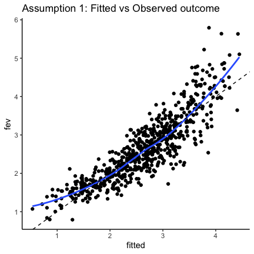<!-- -->

```r
ggplot(data = datPlot, aes(y = residual, x = fitted)) + 
  geom_point() + 
  theme_classic() + 
  ggtitle("Assumption 1: Fitted vs residuals") + 
  geom_smooth(se = FALSE) + 
  geom_hline(yintercept = 0, linetype = "dashed")
```

```
## `geom_smooth()` using method = 'loess' and formula = 'y ~ x'
```

<!-- -->

### Assumption 1 - plot by Sex and Smoking
#### Besure though, smokign is our exposure of interest, so we cannot subset data by smoke 

```r
ggplot(data = datPlot, aes(y = fev, x = fitted)) + 
  geom_point() + 
  theme_classic() + 
  facet_wrap(~smoke) + 
  ggtitle("Assumption 1: Fitted vs Observed outcome, \n by Smoke")+ 
  geom_abline(slope = 1,linetype = "dashed")
```

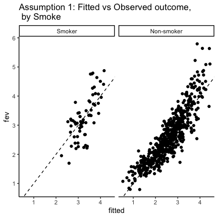<!-- -->

```r
ggplot(data = datPlot, aes(y = fev, x = fitted)) + 
  geom_point() + 
  theme_classic() + 
  facet_wrap(~sex) + 
  ggtitle("Assumption 1: Fitted vs Observed outcome, \n by Sex")+ 
  geom_abline(slope = 1,linetype = "dashed")
```

<!-- -->

### Assumption 1 - Perhaps, quadratic term in the regression model, since we saw that FEV is non-linear with age and height? This cold lead to residual confounding by age and height. 
#### Abter adding quadratic term for age and height, the association of fitted and observed FEV look linear **BUT**, the interpretation of age and height are no longer linear (quadratic term added), and there is a larger disagreement at higher values of fitted and observed. 

```r
dat$age2 <- dat$age*dat$age
dat$height2 <- dat$height*dat$height
fit=lm(fev~age +age2 +sex+height + height2+smoke,data=dat)
datPlot_Q <- data.frame(dat, fitted =  fit$fitted.values, residual = fit$residuals)

ggplot(data = datPlot_Q, aes(y = fev, x = fitted)) + 
  geom_point() + 
  theme_classic() + 
  ggtitle("Assumption 1: Fitted vs Observed outcome, \n quadratic age and height")


ggplot(data = datPlot_Q, aes(y = fev, x = fitted, color = smoke)) + 
  geom_point() + 
  theme_classic() + 
  ggtitle("Assumption 1: Fitted vs Observed outcome, \n quadratic age and height \n color separated by smoking ")

ggplot(data = datPlot, aes(y = fev, x = fitted)) + 
  geom_point() + 
  theme_classic() + 
  ggtitle("Assumption 1: Fitted vs Observed outcome \ Original model ")
```


### Assumption 2 - Independence of errors (residuals)


#### Assumption 3 - Constant dispersion of residuals across the value of fitted values (if multiple regression), or x (if univariate model) 

```r
ggplot(data = datPlot, aes(y = residual, x = fitted)) + 
  geom_point() + 
  theme_classic() + 
  ggtitle("Assumption 3: Fitted vs residuals \n increase of variance \n but U-shaped") + 
  geom_smooth(se = FALSE) + 
  geom_hline(yintercept = 0, linetype = "dashed")
```

```
## `geom_smooth()` using method = 'loess' and formula = 'y ~ x'
```

```r
ggplot(data = datPlot_Q, aes(y = residual, x = fitted)) + 
  geom_point() + 
  theme_classic() + 
  ggtitle("Assumption 3: Fitted vs age \n increase of variance") + 
    geom_smooth(se = FALSE) + 
  geom_hline(yintercept = 0, linetype = "dashed")
```

```
## `geom_smooth()` using method = 'loess' and formula = 'y ~ x'
```


#### Assumption 3 - Constant dispersion of residuals across the value of fitted values (if multiple regression), or x (if univariate model) 

```r
ggplot(data = datPlot[datPlot$smoke == "Smoker", ], aes(y = residual, x = fitted)) + 
  geom_point() + 
  theme_classic() + 
  ggtitle("Assumption 3: Fitted vs height \n smokers only") + 
  geom_hline(yintercept = 0, linetype = "dashed")
```


#### Assumption 3 - Constant dispersion of residuals across the value of fitted values (if multiple regression), or x (if univariate model) 

```r
ggplot(data = datPlot, aes(y = residual, x = age)) + 
  geom_point() + 
  theme_classic() + 
  ggtitle("Assumption 1: Fitted vs age \n increase of variance") + 
  geom_hline(yintercept = 0, linetype = "dashed")

ggplot(data = datPlot, aes(y = residual, x = height)) + 
  geom_point() + 
  theme_classic() + 
  ggtitle("Assumption 1: Fitted vs height \n increase of variance \n and bit of u-shape") + 
  geom_hline(yintercept = 0, linetype = "dashed")
```


### Assumption 4 - Resisuals are normally distributed 
#### We typically do not get very normal distribution of residuals 

```r
hist(fit$residuals, main = "Histrogram of residuals, longer tails", breaks = 20)
qqnorm(fit$residuals)
qqline(fit$residuals)
```


### Assumptions - Summary of residual diagnosis 

```r
plot(fit)
```

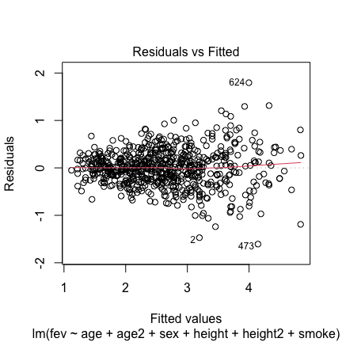<!-- -->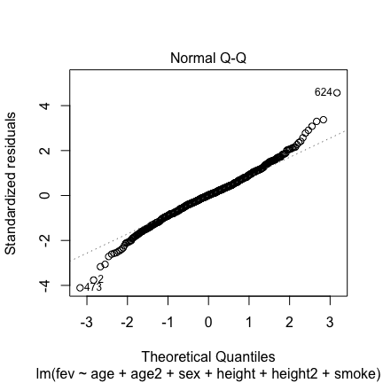<!-- -->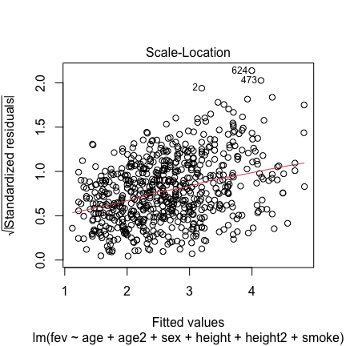<!-- --><!-- -->


