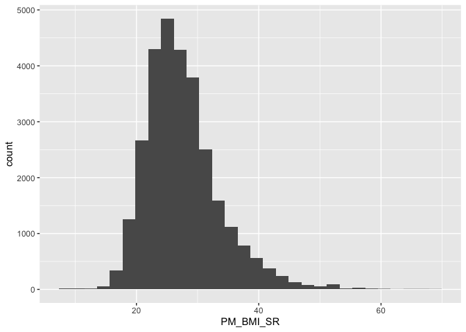
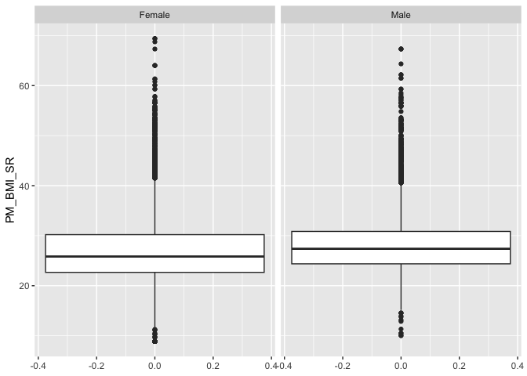
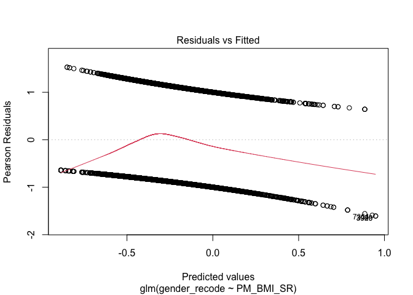
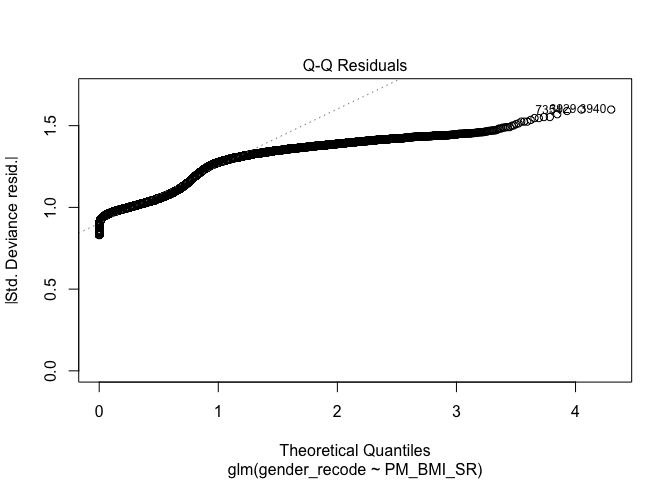
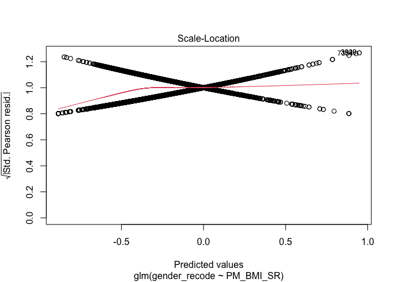
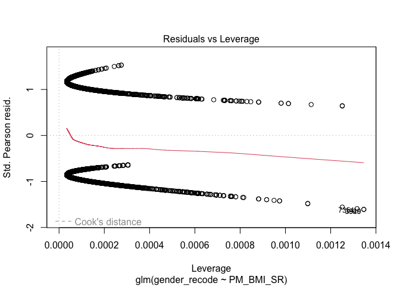

```r
library(rstatix)
library(tidyverse)
library(pastecs)
library(knitr)
library(epitools)
library(jtools)
library(Epi)
library(gtsummary)
options(scipen=999) 
```

## Ressources

1. (Mostly Clinical) Epidemiology with R. James Brophy. [https://bookdown.org/jbrophy115/bookdown-clinepi/](https://bookdown.org/jbrophy115/bookdown-clinepi/)
2. 

### Open the Data

We are interested in the association between gender and BMI. We will do descriptive analysis and examine associations. This is a cheat sheet so mostly to show code examples and is not specific to your assignments. 


```r
data <- read_csv("CANPATH_data.csv")
```

```
## Warning: One or more parsing issues, call `problems()` on your data frame for details,
## e.g.:
##   dat <- vroom(...)
##   problems(dat)
```

```
## Rows: 41187 Columns: 440
## ── Column specification ────────────────────────────────────────────────────────
## Delimiter: ","
## chr   (5): ID, MSD11_PR, MSD11_REG, MSD11_ZONE, MSD11_CMA
## dbl (425): ADM_STUDY_ID, SDC_GENDER, SDC_AGE_CALC, SDC_MARITAL_STATUS, SDC_E...
## lgl  (10): DIS_MH_BIPOLAR_EVER, DIS_GEN_DS_EVER, DIS_GEN_SCA_EVER, DIS_GEN_T...
## 
## ℹ Use `spec()` to retrieve the full column specification for this data.
## ℹ Specify the column types or set `show_col_types = FALSE` to quiet this message.
```

### Recode and label categorical variables as necessary. 

We saw this in data work week 2. [https://github.com/walkabilly/chep801_usask/blob/main/Data%20Work/Week2_data_work_R.md](https://github.com/walkabilly/chep801_usask/blob/main/Data%20Work/Week2_data_work_R.md)


```r
data <- data %>%
	mutate(gender_recode = case_when(
		SDC_GENDER == 1 ~ "Male",
    SDC_GENDER == 2 ~ "Female"
	))

data$gender_recode <- as.factor(data$gender_recode) 

### Checking our code to make sure our recode is correct
table(data$SDC_GENDER, data$gender_recode)
```

```
##    
##     Female  Male
##   1      0 15200
##   2  25987     0
```

Calculate the percents and frequencies 


```r
## First we need to make sure we get the variables recoded and organized

### Example with gender where we already recoded
gender_table <- bind_rows(table(data$gender_recode), prop.table(table(data$gender_recode)))
```

### Visualize the data

Nothing fancy here just default ggplot2. Inspect of the type of distribution, outliers, and anything else. Probably need to fix a few things with the BMI variable. 

We saw this in data work week 3. [https://github.com/walkabilly/chep801_usask/blob/main/Data%20Work/Week3_data_work_R.md](https://github.com/walkabilly/chep801_usask/blob/main/Data%20Work/Week3_data_work_R.md)


```r
bmi_histo <- ggplot(data, aes(PM_BMI_SR)) + 
              geom_histogram()
plot(bmi_histo)
```

```
## `stat_bin()` using `bins = 30`. Pick better value with `binwidth`.
```

```
## Warning: Removed 11976 rows containing non-finite values (`stat_bin()`).
```

<!-- -->

Inspect distribution by gender to see if anything is different other what we would expect. 


```r
boxplot <- ggplot(data, aes(PM_BMI_SR)) + 
              geom_boxplot() + 
              coord_flip() + 
              facet_wrap(~ gender_recode)
plot(boxplot)
```

```
## Warning: Removed 11976 rows containing non-finite values (`stat_boxplot()`).
```

<!-- -->

## Missing data

Two good ressources for missing data [https://jenslaufer.com/data/analysis/visualize_missing_values_with_ggplot.html](https://jenslaufer.com/data/analysis/visualize_missing_values_with_ggplot.html) and [https://towardsdatascience.com/data-cleaning-with-r-and-the-tidyverse-detecting-missing-values-ea23c519bc62](https://towardsdatascience.com/data-cleaning-with-r-and-the-tidyverse-detecting-missing-values-ea23c519bc62). Some of the information from these presented below applied to our data. 

This is critically important step in data cleaning and understanding and it's challenging with real data. 

### Find distinct values


```r
# looking at the distinct values for gender
data %>%
  distinct(SDC_GENDER)
```

```
## # A tibble: 2 × 1
##   SDC_GENDER
##        <dbl>
## 1          2
## 2          1
```

```r
# looking at the distinct values for BMI
data %>%
  distinct(PM_BMI_SR)
```

```
## # A tibble: 7,922 × 1
##    PM_BMI_SR
##        <dbl>
##  1      NA  
##  2      28.3
##  3      25.5
##  4      22.5
##  5      44.8
##  6      23.8
##  7      32.8
##  8      35.2
##  9      25.7
## 10      26.6
## # ℹ 7,912 more rows
```

For `SDC_GENDER` there are no missing but for `PM_BMI_SR` there are missing values. 

### Create a table of missing values for each column

This creates a table with the number of missing for each variable. Pretty handy. Important to walk through this [https://jenslaufer.com/data/analysis/visualize_missing_values_with_ggplot.html](https://jenslaufer.com/data/analysis/visualize_missing_values_with_ggplot.html) to make sure you understand what the code is doing. 


```r
missing.values <- data %>%
    gather(key = "key", value = "val") %>%
    mutate(is.missing = is.na(val)) %>%
    group_by(key, is.missing) %>%
    summarise(num.missing = n()) %>%
    filter(is.missing==T) %>%
    select(-is.missing) %>%
    arrange(desc(num.missing)) 
```

```
## Warning: attributes are not identical across measure variables; they will be
## dropped
```

```
## `summarise()` has grouped output by 'key'. You can override using the `.groups`
## argument.
```

This doc [https://towardsdatascience.com/data-cleaning-with-r-and-the-tidyverse-detecting-missing-values-ea23c519bc62](https://towardsdatascience.com/data-cleaning-with-r-and-the-tidyverse-detecting-missing-values-ea23c519bc62) also has a great explainer on non-standard missing values, which you will find for sure in real data. 

### Examine bi-variable associations 

We saw this in data work week 4 [https://github.com/walkabilly/chep801_usask/blob/main/Data%20Work/Week4_data_work_R.md](https://github.com/walkabilly/chep801_usask/blob/main/Data%20Work/Week4_data_work_R.md) and 5 [https://github.com/walkabilly/chep801_usask/blob/main/Data%20Work/Week5_data_work_R.md](https://github.com/walkabilly/chep801_usask/blob/main/Data%20Work/Week5_data_work_R.md). 

#### Linear regression


```r
bmi_gender <- glm(PM_BMI_SR ~ gender_recode, data = data, family = "gaussian")
summary(bmi_gender)
```

```
## 
## Call:
## glm(formula = PM_BMI_SR ~ gender_recode, family = "gaussian", 
##     data = data)
## 
## Coefficients:
##                   Estimate Std. Error t value            Pr(>|t|)    
## (Intercept)       27.06588    0.04715  574.05 <0.0000000000000002 ***
## gender_recodeMale  1.14805    0.07262   15.81 <0.0000000000000002 ***
## ---
## Signif. codes:  0 '***' 0.001 '**' 0.01 '*' 0.05 '.' 0.1 ' ' 1
## 
## (Dispersion parameter for gaussian family taken to be 37.56522)
## 
##     Null deviance: 1106631  on 29210  degrees of freedom
## Residual deviance: 1097243  on 29209  degrees of freedom
##   (11976 observations deleted due to missingness)
## AIC: 188823
## 
## Number of Fisher Scoring iterations: 2
```

#### Logistic regression


```r
gender_bmi <- glm(gender_recode ~ PM_BMI_SR, data = data, family = "binomial")
summary(gender_bmi)
```

```
## 
## Call:
## glm(formula = gender_recode ~ PM_BMI_SR, family = "binomial", 
##     data = data)
## 
## Coefficients:
##              Estimate Std. Error z value            Pr(>|z|)    
## (Intercept) -1.152796   0.054951  -20.98 <0.0000000000000002 ***
## PM_BMI_SR    0.030278   0.001939   15.62 <0.0000000000000002 ***
## ---
## Signif. codes:  0 '***' 0.001 '**' 0.01 '*' 0.05 '.' 0.1 ' ' 1
## 
## (Dispersion parameter for binomial family taken to be 1)
## 
##     Null deviance: 39772  on 29210  degrees of freedom
## Residual deviance: 39525  on 29209  degrees of freedom
##   (11976 observations deleted due to missingness)
## AIC: 39529
## 
## Number of Fisher Scoring iterations: 4
```

```r
multi_table <- tbl_regression(gender_bmi, exponentiate = TRUE) 

multi_table %>% as_kable()
```


|**Characteristic** | **OR** | **95% CI** | **p-value** |
|:------------------|:------:|:----------:|:-----------:|
|PM_BMI_SR          |  1.03  | 1.03, 1.03 |   <0.001    |

Check model fit and assumptions

We saw this in data work week 5 and the model assumptions lecture.


```r
plot(gender_bmi)
```

<!-- --><!-- --><!-- --><!-- -->


